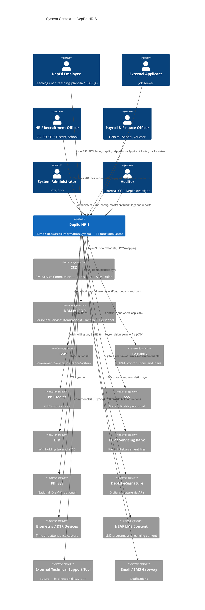
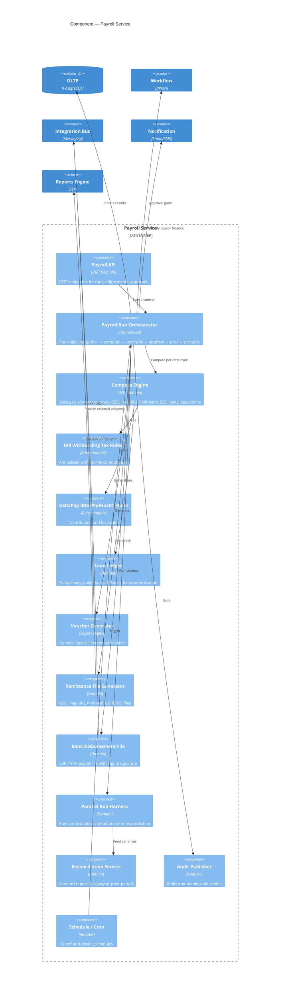
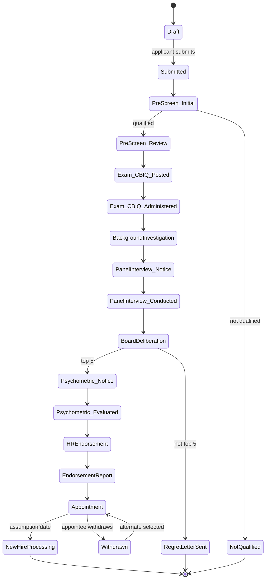
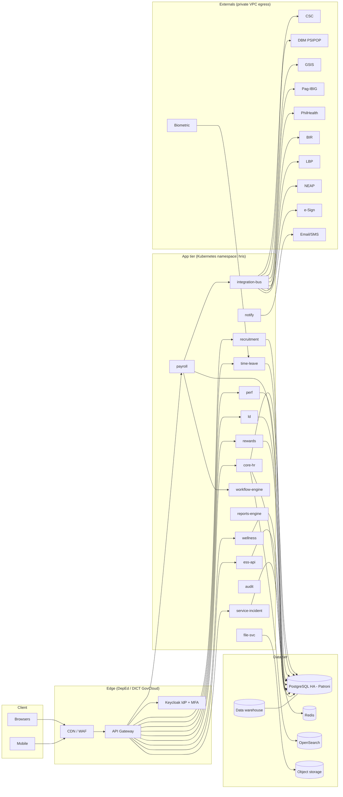
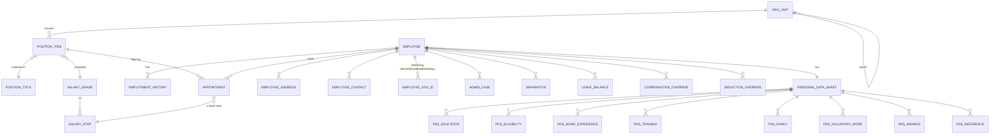
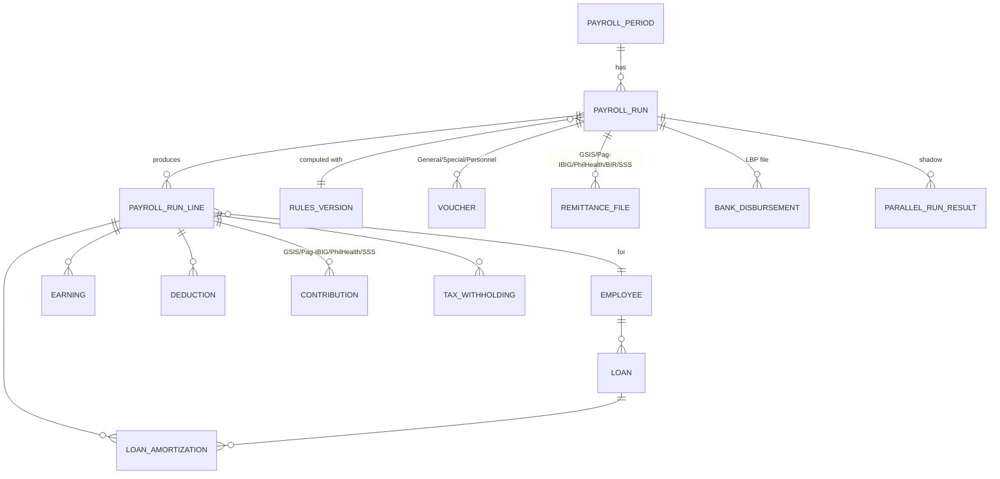

# (C) Architecture (C4) and Core HR + Payroll Data Model

This document defines the target architecture for the DepEd HRIS at four levels (C4: System Context, Container, Component, Code-adjacent) and provides a Core HR and Payroll data model with SQL DDL for PostgreSQL.

All diagrams are Mermaid (renderable in VS Code and GitHub).

---

## C.1 C4 — Level 1: System Context

Shows the DepEd HRIS in relation to its users and external systems.



---

## C.2 C4 — Level 2: Container

Shows the HRIS internals as deployable containers.

```mermaid
C4Container
  title Container — DepEd HRIS

  Person(user, "Users", "Employees, Applicants, HR, Payroll, Admin")

  System_Boundary(hris, "DepEd HRIS") {
    Container(web, "Web Portal", "Blazor SSR / React", "HR portal, ESS, Applicant Portal, Admin console")
    Container(mobile, "Mobile App", "Cross-platform", "ESS / MSS — offline-first for remote schools")
    Container(apigw, "API Gateway", "Kong / APIM", "AuthN/Z, rate limiting, request logging, WAF")
    Container(idp, "Identity Provider", "Keycloak OIDC", "SSO, MFA, RBAC/ABAC")
    Container(app_core, "Core HR Service", ".NET / Java", "PIM, 201 file, positions, plantilla, PSIPOP")
    Container(app_recruit, "Recruitment Service", ".NET / Java", "Applicant Portal, RSP, appointment, new hire")
    Container(app_time, "Time & Leave Service", ".NET / Java", "DTR, leave, CTO, overtime")
    Container(app_payroll, "Payroll Service", ".NET / Java", "General, Special, Voucher; remittances; parallel run")
    Container(app_perf, "Performance Service", ".NET / Java", "SPMS, IPCR, OPCR, IDP/ODP")
    Container(app_ld, "L&D Service", ".NET / Java", "L&D admin, IDPs, scholarships, LMS for NEAP")
    Container(app_rewards, "Rewards Service", ".NET / Java", "Awards, loyalty, step increments")
    Container(app_wellness, "Wellness Service", ".NET / Java", "Wellness, health profile — statistical reporting")
    Container(app_ess, "ESS/MSS API", ".NET / Java", "Employee/manager self-service backends")
    Container(app_service, "Service & Incident", ".NET / Java", "HR service management, technical defects, bi-directional API")
    Container(workflow, "Workflow Engine", "Camunda / Flowable", "BPMN — approvals, recruitment stages, payroll runs")
    Container(reports, "Reports Engine", "Server-side rendering", "CSC Form 9, 33A, Oath, HRMPSB Endorsement, Rating Sheet, Service Record, plus 28 required reports")
    Container(bi, "BI / Analytics", "Metabase / Superset + dbt", "Dashboards, workforce analytics")
    Container(notify, "Notification Service", ".NET / Java", "Email / SMS / push")
    Container(esig_svc, "e-Signature Adapter", ".NET / Java", "DepEd e-Sign integration")
    Container(files, "File / Document Service", ".NET / Java", "PDS attachments, appointment docs, virus scan")
    ContainerDb(oltp, "OLTP Database", "PostgreSQL HA", "Core HR, payroll, workflow state")
    ContainerDb(cache, "Cache", "Redis", "Sessions, hot lookups, rate limits")
    ContainerDb(search, "Search", "OpenSearch", "Employee search, audit log queries")
    ContainerDb(dw, "Data Warehouse", "PostgreSQL / Synapse", "Analytics + BI marts")
    ContainerDb(blob, "Object Storage", "MinIO / S3-compatible", "201 file scans, credentials, exports")
    Container(audit, "Audit Log Service", ".NET / Java", "Immutable, hash-chained events")
    Container(migration, "Migration Toolkit", "Python / .NET", "ETL from legacy, reconciliation")
    Container(integration, "Integration Bus", "MassTransit / Kafka", "Events, sagas, external system adapters")
  }

  System_Ext(externals, "External Systems", "CSC, DBM, GSIS, Pag-IBIG, PhilHealth, SSS, BIR, LBP, PhilSys, biometric, e-Sign, email/SMS, NEAP")

  Rel(user, web, "HTTPS", "TLS 1.3")
  Rel(user, mobile, "HTTPS")
  Rel(web, apigw, "REST/JSON")
  Rel(mobile, apigw, "REST/JSON")
  Rel(apigw, idp, "OIDC token validation")
  Rel(apigw, app_core, "REST")
  Rel(apigw, app_recruit, "REST")
  Rel(apigw, app_time, "REST")
  Rel(apigw, app_payroll, "REST")
  Rel(apigw, app_perf, "REST")
  Rel(apigw, app_ld, "REST")
  Rel(apigw, app_rewards, "REST")
  Rel(apigw, app_wellness, "REST")
  Rel(apigw, app_ess, "REST")
  Rel(apigw, app_service, "REST")

  Rel(app_core, oltp, "SQL")
  Rel(app_recruit, oltp, "SQL")
  Rel(app_time, oltp, "SQL")
  Rel(app_payroll, oltp, "SQL")
  Rel(app_perf, oltp, "SQL")
  Rel(app_ld, oltp, "SQL")
  Rel(app_rewards, oltp, "SQL")
  Rel(app_wellness, oltp, "SQL")
  Rel(app_service, oltp, "SQL")
  Rel(workflow, oltp, "SQL")

  Rel(app_core, cache, "GET/SET")
  Rel(app_core, search, "Index/Query")
  Rel(app_core, audit, "Emit events")
  Rel(app_recruit, workflow, "Start/Advance process")
  Rel(app_time, workflow, "Approvals")
  Rel(app_payroll, workflow, "Approvals")
  Rel(app_perf, workflow, "Approvals")

  Rel(app_core, files, "Upload/Download")
  Rel(app_recruit, files, "Attachments")
  Rel(files, blob, "PUT/GET")

  Rel(app_payroll, integration, "Publish payroll events")
  Rel(app_recruit, integration, "Publish recruitment events")
  Rel(integration, externals, "Adapters: HTTPS/SFTP/File")

  Rel(reports, oltp, "Read")
  Rel(bi, dw, "SQL")
  Rel(dw, oltp, "CDC / batch")

  Rel(app_core, notify, "Send")
  Rel(app_recruit, notify, "Send")
  Rel(app_payroll, notify, "Send")
  Rel(notify, externals, "Email/SMS gateways")

  Rel(app_service, integration, "Bi-directional sync with external support tool")
```



**Design principles**

- **Modular monolith → services**: start as a well-bounded monolith; extract services as scale demands (payroll first).
- **API-first**: OpenAPI specs for every module; versioned REST.
- **Event-driven backbone**: payroll runs, recruitment transitions, notifications, and audit events flow through the integration bus.
- **Workflow-centric**: BPMN engine drives approvals and recruitment stage machines — matches TOR §4.2 and §5.4 (multi-stage plantilla flow).
- **Offline-first for edge**: mobile and school-level clients queue events when disconnected and sync on reconnect.
- **Zero-trust**: every request through API gateway and IdP; MFA for admin/payroll; JIT elevation for payroll finalisation.
- **Data residency**: hosted in PH (GovCloud/DICT-accredited), with encryption at rest and in transit.

---

## C.3 C4 — Level 3: Component — Payroll Service (illustrative deep-dive)

Payroll is the most complex domain — parallel runs, taxes, contributions, remittances. Component-level view:



**Key controls**

- **Maker–checker** enforced by workflow gates.
- **Parallel-run harness** for M6/M7 (TOR §M5, §M7).
- **Immutable audit** for every mutation (TOR §11.2).
- **Deterministic recomputation**: given the same inputs and rules version, the engine produces identical outputs.
- **Rules versioning**: BIR/GSIS/etc. rule sets versioned; the version used is stamped onto each payroll record.

---

## C.4 C4 — Level 3: Component — Recruitment Service (plantilla stage machine)

The plantilla recruitment flow (TOR §5.4.5) is a multi-stage BPMN.



Non-plantilla flow (TOR §5.4.4) is a simpler subset that terminates at CSC submission.

---

## C.5 Deployment view



**Environments**: Dev / Staging / Production, each isolated. Prod DR replica in a secondary DICT region (RPO ≤ 15 min, RTO ≤ 4 h).

---

## C.6 Core HR + Payroll Data Model

Focuses on the schemas required for **M2 (Core HR Foundation)** and **M3 (Payroll + Leave/Attendance + ESS)**. Fields are chosen to satisfy TOR §5.6, §5.8, §6.3, §6.4 and required reports.

### C.6.1 ER Diagram — Core HR



### C.6.2 ER Diagram — Payroll



### C.6.3 SQL DDL — PostgreSQL

The schema below is intended as a **starter reference**. It uses `citext`, `pgcrypto`, and covers row-level scoping via `org_scope`. Money values use `NUMERIC(18,4)` to avoid rounding drift in payroll math. Every mutable table gets audit columns and can be augmented with triggers into a hash-chained `audit_event` stream.

```sql
-- Extensions
CREATE EXTENSION IF NOT EXISTS pgcrypto;
CREATE EXTENSION IF NOT EXISTS citext;
CREATE EXTENSION IF NOT EXISTS pg_trgm;

-- ============================================================
-- Reference / Lookup
-- ============================================================
CREATE TABLE ref_org_level (
    code TEXT PRIMARY KEY,   -- CO, RO, SDO, DIST, SCHOOL
    name TEXT NOT NULL
);

CREATE TABLE org_unit (
    id UUID PRIMARY KEY DEFAULT gen_random_uuid(),
    parent_id UUID REFERENCES org_unit(id),
    code TEXT NOT NULL UNIQUE,          -- e.g., DEPED-CO-ICTS, R7-CEBU-SDO
    name TEXT NOT NULL,
    org_level TEXT NOT NULL REFERENCES ref_org_level(code),
    region_code TEXT,
    division_code TEXT,
    is_active BOOLEAN NOT NULL DEFAULT TRUE,
    created_at TIMESTAMPTZ NOT NULL DEFAULT now(),
    updated_at TIMESTAMPTZ NOT NULL DEFAULT now()
);

CREATE TABLE ref_employment_status (
    code TEXT PRIMARY KEY,   -- PERMANENT, TEMPORARY, CASUAL, COTERMINOUS, COS, JO, ...
    name TEXT NOT NULL
);

CREATE TABLE ref_appointment_status (
    code TEXT PRIMARY KEY,   -- PLANTILLA, NON_PLANTILLA, TEACHING, RELATED_TEACHING, NON_TEACHING
    name TEXT NOT NULL
);

CREATE TABLE ref_civil_status (
    code TEXT PRIMARY KEY,   -- SINGLE, MARRIED, WIDOWED, SEPARATED, ANNULLED
    name TEXT NOT NULL
);

CREATE TABLE ref_sex (
    code TEXT PRIMARY KEY,   -- M, F
    name TEXT NOT NULL
);

-- ============================================================
-- Salary scaffolding (DBM salary grades and steps)
-- ============================================================
CREATE TABLE salary_tranche (
    id UUID PRIMARY KEY DEFAULT gen_random_uuid(),
    code TEXT NOT NULL UNIQUE,           -- e.g., SSL-VII TR1, TR2, TR3
    name TEXT NOT NULL,
    effective_date DATE NOT NULL,
    end_date DATE
);

CREATE TABLE salary_grade (
    id UUID PRIMARY KEY DEFAULT gen_random_uuid(),
    salary_tranche_id UUID NOT NULL REFERENCES salary_tranche(id),
    grade INT NOT NULL,                  -- 1..33
    UNIQUE (salary_tranche_id, grade)
);

CREATE TABLE salary_step (
    id UUID PRIMARY KEY DEFAULT gen_random_uuid(),
    salary_grade_id UUID NOT NULL REFERENCES salary_grade(id),
    step INT NOT NULL,                   -- 1..8
    monthly_amount NUMERIC(18,4) NOT NULL,
    UNIQUE (salary_grade_id, step)
);

-- ============================================================
-- Position master
-- ============================================================
CREATE TABLE position_title (
    id UUID PRIMARY KEY DEFAULT gen_random_uuid(),
    title TEXT NOT NULL,
    csc_position_title_code TEXT,
    salary_grade INT,                    -- default SG for this title
    is_teaching BOOLEAN NOT NULL DEFAULT FALSE
);

-- A "plantilla item" per DBM PSIPOP
CREATE TABLE position_item (
    id UUID PRIMARY KEY DEFAULT gen_random_uuid(),
    item_number TEXT NOT NULL UNIQUE,    -- PSIPOP item number
    position_title_id UUID NOT NULL REFERENCES position_title(id),
    salary_grade_id UUID NOT NULL REFERENCES salary_grade(id),
    org_unit_id UUID NOT NULL REFERENCES org_unit(id),
    is_plantilla BOOLEAN NOT NULL DEFAULT TRUE,
    is_teaching BOOLEAN NOT NULL DEFAULT FALSE,
    account_code TEXT,                   -- required by TOR §5.8.3.2.9
    is_active BOOLEAN NOT NULL DEFAULT TRUE
);

-- ============================================================
-- Employee master
-- ============================================================
CREATE TABLE employee (
    id UUID PRIMARY KEY DEFAULT gen_random_uuid(),
    employee_number TEXT NOT NULL UNIQUE,     -- assigned in new-hire processing (§5.6.3)
    biometric_pin TEXT UNIQUE,                -- §5.6.4
    last_name TEXT NOT NULL,
    first_name TEXT NOT NULL,
    middle_name TEXT,
    name_extension TEXT,
    sex TEXT REFERENCES ref_sex(code),
    civil_status TEXT REFERENCES ref_civil_status(code),
    date_of_birth DATE,
    place_of_birth TEXT,
    height_m NUMERIC(4,2),
    weight_kg NUMERIC(5,2),
    blood_type TEXT,
    citizenship TEXT,
    email CITEXT UNIQUE,
    mobile TEXT,
    telephone TEXT,
    is_active BOOLEAN NOT NULL DEFAULT TRUE,
    created_at TIMESTAMPTZ NOT NULL DEFAULT now(),
    updated_at TIMESTAMPTZ NOT NULL DEFAULT now()
);

CREATE INDEX employee_name_trgm ON employee USING GIN (
    (last_name || ' ' || first_name) gin_trgm_ops
);

CREATE TABLE employee_address (
    id UUID PRIMARY KEY DEFAULT gen_random_uuid(),
    employee_id UUID NOT NULL REFERENCES employee(id) ON DELETE CASCADE,
    address_type TEXT NOT NULL CHECK (address_type IN ('PERMANENT','RESIDENTIAL')),
    house_no TEXT,
    street TEXT,
    subdivision TEXT,
    barangay TEXT,
    city_municipality TEXT,
    province TEXT,
    region TEXT,
    zip_code TEXT
);

CREATE TABLE employee_contact (
    id UUID PRIMARY KEY DEFAULT gen_random_uuid(),
    employee_id UUID NOT NULL REFERENCES employee(id) ON DELETE CASCADE,
    contact_type TEXT NOT NULL,       -- EMERGENCY, SPOUSE, PARENT, ...
    name TEXT,
    phone TEXT,
    email TEXT,
    relationship TEXT
);

-- Government IDs (encrypted at rest via app-side or column-level encryption)
CREATE TABLE employee_gov_id (
    id UUID PRIMARY KEY DEFAULT gen_random_uuid(),
    employee_id UUID NOT NULL REFERENCES employee(id) ON DELETE CASCADE,
    id_type TEXT NOT NULL CHECK (id_type IN
        ('GSIS_BP','PAG_IBIG_MID','PHILHEALTH_PIN','SSS','TIN','PHILSYS','AGENCY_ID')),
    id_value TEXT NOT NULL,
    UNIQUE (employee_id, id_type)
);

-- ============================================================
-- PDS (Personal Data Sheet) — CSC prescribed
-- ============================================================
CREATE TABLE personal_data_sheet (
    employee_id UUID PRIMARY KEY REFERENCES employee(id) ON DELETE CASCADE,
    version INT NOT NULL DEFAULT 1,
    filed_at TIMESTAMPTZ NOT NULL DEFAULT now(),
    updated_at TIMESTAMPTZ NOT NULL DEFAULT now()
);

CREATE TABLE pds_education (
    id UUID PRIMARY KEY DEFAULT gen_random_uuid(),
    employee_id UUID NOT NULL REFERENCES employee(id) ON DELETE CASCADE,
    level TEXT NOT NULL,                 -- ELEMENTARY, SECONDARY, VOCATIONAL, COLLEGE, GRADUATE
    school_name TEXT NOT NULL,
    degree_course TEXT,
    from_year INT,
    to_year INT,
    highest_level_earned TEXT,
    year_graduated INT,
    scholarship_academic_honors TEXT
);

CREATE TABLE pds_eligibility (
    id UUID PRIMARY KEY DEFAULT gen_random_uuid(),
    employee_id UUID NOT NULL REFERENCES employee(id) ON DELETE CASCADE,
    eligibility_name TEXT NOT NULL,
    rating NUMERIC(6,3),
    date_of_examination DATE,
    place_of_examination TEXT,
    license_number TEXT,
    license_valid_until DATE
);

CREATE TABLE pds_work_experience (
    id UUID PRIMARY KEY DEFAULT gen_random_uuid(),
    employee_id UUID NOT NULL REFERENCES employee(id) ON DELETE CASCADE,
    date_from DATE NOT NULL,
    date_to DATE,
    position_title TEXT NOT NULL,
    department TEXT,
    monthly_salary NUMERIC(18,4),
    salary_grade_step TEXT,
    status_of_appointment TEXT,
    is_government BOOLEAN
);

CREATE TABLE pds_training (
    id UUID PRIMARY KEY DEFAULT gen_random_uuid(),
    employee_id UUID NOT NULL REFERENCES employee(id) ON DELETE CASCADE,
    title TEXT NOT NULL,
    date_from DATE,
    date_to DATE,
    hours INT,
    training_type TEXT,
    conducted_by TEXT
);

CREATE TABLE pds_family (
    id UUID PRIMARY KEY DEFAULT gen_random_uuid(),
    employee_id UUID NOT NULL REFERENCES employee(id) ON DELETE CASCADE,
    relation TEXT NOT NULL,               -- SPOUSE, FATHER, MOTHER, CHILD
    name TEXT NOT NULL,
    date_of_birth DATE,
    occupation TEXT,
    business_address TEXT
);

CREATE TABLE pds_voluntary_work (
    id UUID PRIMARY KEY DEFAULT gen_random_uuid(),
    employee_id UUID NOT NULL REFERENCES employee(id) ON DELETE CASCADE,
    organization TEXT NOT NULL,
    date_from DATE,
    date_to DATE,
    hours INT,
    position TEXT
);

CREATE TABLE pds_awards (
    id UUID PRIMARY KEY DEFAULT gen_random_uuid(),
    employee_id UUID NOT NULL REFERENCES employee(id) ON DELETE CASCADE,
    title TEXT NOT NULL,
    granted_by TEXT,
    date_granted DATE,
    description TEXT
);

CREATE TABLE pds_reference (
    id UUID PRIMARY KEY DEFAULT gen_random_uuid(),
    employee_id UUID NOT NULL REFERENCES employee(id) ON DELETE CASCADE,
    name TEXT NOT NULL,
    address TEXT,
    telephone TEXT
);

-- ============================================================
-- Employment / Appointment History
-- ============================================================
CREATE TABLE appointment (
    id UUID PRIMARY KEY DEFAULT gen_random_uuid(),
    employee_id UUID NOT NULL REFERENCES employee(id),
    position_item_id UUID REFERENCES position_item(id),  -- nullable for non-plantilla
    org_unit_id UUID NOT NULL REFERENCES org_unit(id),
    appointment_type TEXT NOT NULL,           -- ORIGINAL, PROMOTION, TRANSFER, REEMPLOYMENT, ...
    employment_status TEXT NOT NULL REFERENCES ref_employment_status(code),
    appointment_status TEXT NOT NULL REFERENCES ref_appointment_status(code),
    is_plantilla BOOLEAN NOT NULL DEFAULT TRUE,
    is_teaching BOOLEAN NOT NULL DEFAULT FALSE,
    date_of_appointment DATE NOT NULL,
    date_of_assumption DATE,
    salary_step_id UUID REFERENCES salary_step(id),
    probationary_period_days INT,
    csc_form_no TEXT,                          -- e.g., CSC Form 33A
    csc_submitted_at TIMESTAMPTZ,
    remarks TEXT,
    created_at TIMESTAMPTZ NOT NULL DEFAULT now()
);

-- Denormalised time-series history for reporting
CREATE TABLE employment_history (
    id UUID PRIMARY KEY DEFAULT gen_random_uuid(),
    employee_id UUID NOT NULL REFERENCES employee(id),
    appointment_id UUID REFERENCES appointment(id),
    org_unit_id UUID NOT NULL REFERENCES org_unit(id),
    position_title TEXT NOT NULL,
    item_number TEXT,
    salary_grade INT,
    salary_step INT,
    monthly_salary NUMERIC(18,4),
    allowances JSONB,                          -- {"RATA": 6000, "PERA": 2000, ...}
    employment_status TEXT REFERENCES ref_employment_status(code),
    valid_from DATE NOT NULL,
    valid_to DATE,                             -- NULL = current
    reason TEXT
);

CREATE INDEX employment_history_current ON employment_history(employee_id) WHERE valid_to IS NULL;

CREATE TABLE separation (
    id UUID PRIMARY KEY DEFAULT gen_random_uuid(),
    employee_id UUID NOT NULL REFERENCES employee(id),
    separation_date DATE NOT NULL,
    nature TEXT NOT NULL,                      -- RETIREMENT, RESIGNATION, DISMISSAL, TRANSFER_OUT, DEATH, ...
    remarks TEXT
);

CREATE TABLE admin_case (
    id UUID PRIMARY KEY DEFAULT gen_random_uuid(),
    employee_id UUID NOT NULL REFERENCES employee(id),
    case_reference TEXT NOT NULL UNIQUE,
    offense TEXT NOT NULL,
    filed_at DATE NOT NULL,
    resolved_at DATE,
    decision TEXT,
    penalty TEXT,
    is_confidential BOOLEAN NOT NULL DEFAULT TRUE
);

-- ============================================================
-- Leave & Attendance
-- ============================================================
CREATE TABLE ref_leave_type (
    code TEXT PRIMARY KEY,        -- VL, SL, ML, PL, SPL, VAWC, STUDY, TERMINAL, MONETIZATION, CTO
    name TEXT NOT NULL,
    with_pay BOOLEAN NOT NULL DEFAULT TRUE,
    max_days_year INT
);

CREATE TABLE leave_balance (
    id UUID PRIMARY KEY DEFAULT gen_random_uuid(),
    employee_id UUID NOT NULL REFERENCES employee(id) ON DELETE CASCADE,
    leave_type TEXT NOT NULL REFERENCES ref_leave_type(code),
    as_of DATE NOT NULL,
    balance_days NUMERIC(6,3) NOT NULL,
    UNIQUE (employee_id, leave_type, as_of)
);

CREATE TABLE leave_application (
    id UUID PRIMARY KEY DEFAULT gen_random_uuid(),
    employee_id UUID NOT NULL REFERENCES employee(id),
    leave_type TEXT NOT NULL REFERENCES ref_leave_type(code),
    date_from DATE NOT NULL,
    date_to DATE NOT NULL,
    days NUMERIC(5,2) NOT NULL,
    reason TEXT,
    status TEXT NOT NULL DEFAULT 'DRAFT'
        CHECK (status IN ('DRAFT','SUBMITTED','APPROVED','DENIED','CANCELLED')),
    workflow_instance_id UUID,
    created_at TIMESTAMPTZ NOT NULL DEFAULT now()
);

CREATE TABLE dtr_entry (
    id UUID PRIMARY KEY DEFAULT gen_random_uuid(),
    employee_id UUID NOT NULL REFERENCES employee(id),
    entry_date DATE NOT NULL,
    time_in TIMESTAMPTZ,
    time_out TIMESTAMPTZ,
    afternoon_in TIMESTAMPTZ,
    afternoon_out TIMESTAMPTZ,
    source TEXT NOT NULL DEFAULT 'BIOMETRIC',   -- BIOMETRIC, ONLINE, MANUAL
    tardiness_minutes INT NOT NULL DEFAULT 0,
    undertime_minutes INT NOT NULL DEFAULT 0,
    is_holiday BOOLEAN NOT NULL DEFAULT FALSE,
    UNIQUE (employee_id, entry_date)
);

-- ============================================================
-- Compensation overrides (§5.6.8 – §5.6.9)
-- ============================================================
CREATE TABLE ref_earning_code (
    code TEXT PRIMARY KEY,        -- BASIC, RATA, PERA, MID_YEAR, YEAR_END, HAZARD, OT, PBB, LOYALTY, ...
    name TEXT NOT NULL,
    taxable BOOLEAN NOT NULL DEFAULT TRUE,
    is_regular BOOLEAN NOT NULL DEFAULT TRUE
);

CREATE TABLE ref_deduction_code (
    code TEXT PRIMARY KEY,        -- GSIS_LOAN, PAGIBIG_LOAN, PHIC, SSS, BIR_WHT, COOP, INSURANCE, ...
    name TEXT NOT NULL,
    is_statutory BOOLEAN NOT NULL DEFAULT FALSE
);

CREATE TABLE compensation_override (
    id UUID PRIMARY KEY DEFAULT gen_random_uuid(),
    employee_id UUID NOT NULL REFERENCES employee(id) ON DELETE CASCADE,
    earning_code TEXT NOT NULL REFERENCES ref_earning_code(code),
    amount NUMERIC(18,4) NOT NULL,
    effective_from DATE NOT NULL,
    effective_to DATE,
    remarks TEXT
);

CREATE TABLE deduction_override (
    id UUID PRIMARY KEY DEFAULT gen_random_uuid(),
    employee_id UUID NOT NULL REFERENCES employee(id) ON DELETE CASCADE,
    deduction_code TEXT NOT NULL REFERENCES ref_deduction_code(code),
    amount NUMERIC(18,4) NOT NULL,
    effective_from DATE NOT NULL,
    effective_to DATE,
    remarks TEXT
);

-- ============================================================
-- Payroll
-- ============================================================
CREATE TABLE rules_version (
    id UUID PRIMARY KEY DEFAULT gen_random_uuid(),
    code TEXT NOT NULL UNIQUE,          -- e.g., BIR_TRAIN_2025, GSIS_2023, PHIC_2024
    domain TEXT NOT NULL,               -- BIR, GSIS, PHIC, HDMF, SSS
    effective_from DATE NOT NULL,
    effective_to DATE,
    definition JSONB NOT NULL           -- rule set / brackets / rates
);

CREATE TABLE payroll_period (
    id UUID PRIMARY KEY DEFAULT gen_random_uuid(),
    period_code TEXT NOT NULL UNIQUE,    -- 2026-07-1H, 2026-07-2H, 2026-Q3-SPL, ...
    period_type TEXT NOT NULL CHECK (period_type IN
        ('SEMI_MONTHLY_1','SEMI_MONTHLY_2','MONTHLY','SPECIAL','13TH_MONTH','MID_YEAR','YEAR_END','TERMINAL')),
    start_date DATE NOT NULL,
    end_date DATE NOT NULL,
    is_closed BOOLEAN NOT NULL DEFAULT FALSE
);

CREATE TABLE payroll_run (
    id UUID PRIMARY KEY DEFAULT gen_random_uuid(),
    payroll_period_id UUID NOT NULL REFERENCES payroll_period(id),
    run_type TEXT NOT NULL CHECK (run_type IN ('GENERAL','SPECIAL','VOUCHER','PARALLEL','ADJUSTMENT')),
    org_unit_id UUID REFERENCES org_unit(id),
    status TEXT NOT NULL DEFAULT 'DRAFT'
        CHECK (status IN ('DRAFT','COMPUTED','APPROVED','POSTED','DISBURSED','VOIDED')),
    bir_rules_id UUID REFERENCES rules_version(id),
    gsis_rules_id UUID REFERENCES rules_version(id),
    phic_rules_id UUID REFERENCES rules_version(id),
    hdmf_rules_id UUID REFERENCES rules_version(id),
    computed_at TIMESTAMPTZ,
    approved_at TIMESTAMPTZ,
    approved_by UUID,
    posted_at TIMESTAMPTZ,
    disbursed_at TIMESTAMPTZ,
    parent_run_id UUID REFERENCES payroll_run(id),   -- for PARALLEL shadow of a GENERAL run
    total_gross NUMERIC(18,4),
    total_deductions NUMERIC(18,4),
    total_net NUMERIC(18,4),
    created_at TIMESTAMPTZ NOT NULL DEFAULT now()
);

CREATE TABLE payroll_run_line (
    id UUID PRIMARY KEY DEFAULT gen_random_uuid(),
    payroll_run_id UUID NOT NULL REFERENCES payroll_run(id) ON DELETE CASCADE,
    employee_id UUID NOT NULL REFERENCES employee(id),
    org_unit_id UUID NOT NULL REFERENCES org_unit(id),
    salary_grade INT,
    salary_step INT,
    basic_pay NUMERIC(18,4) NOT NULL DEFAULT 0,
    total_earnings NUMERIC(18,4) NOT NULL DEFAULT 0,
    total_deductions NUMERIC(18,4) NOT NULL DEFAULT 0,
    total_contributions NUMERIC(18,4) NOT NULL DEFAULT 0,
    total_tax_withholding NUMERIC(18,4) NOT NULL DEFAULT 0,
    total_loan_amortization NUMERIC(18,4) NOT NULL DEFAULT 0,
    net_pay NUMERIC(18,4) NOT NULL DEFAULT 0,
    days_worked NUMERIC(6,3),
    tardiness_deduction NUMERIC(18,4) NOT NULL DEFAULT 0,
    UNIQUE (payroll_run_id, employee_id)
);

CREATE TABLE earning (
    id UUID PRIMARY KEY DEFAULT gen_random_uuid(),
    payroll_run_line_id UUID NOT NULL REFERENCES payroll_run_line(id) ON DELETE CASCADE,
    code TEXT NOT NULL REFERENCES ref_earning_code(code),
    amount NUMERIC(18,4) NOT NULL,
    remarks TEXT
);

CREATE TABLE deduction (
    id UUID PRIMARY KEY DEFAULT gen_random_uuid(),
    payroll_run_line_id UUID NOT NULL REFERENCES payroll_run_line(id) ON DELETE CASCADE,
    code TEXT NOT NULL REFERENCES ref_deduction_code(code),
    amount NUMERIC(18,4) NOT NULL,
    remarks TEXT
);

CREATE TABLE contribution (
    id UUID PRIMARY KEY DEFAULT gen_random_uuid(),
    payroll_run_line_id UUID NOT NULL REFERENCES payroll_run_line(id) ON DELETE CASCADE,
    scheme TEXT NOT NULL CHECK (scheme IN ('GSIS','PAGIBIG','PHILHEALTH','SSS')),
    employee_share NUMERIC(18,4) NOT NULL DEFAULT 0,
    employer_share NUMERIC(18,4) NOT NULL DEFAULT 0
);

CREATE TABLE tax_withholding (
    id UUID PRIMARY KEY DEFAULT gen_random_uuid(),
    payroll_run_line_id UUID NOT NULL REFERENCES payroll_run_line(id) ON DELETE CASCADE,
    taxable_income NUMERIC(18,4) NOT NULL,
    tax_withheld NUMERIC(18,4) NOT NULL,
    tax_bracket TEXT
);

CREATE TABLE loan (
    id UUID PRIMARY KEY DEFAULT gen_random_uuid(),
    employee_id UUID NOT NULL REFERENCES employee(id),
    provider TEXT NOT NULL,                 -- GSIS, PAGIBIG, SSS, COOP, BANK
    loan_type TEXT NOT NULL,                -- SALARY_LOAN, POLICY_LOAN, MPL, CALAMITY, HOUSING
    principal NUMERIC(18,4) NOT NULL,
    interest_rate NUMERIC(6,4),
    monthly_amortization NUMERIC(18,4) NOT NULL,
    number_of_terms INT NOT NULL,
    start_period_id UUID REFERENCES payroll_period(id),
    end_period_id UUID REFERENCES payroll_period(id),
    outstanding_balance NUMERIC(18,4) NOT NULL,
    status TEXT NOT NULL DEFAULT 'ACTIVE'
        CHECK (status IN ('ACTIVE','ON_HOLD','FULLY_PAID','WRITTEN_OFF'))
);

CREATE TABLE loan_amortization (
    id UUID PRIMARY KEY DEFAULT gen_random_uuid(),
    loan_id UUID NOT NULL REFERENCES loan(id),
    payroll_run_line_id UUID NOT NULL REFERENCES payroll_run_line(id) ON DELETE CASCADE,
    principal_portion NUMERIC(18,4) NOT NULL,
    interest_portion NUMERIC(18,4) NOT NULL,
    balance_after NUMERIC(18,4) NOT NULL
);

CREATE TABLE voucher (
    id UUID PRIMARY KEY DEFAULT gen_random_uuid(),
    payroll_run_id UUID NOT NULL REFERENCES payroll_run(id) ON DELETE CASCADE,
    voucher_type TEXT NOT NULL CHECK (voucher_type IN ('GENERAL','SPECIAL','PERSONNEL')),
    voucher_number TEXT NOT NULL UNIQUE,
    issued_at DATE NOT NULL,
    total_amount NUMERIC(18,4) NOT NULL,
    signed_pdf_object_key TEXT
);

CREATE TABLE remittance_file (
    id UUID PRIMARY KEY DEFAULT gen_random_uuid(),
    payroll_run_id UUID NOT NULL REFERENCES payroll_run(id) ON DELETE CASCADE,
    scheme TEXT NOT NULL CHECK (scheme IN ('GSIS','PAGIBIG','PHILHEALTH','SSS','BIR')),
    file_type TEXT NOT NULL,               -- e.g., BIR_1601C, GSIS_EPRS, PHIC_ERR, HDMF_MCRF
    reference_number TEXT,
    file_object_key TEXT NOT NULL,
    generated_at TIMESTAMPTZ NOT NULL DEFAULT now()
);

CREATE TABLE bank_disbursement (
    id UUID PRIMARY KEY DEFAULT gen_random_uuid(),
    payroll_run_id UUID NOT NULL REFERENCES payroll_run(id) ON DELETE CASCADE,
    bank TEXT NOT NULL,                    -- LBP, ...
    file_object_key TEXT NOT NULL,
    total_amount NUMERIC(18,4) NOT NULL,
    disbursed_at TIMESTAMPTZ
);

CREATE TABLE parallel_run_result (
    id UUID PRIMARY KEY DEFAULT gen_random_uuid(),
    payroll_run_id UUID NOT NULL REFERENCES payroll_run(id),
    baseline_run_id UUID NOT NULL REFERENCES payroll_run(id),
    employee_id UUID NOT NULL REFERENCES employee(id),
    field TEXT NOT NULL,                   -- basic_pay, tax_withholding, gsis_ee, net_pay, ...
    parallel_value NUMERIC(18,4),
    baseline_value NUMERIC(18,4),
    variance NUMERIC(18,4)
);

CREATE INDEX parallel_run_variance ON parallel_run_result(payroll_run_id) WHERE variance <> 0;

-- ============================================================
-- Audit (immutable, hash-chained)
-- ============================================================
CREATE TABLE audit_event (
    id BIGSERIAL PRIMARY KEY,
    event_time TIMESTAMPTZ NOT NULL DEFAULT now(),
    actor_user_id UUID,
    actor_display TEXT,
    action TEXT NOT NULL,                  -- INSERT, UPDATE, DELETE, LOGIN, EXPORT, PAYROLL_APPROVE, ...
    entity_type TEXT NOT NULL,
    entity_id TEXT,
    org_unit_id UUID,
    ip_address INET,
    user_agent TEXT,
    payload JSONB,                         -- before/after diff
    prev_hash BYTEA,
    hash BYTEA NOT NULL
);

CREATE INDEX audit_event_entity ON audit_event(entity_type, entity_id);
CREATE INDEX audit_event_actor ON audit_event(actor_user_id, event_time DESC);
```

### C.6.4 Notes on the schema

- **Historisation**: `employment_history` uses closed-open time ranges (`valid_from`, `valid_to`) to satisfy TOR §5.8.5 (full job-related history) and generate Service Records at any point-in-time.
- **PSIPOP alignment**: `position_item.item_number` is the PSIPOP item number; positions can be linked to plantilla items, and non-plantilla appointments leave it null.
- **Rules versioning**: every payroll run stamps the rules versions used for BIR/GSIS/PHIC/HDMF. Recomputation on the same inputs and same rules IDs is deterministic — mandatory for parallel runs and audits.
- **Parallel run**: `payroll_run.parent_run_id` links a `PARALLEL` shadow run to its production baseline; `parallel_run_result` captures line-level variances for the acceptance report at M6/M7.
- **Row-level security** (future): add `org_unit_id` predicates + PostgreSQL RLS policies to enforce region/division scoping for HR officers.
- **Sensitive fields** (medical, disciplinary, government IDs): candidates for field-level encryption using pgcrypto or an app-side envelope encryption pattern. Health profile data belongs in a separate `hris_wellness` schema with tighter grants and statistical-only views (TOR §6.8.1.5).
- **Immutability**: `audit_event.hash` is computed from the prior row's hash + this row's canonicalised payload, forming a tamper-evident chain that supports TOR §11.2.

### C.6.5 Reports coverage traceability

| Required report / form (TOR) | Primary tables |
|---|---|
| Service Record | `employee`, `employment_history`, `appointment`, `separation` |
| CSC Form 33A – Appointment Form | `appointment` (+ `position_item`, `salary_step`) |
| Oath of Office / Cert. of Erasures / HRMPSB Endorsement | `appointment` + attachments in object storage |
| CSC Form 9 (Request for Publication) | `job_posting` (Recruitment schema — omitted here, defined in Recruitment service) |
| Rating Evaluation Sheet, Matrix of Applicants | `applicant`, `application`, `assessment`, `assessment_criterion` (Recruitment) |
| Agency Plantilla | `position_item`, `salary_grade`, `salary_step`, `appointment` |
| Employee Masterlist / Distribution reports | `employee`, `appointment`, `org_unit` |
| Notice of Salary Adjustment / Step Increment | `employment_history`, `appointment`, `salary_step` |
| Payroll register, vouchers, remittances | `payroll_run`, `payroll_run_line`, `voucher`, `remittance_file`, `bank_disbursement` |
| Parallel-run accuracy report | `parallel_run_result` |
| BIR 2316 (year-end) | Aggregation over `earning`, `tax_withholding` |
| GSIS / Pag-IBIG / PhilHealth / SSS remittance reports | `contribution`, `remittance_file` |

---

## C.7 Recruitment domain data model

Covers TOR §5.1 (Applicant Portal), §5.2 (Job Posting), §5.3 (Job Opportunities), §5.4 (Applicant Management — both non-plantilla and plantilla flows), §5.5 (Appointment Process), §5.6 (New Hire Processing), and §5.7 (28 required recruitment reports).

The Recruitment schema is designed as its own bounded context (`hris_recruitment`) that references — but does not extend — the Core HR schema. It reuses `org_unit`, `position_item`, `position_title`, `salary_grade`, `salary_step`, `employee`, and `appointment` from Core HR. Applicants who become employees flow through a controlled promotion step that creates the corresponding Core HR records.

### C.7.1 ER Diagram — Recruitment

```mermaid
erDiagram
  APPLICANT ||--o{ APPLICATION : "submits"
  APPLICANT ||--|| APPLICANT_PDS : "has"
  APPLICANT_PDS ||--o{ APPLICANT_EDUCATION : ""
  APPLICANT_PDS ||--o{ APPLICANT_ELIGIBILITY : ""
  APPLICANT_PDS ||--o{ APPLICANT_WORK_EXPERIENCE : ""
  APPLICANT_PDS ||--o{ APPLICANT_TRAINING : ""
  APPLICANT_PDS ||--o{ APPLICANT_FAMILY : ""
  APPLICANT_PDS ||--o{ APPLICANT_VOLUNTARY_WORK : ""
  APPLICANT_PDS ||--o{ APPLICANT_AWARDS : ""
  APPLICANT_PDS ||--o{ APPLICANT_REFERENCE : ""
  APPLICANT ||--o{ APPLICANT_ATTACHMENT : "photo / letter / notarised PDS / other"

  JOB_POSTING }o--|| POSITION_ITEM : "plantilla item (nullable)"
  JOB_POSTING }o--|| POSITION_TITLE : "for title"
  JOB_POSTING }o--|| ORG_UNIT : "scope (CO/RO)"
  JOB_POSTING ||--o{ POSTING_REQUIRED_TAB : "6 for plantilla / 5 for non-plantilla"
  JOB_POSTING ||--o{ POSTING_DOCUMENT_REQUIREMENT : ""
  JOB_POSTING ||--|| QUALIFICATION_STANDARD : "per position"
  JOB_POSTING ||--o{ APPLICATION : "receives"

  APPLICATION }o--|| APPLICANT : ""
  APPLICATION }o--|| JOB_POSTING : ""
  APPLICATION ||--o{ APPLICATION_STAGE_EVENT : "state machine transitions"
  APPLICATION ||--o{ APPLICATION_DOCUMENT : "uploaded per requirement"
  APPLICATION ||--o{ ASSESSMENT : ""
  ASSESSMENT }o--|| ASSESSMENT_CRITERION : ""
  ASSESSMENT ||--o{ ASSESSMENT_RATING : "one per rater"
  APPLICATION ||--o{ BACKGROUND_INVESTIGATION : "≥ 3"
  APPLICATION ||--o{ INTERVIEW : ""
  INTERVIEW ||--o{ INTERVIEW_PANELIST : ""
  INTERVIEW ||--o{ INTERVIEW_RATING : ""
  APPLICATION ||--o{ EXAMINATION : "CBIQ / Psychometric"
  APPLICATION ||--o{ EXAMINATION_ATTENDANCE : ""
  APPLICATION ||--o{ BOARD_DELIBERATION : ""

  APPLICATION ||--o{ RECRUITMENT_APPOINTMENT : ""
  RECRUITMENT_APPOINTMENT }o--|| APPOINTMENT : "promoted to Core HR"
  RECRUITMENT_APPOINTMENT ||--o{ ALTERNATE_APPOINTEE : "on withdrawal"
  ALTERNATE_APPOINTEE }o--|| APPLICATION : "next candidate"

  APPLICANT ||--o{ APPLICANT_NOTIFICATION : "emails / status changes"
  JOB_POSTING ||--o{ POSTING_PUBLICATION_LOG : "publish / unpublish / bulk import"
```



### C.7.2 State machine — Application

Non-plantilla flow (TOR §5.4.4):

```text
Draft → Submitted → PreScreen → Endorsement → Resolution → AppointmentPrep → CSCSubmission → Terminated
```

Plantilla flow (TOR §5.4.5):

```text
Draft → Submitted → PreScreenInitial → PreScreenReview → ExamCBIQPosted
    → ExamCBIQAdministered → BackgroundInvestigation → PanelInterviewNotice
    → PanelInterviewConducted → BoardDeliberation → (top 5 → PsychometricNotice → PsychometricEvaluated → HREndorsement → EndorsementOfQualified → Appointment → NewHire)
                                    │
                                    └─(not top 5 → RegretLetter → Terminated)
```

Both flows terminate at `Withdrawn`, `NotQualified`, `RegretLetter`, or `Terminated`; `Appointment` transitions the application to Core HR via `RECRUITMENT_APPOINTMENT` and (optionally) a follow-up `NewHireProcessing` handoff.

### C.7.3 SQL DDL — PostgreSQL

The schema lives in its own PostgreSQL schema `hris_recruitment` and reuses tables from Core HR (unqualified names below assume `search_path = hris_recruitment, hris_core, public`).

```sql
-- Assumes Core HR tables (org_unit, position_item, position_title, salary_grade, salary_step,
-- employee, appointment) already exist per §C.6.3.
CREATE SCHEMA IF NOT EXISTS hris_recruitment;
SET search_path = hris_recruitment, public;

-- ============================================================
-- Reference / Lookup
-- ============================================================
CREATE TABLE ref_posting_type (
    code TEXT PRIMARY KEY,           -- PLANTILLA, NON_PLANTILLA_CASUAL, JOB_ORDER
    name TEXT NOT NULL
);

CREATE TABLE ref_posting_channel (
    code TEXT PRIMARY KEY,           -- PUBLICATION, INTERNAL, BOTH
    name TEXT NOT NULL
);

CREATE TABLE ref_posting_status (
    code TEXT PRIMARY KEY,           -- DRAFT, PUBLISHED, UNPUBLISHED, CLOSED, ARCHIVED
    name TEXT NOT NULL
);

CREATE TABLE ref_application_status (
    code TEXT PRIMARY KEY,           -- DRAFT, SUBMITTED, ONGOING, APPOINTED, NOT_CHOSEN, WITHDRAWN
    name TEXT NOT NULL,
    -- These five terminal-or-visible statuses are what applicants see (TOR §5.1.10)
    is_applicant_visible BOOLEAN NOT NULL DEFAULT TRUE
);

CREATE TABLE ref_application_stage (
    code TEXT PRIMARY KEY,           -- Full plantilla/non-plantilla stage list
    name TEXT NOT NULL,
    is_terminal BOOLEAN NOT NULL DEFAULT FALSE,
    -- e.g., DRAFT, SUBMITTED, PRE_SCREEN_INITIAL, PRE_SCREEN_REVIEW, EXAM_CBIQ_POSTED,
    -- EXAM_CBIQ_ADMINISTERED, BACKGROUND_INVESTIGATION, PANEL_INTERVIEW_NOTICE,
    -- PANEL_INTERVIEW_CONDUCTED, BOARD_DELIBERATION, PSYCHOMETRIC_NOTICE,
    -- PSYCHOMETRIC_EVALUATED, HR_ENDORSEMENT, ENDORSEMENT_OF_QUALIFIED,
    -- APPOINTMENT, NEW_HIRE_PROCESSING, WITHDRAWN, NOT_QUALIFIED, REGRET_LETTER, TERMINATED
    applicable_to TEXT NOT NULL      -- PLANTILLA, NON_PLANTILLA, BOTH
);

CREATE TABLE ref_document_status (
    code TEXT PRIMARY KEY,           -- COMPLETE, INCOMPLETE, FOR_COMPLIANCE, FOR_RESUBMISSION
    name TEXT NOT NULL
);

CREATE TABLE ref_qualification_check (
    code TEXT PRIMARY KEY,           -- QUALIFIED, NOT_QUALIFIED, PENDING
    name TEXT NOT NULL
);

-- ============================================================
-- Applicant identity (separate from Core HR employee identity)
-- ============================================================
CREATE TABLE applicant (
    id UUID PRIMARY KEY DEFAULT gen_random_uuid(),
    account_email CITEXT NOT NULL UNIQUE,
    external_identity_id TEXT UNIQUE,             -- Keycloak subject or similar
    is_active BOOLEAN NOT NULL DEFAULT TRUE,
    email_verified BOOLEAN NOT NULL DEFAULT FALSE,
    mfa_enrolled BOOLEAN NOT NULL DEFAULT FALSE,
    linked_employee_id UUID REFERENCES hris_core.employee(id),  -- set once appointed
    last_login_at TIMESTAMPTZ,
    pds_last_updated_at TIMESTAMPTZ,              -- for 6-month reminder (TOR §5.1.8)
    account_created_at TIMESTAMPTZ NOT NULL DEFAULT now(),
    updated_at TIMESTAMPTZ NOT NULL DEFAULT now()
);

CREATE INDEX applicant_pds_reminder_due
    ON applicant (pds_last_updated_at)
    WHERE is_active AND linked_employee_id IS NULL;

CREATE TABLE applicant_pds (
    applicant_id UUID PRIMARY KEY REFERENCES applicant(id) ON DELETE CASCADE,
    last_name TEXT NOT NULL,
    first_name TEXT NOT NULL,
    middle_name TEXT,
    name_extension TEXT,
    sex TEXT,
    civil_status TEXT,
    date_of_birth DATE,
    place_of_birth TEXT,
    height_m NUMERIC(4,2),
    weight_kg NUMERIC(5,2),
    blood_type TEXT,
    citizenship TEXT,
    email CITEXT,
    mobile TEXT,
    telephone TEXT,
    permanent_address JSONB,
    residential_address JSONB,
    -- Gov IDs kept encrypted at app tier; store references only
    gsis_bp TEXT,
    pagibig_mid TEXT,
    philhealth_pin TEXT,
    sss_number TEXT,
    tin TEXT,
    philsys_number TEXT,
    version INT NOT NULL DEFAULT 1,
    filed_at TIMESTAMPTZ NOT NULL DEFAULT now(),
    updated_at TIMESTAMPTZ NOT NULL DEFAULT now()
);

CREATE TABLE applicant_education (
    id UUID PRIMARY KEY DEFAULT gen_random_uuid(),
    applicant_id UUID NOT NULL REFERENCES applicant(id) ON DELETE CASCADE,
    level TEXT NOT NULL,             -- ELEMENTARY, SECONDARY, VOCATIONAL, COLLEGE, GRADUATE
    school_name TEXT NOT NULL,
    degree_course TEXT,
    from_year INT,
    to_year INT,
    highest_level_earned TEXT,
    year_graduated INT,
    scholarship_academic_honors TEXT
);

CREATE TABLE applicant_eligibility (
    id UUID PRIMARY KEY DEFAULT gen_random_uuid(),
    applicant_id UUID NOT NULL REFERENCES applicant(id) ON DELETE CASCADE,
    eligibility_name TEXT NOT NULL,
    rating NUMERIC(6,3),
    date_of_examination DATE,
    place_of_examination TEXT,
    license_number TEXT,
    license_valid_until DATE
);

CREATE TABLE applicant_work_experience (
    id UUID PRIMARY KEY DEFAULT gen_random_uuid(),
    applicant_id UUID NOT NULL REFERENCES applicant(id) ON DELETE CASCADE,
    date_from DATE NOT NULL,
    date_to DATE,
    position_title TEXT NOT NULL,
    department TEXT,
    monthly_salary NUMERIC(18,4),
    salary_grade_step TEXT,
    status_of_appointment TEXT,
    is_government BOOLEAN
);

CREATE TABLE applicant_training (
    id UUID PRIMARY KEY DEFAULT gen_random_uuid(),
    applicant_id UUID NOT NULL REFERENCES applicant(id) ON DELETE CASCADE,
    title TEXT NOT NULL,
    date_from DATE,
    date_to DATE,
    hours INT,
    training_type TEXT,
    conducted_by TEXT
);

CREATE TABLE applicant_family (
    id UUID PRIMARY KEY DEFAULT gen_random_uuid(),
    applicant_id UUID NOT NULL REFERENCES applicant(id) ON DELETE CASCADE,
    relation TEXT NOT NULL,
    name TEXT NOT NULL,
    date_of_birth DATE,
    occupation TEXT,
    business_address TEXT
);

CREATE TABLE applicant_voluntary_work (
    id UUID PRIMARY KEY DEFAULT gen_random_uuid(),
    applicant_id UUID NOT NULL REFERENCES applicant(id) ON DELETE CASCADE,
    organization TEXT NOT NULL,
    date_from DATE,
    date_to DATE,
    hours INT,
    position TEXT
);

CREATE TABLE applicant_awards (
    id UUID PRIMARY KEY DEFAULT gen_random_uuid(),
    applicant_id UUID NOT NULL REFERENCES applicant(id) ON DELETE CASCADE,
    title TEXT NOT NULL,
    granted_by TEXT,
    date_granted DATE,
    description TEXT
);

CREATE TABLE applicant_reference (
    id UUID PRIMARY KEY DEFAULT gen_random_uuid(),
    applicant_id UUID NOT NULL REFERENCES applicant(id) ON DELETE CASCADE,
    name TEXT NOT NULL,
    address TEXT,
    telephone TEXT
);

CREATE TABLE applicant_attachment (
    id UUID PRIMARY KEY DEFAULT gen_random_uuid(),
    applicant_id UUID NOT NULL REFERENCES applicant(id) ON DELETE CASCADE,
    attachment_type TEXT NOT NULL
        CHECK (attachment_type IN ('PROFILE_PHOTO','APPLICATION_LETTER','NOTARISED_PDS','OTHER')),
    file_name TEXT NOT NULL,
    mime_type TEXT NOT NULL,
    size_bytes BIGINT NOT NULL,
    object_key TEXT NOT NULL,       -- object storage key
    checksum_sha256 BYTEA,
    virus_scanned BOOLEAN NOT NULL DEFAULT FALSE,
    virus_scan_verdict TEXT,
    uploaded_at TIMESTAMPTZ NOT NULL DEFAULT now()
);

-- ============================================================
-- Qualification Standards (per position title)
-- ============================================================
CREATE TABLE qualification_standard (
    id UUID PRIMARY KEY DEFAULT gen_random_uuid(),
    position_title_id UUID NOT NULL REFERENCES hris_core.position_title(id),
    version INT NOT NULL,
    education TEXT,
    experience TEXT,
    training TEXT,
    eligibility TEXT,
    competency TEXT,
    is_current BOOLEAN NOT NULL DEFAULT TRUE,
    effective_from DATE NOT NULL,
    effective_to DATE,
    UNIQUE (position_title_id, version)
);

CREATE UNIQUE INDEX qualification_standard_current
    ON qualification_standard (position_title_id)
    WHERE is_current;

-- ============================================================
-- Job posting
-- ============================================================
CREATE TABLE job_posting (
    id UUID PRIMARY KEY DEFAULT gen_random_uuid(),
    reference_number TEXT NOT NULL UNIQUE,          -- system-generated control number
    posting_type TEXT NOT NULL REFERENCES ref_posting_type(code),
    channel TEXT NOT NULL REFERENCES ref_posting_channel(code),
    status TEXT NOT NULL REFERENCES ref_posting_status(code) DEFAULT 'DRAFT',
    org_scope_unit_id UUID NOT NULL REFERENCES hris_core.org_unit(id),  -- CO or RO
    position_title_id UUID NOT NULL REFERENCES hris_core.position_title(id),
    position_item_id UUID REFERENCES hris_core.position_item(id),        -- plantilla item; NULL for non-plantilla / JO
    salary_grade INT,
    minimum_education TEXT,
    csc_form_9_reference TEXT,                       -- if externally approved
    csc_form_9_object_key TEXT,                      -- generated / attached CSC Form 9
    qualification_standard_id UUID REFERENCES qualification_standard(id),
    number_of_vacancies INT NOT NULL DEFAULT 1,
    date_opened DATE NOT NULL,
    deadline_at TIMESTAMPTZ NOT NULL,                -- 5:00 PM cutoff enforced app-side (TOR §5.2.11)
    unpublished_at TIMESTAMPTZ,
    published_at TIMESTAMPTZ,
    created_by UUID,                                 -- Recruitment Officer user id
    created_at TIMESTAMPTZ NOT NULL DEFAULT now(),
    updated_at TIMESTAMPTZ NOT NULL DEFAULT now()
);

CREATE INDEX job_posting_active
    ON job_posting (status, deadline_at)
    WHERE status = 'PUBLISHED';

-- Which tabs are required on the application form for a posting (TOR §5.2.7 / §5.2.8)
CREATE TABLE posting_required_tab (
    id UUID PRIMARY KEY DEFAULT gen_random_uuid(),
    job_posting_id UUID NOT NULL REFERENCES job_posting(id) ON DELETE CASCADE,
    tab_code TEXT NOT NULL,       -- PERSONAL, EDUCATION, WORK_EXPERIENCE, LD, ELIGIBILITY, REFERENCES, FAMILY, TRAINING, ...
    is_required BOOLEAN NOT NULL DEFAULT TRUE,
    UNIQUE (job_posting_id, tab_code)
);

CREATE TABLE posting_document_requirement (
    id UUID PRIMARY KEY DEFAULT gen_random_uuid(),
    job_posting_id UUID NOT NULL REFERENCES job_posting(id) ON DELETE CASCADE,
    document_code TEXT NOT NULL,          -- APPLICATION_LETTER, NOTARISED_PDS, TOR, DIPLOMA, ...
    description TEXT,
    is_mandatory BOOLEAN NOT NULL DEFAULT TRUE,
    UNIQUE (job_posting_id, document_code)
);

CREATE TABLE posting_publication_log (
    id UUID PRIMARY KEY DEFAULT gen_random_uuid(),
    job_posting_id UUID NOT NULL REFERENCES job_posting(id) ON DELETE CASCADE,
    action TEXT NOT NULL CHECK (action IN
        ('PUBLISH','UNPUBLISH','EDIT','BULK_IMPORTED','DEADLINE_CHANGED','ARCHIVED')),
    actor_user_id UUID,
    context JSONB,
    logged_at TIMESTAMPTZ NOT NULL DEFAULT now()
);

-- ============================================================
-- Application (an applicant applies to a job posting)
-- ============================================================
CREATE TABLE application (
    id UUID PRIMARY KEY DEFAULT gen_random_uuid(),
    reference_number TEXT NOT NULL UNIQUE,
    applicant_id UUID NOT NULL REFERENCES applicant(id),
    job_posting_id UUID NOT NULL REFERENCES job_posting(id),
    is_internal BOOLEAN NOT NULL DEFAULT FALSE,            -- internal (existing employee) or external
    linked_employee_id UUID REFERENCES hris_core.employee(id), -- for internal applicants
    status TEXT NOT NULL REFERENCES ref_application_status(code) DEFAULT 'DRAFT',
    current_stage TEXT REFERENCES ref_application_stage(code),
    submitted_at TIMESTAMPTZ,
    withdrawn_at TIMESTAMPTZ,
    withdrawal_letter_object_key TEXT,                    -- required for withdrawal → alternate (TOR §5.5.13)
    reopened_from_withdrawn BOOLEAN NOT NULL DEFAULT FALSE,
    created_at TIMESTAMPTZ NOT NULL DEFAULT now(),
    updated_at TIMESTAMPTZ NOT NULL DEFAULT now(),
    UNIQUE (applicant_id, job_posting_id)                 -- one application per posting per applicant
);

CREATE INDEX application_by_posting_status
    ON application (job_posting_id, status);

CREATE INDEX application_by_applicant
    ON application (applicant_id, status);

CREATE TABLE application_stage_event (
    id BIGSERIAL PRIMARY KEY,
    application_id UUID NOT NULL REFERENCES application(id) ON DELETE CASCADE,
    from_stage TEXT REFERENCES ref_application_stage(code),
    to_stage TEXT NOT NULL REFERENCES ref_application_stage(code),
    qualification_check TEXT REFERENCES ref_qualification_check(code),
    actor_user_id UUID,
    remarks TEXT,
    payload JSONB,                                       -- stage-specific metadata (venue, meeting link, exam date, etc.)
    occurred_at TIMESTAMPTZ NOT NULL DEFAULT now()
);

CREATE TABLE application_document (
    id UUID PRIMARY KEY DEFAULT gen_random_uuid(),
    application_id UUID NOT NULL REFERENCES application(id) ON DELETE CASCADE,
    document_code TEXT NOT NULL,               -- corresponds to posting_document_requirement.document_code
    status TEXT NOT NULL REFERENCES ref_document_status(code) DEFAULT 'INCOMPLETE',
    object_key TEXT,
    remarks TEXT,
    updated_at TIMESTAMPTZ NOT NULL DEFAULT now(),
    UNIQUE (application_id, document_code)
);

-- ============================================================
-- Examinations (Competency-Based / IQ / Psychometric)
-- ============================================================
CREATE TABLE examination (
    id UUID PRIMARY KEY DEFAULT gen_random_uuid(),
    application_id UUID NOT NULL REFERENCES application(id) ON DELETE CASCADE,
    exam_type TEXT NOT NULL CHECK (exam_type IN ('CBIQ','PSYCHOMETRIC')),
    scheduled_at TIMESTAMPTZ,
    venue TEXT,
    online_meeting_url TEXT,
    posted_at TIMESTAMPTZ,
    administered_at TIMESTAMPTZ,
    results_submitted BOOLEAN NOT NULL DEFAULT FALSE,
    results_summary TEXT,
    passed BOOLEAN,
    remarks TEXT
);

CREATE TABLE examination_attendance (
    id UUID PRIMARY KEY DEFAULT gen_random_uuid(),
    examination_id UUID NOT NULL REFERENCES examination(id) ON DELETE CASCADE,
    attended BOOLEAN NOT NULL,
    marked_by UUID,
    marked_at TIMESTAMPTZ NOT NULL DEFAULT now()
);

-- ============================================================
-- Interviews and Panel
-- ============================================================
CREATE TABLE interview (
    id UUID PRIMARY KEY DEFAULT gen_random_uuid(),
    application_id UUID NOT NULL REFERENCES application(id) ON DELETE CASCADE,
    scheduled_at TIMESTAMPTZ,
    venue TEXT,
    is_online BOOLEAN NOT NULL DEFAULT FALSE,
    online_meeting_url TEXT,
    conducted BOOLEAN NOT NULL DEFAULT FALSE,
    conducted_at TIMESTAMPTZ,
    notice_sent_at TIMESTAMPTZ
);

CREATE TABLE interview_panelist (
    id UUID PRIMARY KEY DEFAULT gen_random_uuid(),
    interview_id UUID NOT NULL REFERENCES interview(id) ON DELETE CASCADE,
    panelist_employee_id UUID REFERENCES hris_core.employee(id),
    panelist_display_name TEXT,                  -- for external panellists
    role TEXT                                    -- CHAIR, MEMBER, OBSERVER
);

CREATE TABLE interview_rating (
    id UUID PRIMARY KEY DEFAULT gen_random_uuid(),
    interview_id UUID NOT NULL REFERENCES interview(id) ON DELETE CASCADE,
    panelist_id UUID NOT NULL REFERENCES interview_panelist(id) ON DELETE CASCADE,
    criterion_code TEXT NOT NULL,
    numerical_rating NUMERIC(6,3),
    adjectival_rating TEXT,
    remarks TEXT,
    UNIQUE (interview_id, panelist_id, criterion_code)
);

-- ============================================================
-- Assessment (application-level, TOR §5.4.8)
-- ============================================================
CREATE TABLE assessment_criterion (
    id UUID PRIMARY KEY DEFAULT gen_random_uuid(),
    code TEXT NOT NULL UNIQUE,               -- EDU, EXP, TRAINING, ELIG, PERF, INTERVIEW, PSB, BI, ...
    name TEXT NOT NULL,
    weight NUMERIC(6,3) NOT NULL,            -- percentage weight
    is_active BOOLEAN NOT NULL DEFAULT TRUE
);

CREATE TABLE assessment (
    id UUID PRIMARY KEY DEFAULT gen_random_uuid(),
    application_id UUID NOT NULL REFERENCES application(id) ON DELETE CASCADE,
    assessed_by UUID,                        -- Recruitment Officer or PSB Secretariat user id
    assessed_at TIMESTAMPTZ NOT NULL DEFAULT now(),
    is_posted BOOLEAN NOT NULL DEFAULT FALSE,
    posted_at TIMESTAMPTZ,
    performance_rating_applied NUMERIC(6,3), -- pulled from Core HR for internal applicants
    total_score_with_perf NUMERIC(8,3),
    total_score_without_perf NUMERIC(8,3),
    remarks TEXT
);

CREATE TABLE assessment_rating (
    id UUID PRIMARY KEY DEFAULT gen_random_uuid(),
    assessment_id UUID NOT NULL REFERENCES assessment(id) ON DELETE CASCADE,
    criterion_id UUID NOT NULL REFERENCES assessment_criterion(id),
    numerical_rating NUMERIC(6,3),
    adjectival_rating TEXT,
    contributed_by_rater UUID,               -- specific rater when multiple ratings averaged (PSB Secretariat)
    UNIQUE (assessment_id, criterion_id, contributed_by_rater)
);

-- Automatic PSB averaging is computed at read time (view) rather than materialising here.

-- ============================================================
-- Background Investigation (≥ 3 investigations)
-- ============================================================
CREATE TABLE background_investigation (
    id UUID PRIMARY KEY DEFAULT gen_random_uuid(),
    application_id UUID NOT NULL REFERENCES application(id) ON DELETE CASCADE,
    conducted_by UUID,
    conducted_at DATE,
    external_informant_name TEXT,
    external_informant_role TEXT,
    findings TEXT,
    numerical_rating NUMERIC(6,3),
    adjectival_rating TEXT,
    remarks TEXT
);

CREATE INDEX bi_by_application ON background_investigation(application_id);

-- ============================================================
-- Board Deliberation (top-5 for plantilla)
-- ============================================================
CREATE TABLE board_deliberation (
    id UUID PRIMARY KEY DEFAULT gen_random_uuid(),
    job_posting_id UUID NOT NULL REFERENCES job_posting(id),
    deliberation_date DATE NOT NULL,
    remarks TEXT
);

CREATE TABLE board_deliberation_ranking (
    id UUID PRIMARY KEY DEFAULT gen_random_uuid(),
    board_deliberation_id UUID NOT NULL REFERENCES board_deliberation(id) ON DELETE CASCADE,
    application_id UUID NOT NULL REFERENCES application(id) ON DELETE CASCADE,
    rank INT NOT NULL,                       -- 1..N; top-5 progress
    is_in_top_five BOOLEAN GENERATED ALWAYS AS (rank <= 5) STORED,
    remarks TEXT,
    UNIQUE (board_deliberation_id, application_id),
    UNIQUE (board_deliberation_id, rank)
);

-- ============================================================
-- Appointment (recruitment-side; promoted to Core HR)
-- ============================================================
CREATE TABLE recruitment_appointment (
    id UUID PRIMARY KEY DEFAULT gen_random_uuid(),
    application_id UUID NOT NULL UNIQUE REFERENCES application(id) ON DELETE CASCADE,
    core_appointment_id UUID UNIQUE REFERENCES hris_core.appointment(id),   -- set on promotion to Core HR
    csc_form_33a_object_key TEXT,
    oath_of_office_object_key TEXT,
    certificate_of_erasures_object_key TEXT,
    hrmpsb_endorsement_object_key TEXT,
    orientation_date DATE,
    probationary_period_days INT,
    is_released BOOLEAN NOT NULL DEFAULT FALSE,
    released_at TIMESTAMPTZ,
    assumption_date DATE,                    -- triggers §5.6.10 for internal applicants
    remarks TEXT,
    created_at TIMESTAMPTZ NOT NULL DEFAULT now(),
    updated_at TIMESTAMPTZ NOT NULL DEFAULT now()
);

CREATE TABLE alternate_appointee (
    id UUID PRIMARY KEY DEFAULT gen_random_uuid(),
    original_recruitment_appointment_id UUID NOT NULL REFERENCES recruitment_appointment(id) ON DELETE CASCADE,
    alternate_application_id UUID NOT NULL REFERENCES application(id),
    withdrawal_letter_object_key TEXT NOT NULL,          -- guard per TOR §5.5.13
    selected_at TIMESTAMPTZ NOT NULL DEFAULT now(),
    selected_by UUID
);

-- ============================================================
-- New Hire Processing bridge (TOR §5.6)
-- ============================================================
CREATE TABLE new_hire_processing (
    id UUID PRIMARY KEY DEFAULT gen_random_uuid(),
    recruitment_appointment_id UUID NOT NULL UNIQUE REFERENCES recruitment_appointment(id) ON DELETE CASCADE,
    hr_records_officer_id UUID,
    employee_id UUID REFERENCES hris_core.employee(id),  -- set on Core HR record creation
    employee_number TEXT,                                -- assigned per TOR §5.6.3
    biometric_pin TEXT,                                  -- TOR §5.6.4
    work_schedule_code TEXT,                             -- reference to schedule catalogue
    work_location_org_unit_id UUID REFERENCES hris_core.org_unit(id),
    carried_over_leave_balances JSONB,                   -- {"VL": 12.5, "SL": 15}
    compensation_overrides JSONB,                        -- see hris_core.compensation_override
    deduction_overrides JSONB,
    is_skipped_internal BOOLEAN NOT NULL DEFAULT FALSE,  -- true when applicant is internal (TOR §5.6.10)
    completed_at TIMESTAMPTZ,
    remarks TEXT,
    created_at TIMESTAMPTZ NOT NULL DEFAULT now()
);

-- ============================================================
-- Notifications and calendar
-- ============================================================
CREATE TABLE applicant_notification (
    id BIGSERIAL PRIMARY KEY,
    applicant_id UUID NOT NULL REFERENCES applicant(id) ON DELETE CASCADE,
    application_id UUID REFERENCES application(id) ON DELETE CASCADE,
    template_code TEXT NOT NULL,             -- ACK_SUBMISSION, STATUS_UPDATE, PDS_UPDATE_REMINDER, ...
    channel TEXT NOT NULL CHECK (channel IN ('EMAIL','SMS','PUSH')),
    subject TEXT,
    body_preview TEXT,
    delivered BOOLEAN NOT NULL DEFAULT FALSE,
    delivered_at TIMESTAMPTZ,
    error TEXT,
    created_at TIMESTAMPTZ NOT NULL DEFAULT now()
);

CREATE TABLE recruitment_calendar_entry (
    id UUID PRIMARY KEY DEFAULT gen_random_uuid(),
    job_posting_id UUID REFERENCES job_posting(id),
    application_id UUID REFERENCES application(id),
    activity_type TEXT NOT NULL,             -- EXAMINATION, INTERVIEW, DELIBERATION, ENDORSEMENT, ORIENTATION
    starts_at TIMESTAMPTZ NOT NULL,
    ends_at TIMESTAMPTZ,
    venue TEXT,
    online_meeting_url TEXT,
    created_by UUID,
    created_at TIMESTAMPTZ NOT NULL DEFAULT now()
);

CREATE INDEX recruitment_calendar_by_month
    ON recruitment_calendar_entry (starts_at);
```

### C.7.4 Notes on the recruitment schema

- **Bounded context isolation**: keeping applicant identity in a separate schema and identity store avoids conflating applicants with employees, and enables the applicant portal to be exposed publicly while employee data stays behind stricter controls.
- **Deadline enforcement (TOR §5.2.11)**: the 5:00 PM cutoff is stored in `job_posting.deadline_at` as a timestamp; the API rejects submissions after this instant using server-side clock (never trusting client time).
- **Bulk posting import (TOR §5.2.10.2)**: implemented as a CSV pipeline that stages rows, validates them against reference data, and creates `job_posting` records inside a single transaction; `posting_publication_log` records `BULK_IMPORTED`.
- **State machine (TOR §5.4.4 / §5.4.5)**: `application_stage_event` is the append-only event log. `application.current_stage` is the projection maintained by the service; the log is the source of truth and drives audit and reports (Recruitment Aging, Status of Recruitment).
- **Alternate appointee guard (TOR §5.5.13)**: `alternate_appointee.withdrawal_letter_object_key` is `NOT NULL`, enforcing the required Withdrawal Letter upload before the alternate can be recorded.
- **Automatic PDS carryover reminder (TOR §5.1.8)**: `applicant.pds_last_updated_at` and its filtered index power a scheduled job that emails applicants roughly 6 months after account creation (or last PDS update).
- **Internal applicant fast-path (TOR §5.6.10)**: `new_hire_processing.is_skipped_internal` marks records where the new-hire step is bypassed; instead, a domain event `AssumptionDateSet` triggers Core HR to create a new `employment_history` row and, where applicable, `pds_work_experience`.
- **Report coverage**: reports enumerated in §4.9 of the TOR response map into this schema as follows.

### C.7.5 Recruitment reports coverage

| # (TOR §5.7.1) | Report | Primary tables |
|---|---|---|
| 1 | Request for Publication of Vacant Positions | `job_posting`, `posting_document_requirement`, `qualification_standard` |
| 2 | Personal Data Sheet (applicant) | `applicant_pds` + sub-tables |
| 3 | Work Experience Sheet | `applicant_work_experience` |
| 4 | Report on Appointments Issued | `recruitment_appointment`, `application`, `job_posting` |
| 5 | CSC Form 33A – Appointment Form | `recruitment_appointment`, `application`, `hris_core.appointment` |
| 6 | Oath of Office | `recruitment_appointment.oath_of_office_object_key` (rendered from template) |
| 7 | Certificate of Erasures / Alteration | `recruitment_appointment.certificate_of_erasures_object_key` |
| 8 | HRMPSB Endorsement Report | `recruitment_appointment.hrmpsb_endorsement_object_key`, `board_deliberation_ranking` |
| 9 | Matrix of Applicants | `application`, `assessment`, `assessment_rating`, `background_investigation`, `interview_rating` |
| 10 | Rating Evaluation Sheet | `assessment`, `assessment_rating`, `interview_rating`, `background_investigation` (highest rating), Core HR performance |
| 11 | List of Qualified Applicants Demographics per Position | `application`, `applicant`, `applicant_pds` (age, sex, education) |
| 12 | Endorsement Report | `application_stage_event` where stage in ('ENDORSEMENT_OF_QUALIFIED') |
| 13 | Profile of Applicants | `applicant`, `applicant_pds` and children |
| 14 | List of Applicants per Job Posting | `application` grouped by `job_posting` |
| 15 | Applicant Assessment Summary Form | `assessment`, `assessment_rating` |
| 16 | Applicants for Plantilla Position | `application` where `job_posting.posting_type = 'PLANTILLA'` |
| 17 | Appointment Form | `recruitment_appointment.csc_form_33a_object_key` |
| 18 | Certificate of Assumption to Duty / List of Applications Received | `recruitment_appointment.assumption_date`, `application.submitted_at` |
| 19 | List of Appointments | `recruitment_appointment` joined to `application`/`job_posting` |
| 20 | Certificate of the Absence of a Qualified Eligible | `job_posting`, `application` (all with `qualification_check = NOT_QUALIFIED`) |
| 21 | List of Pooling Candidates | `application` where `status = NOT_CHOSEN` and eligible for pooling |
| 22 | List of Qualified Applicants | `application` where any stage event set `qualification_check = QUALIFIED` |
| 23 | List of Vacant Positions | Core HR: `hris_core.position_item` with no active `hris_core.appointment` |
| 24 | Recruitment Aging and Processing Report | `application_stage_event` (durations between transitions) |
| 25 | Status of Recruitment and Selection Process | `application.current_stage`, aggregated by posting |
| 26 | Talent Sourcing | `applicant` grouped by acquisition channel (extension field) |
| 27 | Interview Rating Sheet | `interview`, `interview_rating`, `interview_panelist` |
| 28 | Reporting to Office of the Appointee / Background Investigation | `background_investigation`, `recruitment_appointment.assumption_date` |

### C.7.6 Cross-schema integrity and event handoffs

- **Applicant → Employee**: when a `recruitment_appointment.core_appointment_id` is set, the recruitment service publishes `AppointmentPromoted` on the integration bus. The Core HR service consumes it to persist the appointment, employment history, and links `applicant.linked_employee_id`.
- **Assumption Date → New Hire Processing**: publishing `AssumptionDateSet` triggers either `new_hire_processing` (external applicants) or an internal `EmploymentHistoryUpdated` event (internal applicants).
- **Withdrawal**: writing `application.withdrawn_at` and `withdrawal_letter_object_key` triggers `ApplicationWithdrawn`; the recruitment service exposes a "Select Alternate" workflow that requires uploading the withdrawal letter before the alternate application can be attached.

---

## C.8 What comes next

Once (a) is signed off and (b) is populated, the natural transition into implementation is:

1. Convert the C4 diagrams into a repository skeleton (multi-service solution, PostgreSQL migrations, workflow definitions, API contracts).
2. Encode the reference data (salary grades / steps, leave types, earning/deduction codes, rules versions for BIR/GSIS/PHIC/HDMF, application stages, posting types, criteria).
3. Build M2 (Core HR Foundation) first: 201 file, PDS, PSIPOP, appointment, new hire — end-to-end vertical slice, then layer in the Recruitment schema for the Applicant Portal and RSP.
4. Layer M3 (Payroll + Leave/Attendance + ESS) with parallel-run harness enabled from day one.
