# D · Value-Added Components

!!! info "About this paper"
    Papers **A**, **B** and **C** describe the base scope demanded by the PBD.
    **This paper is different** — it describes eight **discretionary components** offered *in addition* to the base scope, at **no incremental cost** to the ABC of PHP 500 M. Each one is either a re-use of a component already scoped, a hardening of a mandatory requirement, or a discharge of a risk that would otherwise fall on DepEd. Formal contract wording is in [Paper B §16.5](B_tor_response_outline.md#165-value-added-components-at-no-additional-cost).

## Design principle

Every value-added component (VAC) had to pass **three gates** before being included:

1. **Documented pain point.** The PBD acknowledges the need (or the operating context makes it obvious) but does not fully price a solution.
2. **Fits inside the 365 days.** No displacement of base scope; delivery slotted into an existing milestone.
3. **Survives audit.** Passes CSC, COA, NPC, and DICT review with no additional legal or procurement action.

Ideas that did not clear all three gates are recorded but not offered — because a VAC that becomes a scope conversation is a liability, not a differentiator.

---

## The eight components

### 1 · Bilingual UI + SMS / USSD channels

**What.** Full user interface in Filipino, Cebuano, and Ilocano in addition to English. Payslip enquiries, leave applications, and OTP verification also reachable via SMS and USSD short-codes, so any teacher with a feature phone can transact.

**Why.** Roughly 60% of DepEd's non-urban workforce still relies on SMS as a primary channel. Competitors typically ship English-only web/mobile.

**Delivery.** i18n framework at M2, translations delivered at M4, SMS/USSD gateway integrated at M4 alongside the notification service.

**Base-scope tie-in.** Extends the web and mobile UI scoped in §5 Architecture; the notification service already exists.

**Evidence.** Language coverage per module, SMS/USSD test-plan and gateway-provider certification (Annex `V-01`).

---

### 2 · Offline-first PWA with CRDT sync

**What.** Progressive Web App usable in schools with intermittent connectivity. Writes are captured locally using conflict-free replicated data types (CRDTs) and reconciled deterministically when the school reconnects. Kiosk daemon does the same for shared-device stations.

**Why.** The PBD requires "offline access" but does not specify the reconciliation strategy. Naive last-write-wins loses data at scale. CRDTs are proven — the same maths behind Google Docs and Apple Notes.

**Delivery.** PWA shell at M4; CRDT sync layer at M5; field-tested at three low-connectivity SDOs before M6 payroll gate.

**Base-scope tie-in.** Uses the same auth, encryption and schema as the online UI; only the transport and merge strategy differ.

**Evidence.** Reconciliation test-plan, chaos-test report showing zero-loss under 72-hour partition (Annex `V-02`).

---

### 3 · HR Copilot — self-hosted LLM

**What.** A conversational assistant grounded in the 201 file store, plantilla, DepEd Orders, and CSC memoranda. Answers natural-language questions such as *"How many secondary teachers in Region VIII are eligible for reclassification this fiscal year?"* Returns cited passages with the answer, never hallucinated free-text.

**Why.** Turns the HRIS from a database into a decision tool. The evaluation panel will visibly recognise this as a modern capability few competitors will demo credibly.

**Delivery.** Retrieval index at M5; assistant UI + guardrails at M7. Runs on a **self-hosted, open-weights model** (Llama-3.1-8B-Instruct or Qwen-2.5-7B-Instruct class) inside the DepEd DMZ — no data leaves the perimeter, satisfying RA 10173 by construction.

**Base-scope tie-in.** Uses the search/retrieval engine already scoped for document management and reporting.

**Evidence.** Grounding evaluation set with citation-accuracy scores, DPO opinion on data-flow topology, red-team results (Annex `V-03`).

---

### 4 · Payroll anomaly detector — M6 parallel-run gate

**What.** Statistical + rules-based anomaly detector that runs against every payroll cycle **before** disbursement is authorised. Flags: ghost employees, duplicate bank accounts, out-of-band net-pay deltas, deduction imbalances, GSIS/BIR/PhilHealth remittance drift, and time-clock anomalies.

**Why.** Turns the mandatory M6 parallel-run from a compliance chore into a **fraud-prevention asset**. Directly reduces DepEd's post-audit exposure and the personal risk of the disbursing officer.

**Delivery.** Detector at M4 (training on legacy payroll data); gated integration at M6 alongside the parallel-run sign-off; deployed in production at M8.

**Base-scope tie-in.** Analytical extension of the payroll engine scoped in Paper C. Rules and thresholds are configurable by DepEd finance staff.

**Evidence.** Detection precision/recall on historical DepEd payroll (with anonymisation), operator runbook, escalation matrix (Annex `V-04`).

---

### 5 · Immutable, hash-chained audit ledger

**What.** Every state transition (personnel event, approval, payroll adjustment, permission change) is written to an append-only audit table whose rows are cryptographically hashed into a chain. A daily Merkle root is published to a public timestamp service (e.g. `opentimestamps.org` anchored to Bitcoin block headers).

**Why.** Blockchain-grade tamper-evidence at PostgreSQL cost. Any COA or Ombudsman investigator can independently verify that a given audit record existed on a given date and has not been altered.

**Delivery.** Schema at M2; hash-chain writer at M5; public timestamp job at M5; verification CLI shipped in the operations toolkit.

**Base-scope tie-in.** Extends the audit-log requirement in §7 Security. No new database, no new dependency — just a small extension of the existing audit schema plus a nightly cron.

**Evidence.** Verification demo, cryptographic protocol document, NPC-approved public-anchor plan (Annex `V-05`).

---

### 6 · Public transparency portal

**What.** A read-only, aggregate, anonymised public site: teacher-to-student ratios per region, plantilla vacancies by division, gender/age pyramid, average time-to-fill for CSC-mandated posts. No personally identifiable information ever leaves the perimeter — the portal is generated from a nightly snapshot with k-anonymity ≥ 5 applied to every cell.

**Why.** DepEd looks transparent, media get a self-serve source, civil-society researchers stop filing FOI requests for the same aggregates. Zero PII risk under RA 10173.

**Delivery.** Snapshot pipeline at M6; portal UI at M7; NPC-approved DPIA at M6.

**Base-scope tie-in.** Reuses the reporting engine, the same charts library, and the existing static-site build. No new authentication or infrastructure.

**Evidence.** DPIA report, k-anonymity certification, sample datasets (Annex `V-06`).

---

### 7 · 10-year source escrow + community edition

**What.** Two complementary continuity commitments beyond what the PBD minimum requires:

- **10-year source escrow** with a Philippine escrow agent — DepEd receives release triggers on bidder insolvency, missed critical patches, or agreed non-performance conditions.
- **Community edition** — a stripped-down variant of the HRIS core released under a permissive open-source licence, so other national agencies and LGUs can fork, contribute, or seed their own HRIS efforts.

**Why.** Directly answers the perennial procurement worry: *"What happens if the vendor disappears?"* Also positions DepEd as a leader in the government-tech open-source movement (aligning with DICT and DBM-PS policy direction).

**Delivery.** Escrow agreement executed at M1; community edition repository seeded at M8; ongoing quarterly public releases.

**Base-scope tie-in.** Extends the §11 Turnover commitments. No additional engineering cost beyond community-edition curation.

**Evidence.** Executed escrow deed, licence text, governance charter for the community project (Annex `V-07`).

---

### 8 · Teacher-to-school placement optimiser (advisory)

**What.** A recommendation engine that reads plantilla vacancies and current teacher assignments, and emits candidate reassignments with a trade-off analysis — for example, *"reassigning 12 teachers closes 8 subject-specific vacancies at the cost of a 47 km average commute increase."* Every recommendation is reviewed by the appropriate authority (Schools Division Superintendent for intra-division moves; DepEd Central for cross-region moves). **No automated writes to any personnel record.** Every decision — accept, reject, or override — is logged to the audit ledger (VAC #5) with the human decision-maker, timestamp, and reason.

**Why.** Solves the perennial DepEd headline *“no math teachers in Mindanao”* by turning the plantilla module from a record store into a management decision tool. Import of a **proven-in-production pattern from Chile** (SIGE, ~240 K teachers) — not novel research. No competitor for this bid is likely to offer this.

**Delivery.** Data model in place at M4 (reads existing plantilla and 201 file tables). First solver runs at M6 in shadow mode against historical assignments. UI and human-in-the-loop decision workflow at M7. Production hand-off at M8.

**Base-scope tie-in.** Reads from the plantilla and 201 file tables defined in Paper C's Core-HR and Recruitment bounded contexts. Writes only to a new advisory table plus the audit ledger. Reuses the workflow engine and approval routing that the base scope already ships.

**Political & governance guardrails.**

- **Advisory only.** All final decisions remain with the CSC-authorised appointing authority. The solver never triggers a personnel record change.
- **Union-safe framing.** Every recommendation is accompanied by a natural-language rationale (subject match, distance, seniority, hardship-post premium) that the decision-maker can share with the affected teacher.
- **CSC rule engine.** Solver constraints include CSC merit-and-fitness rules and DepEd Orders on assignment; a recommendation that violates any hard rule is filtered before it reaches the UI.
- **DPO sign-off.** Data-flow is inside the perimeter (RA 10173 safe); DPIA delivered alongside the anomaly detector at M6.

**Evidence.** Solver technical design, CSC rule-set encoding, DPIA, shadow-mode evaluation report showing agreement rate with historical human decisions (Annex `V-08`).

---

## Delivery timeline

The eight VACs are folded into the base milestone plan — no additional milestones, no critical-path additions:

```mermaid
gantt
    title Value-Added Components — milestone alignment
    dateFormat  X
    axisFormat  M%d

    section M2 · Foundation
    Bilingual UI framework          :m2a, 0, 1
    Hash-chained audit schema       :m2b, 0, 1

    section M4 · Core UX
    Translations delivered          :m4a, 3, 1
    SMS / USSD gateway              :m4b, 3, 1
    Offline PWA shell               :m4c, 3, 1
    Anomaly detector — training     :m4d, 3, 1
    Placement solver — data model   :m4e, 3, 1

    section M5 · Integration
    CRDT sync layer                 :m5a, 4, 1
    Copilot retrieval index         :m5b, 4, 1
    Audit hash-chain writer         :m5c, 4, 1
    Public timestamp job            :m5d, 4, 1

    section M6 · Parallel-run gate
    Anomaly detector — gated        :m6, 5, 1
    Snapshot pipeline               :m6b, 5, 1
    DPIA sign-off                   :m6c, 5, 1
    Placement solver — shadow mode  :m6d, 5, 1

    section M7 · Rollout
    Copilot assistant UI            :m7a, 6, 1
    Transparency portal             :m7b, 6, 1
    Placement solver — UI + HITL    :m7c, 6, 1

    section M8 · Turnover
    Community-edition repo seed     :m8, 7, 1
    Placement solver — production   :m8b, 7, 1
```

## Fit against the compare table

| VAC | Reinforces paper |
| --- | ---------------- |
| Bilingual UI + SMS/USSD             | A (scope) · C (UI/notification service) |
| Offline PWA + CRDT                  | A (offline) · C (Container view)        |
| HR Copilot                          | C (retrieval component) · B (SLA)       |
| Payroll anomaly detector            | A (M6 gate) · B (milestone entry/exit)  |
| Hash-chained audit ledger           | A (audit) · B (§7 Security response)    |
| Public transparency portal          | A (28 reports) · C (reporting engine)   |
| 10-year escrow + community edition  | A (turnover) · B (§11 Continuity)       |
| Placement optimiser (advisory)      | C (Plantilla/Recruitment) · E (Chile SIGE precedent) |

## Formal offer wording

The formal, contractual wording of these VACs — including the "goodwill reduction" clause and delivery gating — is in [Paper B §16.5](B_tor_response_outline.md#165-value-added-components-at-no-additional-cost).

---

<section class="page-footer" markdown>

**Related:** [A · Brief](A_technical_specifications_brief.md) · [B · Response](B_tor_response_outline.md) · [C · Architecture](C_architecture_and_data_model.md) · [Downloads](downloads.md)

</section>
