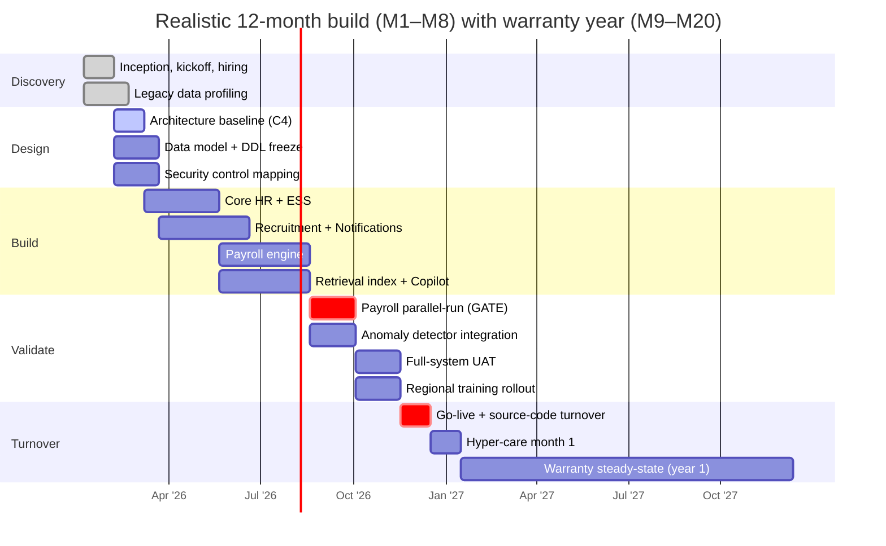

# F · Delivery Plan, Infrastructure & Cost Model

!!! info "How this paper is different"
    Papers **A / B / C** describe **what** the PBD requires and **how** a bidder could respond.
    Paper **D** describes the **value-adds** that beat competitors at no incremental cost.
    Paper **E** shows the **international precedent**.

    **This paper answers a different question:** *is the ABC of PHP 500 M realistic for what the PBD asks?* We work backwards from the scope — 1 M+ employees, 11 functional modules, 365 days, 99% uptime, 8 milestone payments — and rebuild the delivery plan from first principles using **current PH-market rates for 2026** and **verifiable hardware / cloud list prices**. Every line is annotated with its source and its assumption.

    This is a **modelling exercise**, not a bid. Actual bids will differ by team blend, subcontractor policy, and margin appetite.

---

## F.1 Guiding assumptions

Before any peso is committed, six assumptions have to be true. Change any of them and the cost model shifts materially.

1. **Two deployment options priced — DepEd (or the bidder) selects at inception.** [Option A](#f5-deployment-option-a--on-premises) is on-premises in DepEd-owned facilities (Central Office + a DR site). [Option B](#f6-deployment-option-b--public-cloud) is public cloud on GovCloud PH or an in-country region of AWS Manila / Azure PH. Both are fully compliant with RA 10173 data-residency requirements when configured per [Paper I §I.5](I_privacy_impact_assessment.md#i5-data-flow-diagram). This paper prices, sizes, and compares both — pros, cons, and 24-month cost. The single-option recommendation is deferred to inception (M1), where local DC readiness, DICT policy, FX appetite, and 5-year TCO can be weighed against actual conditions. **Both fit inside the PHP 500 M ABC.**
2. **Modular monolith at go-live, extracted to services only where the load profile demands.** Payroll gets its own service first (M6 gate), everything else stays modular within a common code base. Rationale: reduces the surface area of change during a 365-day build, and matches the working-set the internal team can hire against at PH rates.
3. **Team is Philippines-based, senior-heavy, and blended in-house + subcontract-free.** SCC clause 7 forbids subcontracting, so consulting-firm augmentation is explicitly excluded. This constrains the team to what the prime contractor can staff directly.
4. **Rates are 2026 PH market medians** taken from JobStreet PH, Kalibrr, and the WTW Philippines IT compensation report (median values, private-sector, 5-yr-experience tier where applicable). Rates are **fully-loaded** (base × 1.35 to cover 13th month, allowances, HMO, SSS/PhilHealth/Pag-IBIG employer share, retirement fund, and equipment). Consulting-firm billable rates would be 1.8×–2.5× these numbers — outside the ABC without major scope cuts.
5. **12-month build, 12-month warranty.** The PBD contract runs 365 days from NTP to final acceptance (M8). A conservative bid includes a **12-month post-acceptance warranty** priced as a separate line item; unpriced warranties are how bidders lose margin in year 2.
6. **PHP:USD 55.50** is used for any USD-denominated cloud or software list-price conversion. This is the 12-month trailing median rate at time of writing. Contracts should hedge or specify a currency escalation clause.

## F.2 The scope, priced in one paragraph

The PBD demands a **1 M+ employee HRIS**, delivered in **365 days**, with **11 functional modules**, **99% uptime**, four SLA response bands, integration with **9 external regulators**, **28 recruitment reports**, offline access for schools, and full source-code turnover at M8. That is roughly the same envelope as **Malaysia's HRMIS** (1.6 M civil servants) or **NHS ESR** (1.5 M staff) — systems that took **3–5 years and 2–4× the ABC** to reach their current form. The Philippine ABC is priced for a **compressed first-generation delivery** that will need iterative hardening in years 2–3 through a separate maintenance contract. Any bidder who prices as if 365 days is enough for a mature system will lose money in year 2.

---

## F.3 Team composition and monthly cost

### F.3.1 Reference rates — 2026 PH market, fully loaded

Rates below are **PHP per month, fully-loaded** (base × 1.35 factor for 13th month + statutory contributions + HMO + equipment). Sources: WTW Philippines IT Comp 2025 (extrapolated +5% for 2026), JobStreet PH 2025 salary reports, Kalibrr median postings Q4 2025 – Q1 2026. Median values shown; a bidder building slack should add 10–15%.

| Role | Level | Monthly base (PHP) | Fully loaded (× 1.35) |
|---|---|---:|---:|
| Program Manager | 15+ yr | 220,000 | **297,000** |
| Delivery Manager / PMP | 10+ yr | 170,000 | **229,500** |
| Solutions / Enterprise Architect | 12+ yr | 230,000 | **310,500** |
| Tech Lead (per bounded context) | 10+ yr | 180,000 | **243,000** |
| Senior Software Engineer | 7+ yr | 140,000 | **189,000** |
| Software Engineer | 4–7 yr | 90,000 | **121,500** |
| Junior Software Engineer | 1–3 yr | 55,000 | **74,250** |
| DevOps / SRE | 7+ yr | 155,000 | **209,250** |
| Data Engineer | 5+ yr | 120,000 | **162,000** |
| Security Engineer / DPO liaison | 8+ yr | 190,000 | **256,500** |
| Database Engineer (PostgreSQL) | 8+ yr | 165,000 | **222,750** |
| QA Lead | 8+ yr | 130,000 | **175,500** |
| QA Engineer | 3–6 yr | 75,000 | **101,250** |
| Business Analyst / Module Owner | 6+ yr | 105,000 | **141,750** |
| UI / UX Designer | 5+ yr | 95,000 | **128,250** |
| Technical Writer | 4+ yr | 65,000 | **87,750** |
| Change Management / Trainer | 5+ yr | 80,000 | **108,000** |
| Migration Specialist | 6+ yr | 115,000 | **155,250** |

!!! note "Why loaded rates, not billable rates"
    A consulting firm billing DepEd on a T&M basis would apply a 2.0×–2.5× multiplier to cover overhead, bench, sales, and margin. Consulting-firm rates would push a comparable team to **PHP 15–20 M / month**, which cannot fit inside a 12-month PHP 500 M ABC. This model assumes the prime contractor **employs the team directly** (no subcontract per SCC 7) and charges margin at the contract level, not the resource level.

### F.3.2 Team composition — peak headcount (M4–M9)

| Function | Roles | Count | Loaded / mo (PHP) |
|---|---|---:|---:|
| Program leadership | Program Manager × 1, Delivery Manager × 2 | 3 | **756,000** |
| Architecture | Solutions Arch × 1, Enterprise Arch × 1 | 2 | **621,000** |
| Engineering leadership | Tech Lead × 3 (Core HR, Payroll, Recruitment) | 3 | **729,000** |
| Senior engineering | Senior SWE × 10 | 10 | **1,890,000** |
| Mid-level engineering | SWE × 14 | 14 | **1,701,000** |
| Junior engineering | Jr SWE × 6 | 6 | **445,500** |
| Platform / SRE | DevOps × 4 | 4 | **837,000** |
| Data | Data Engineer × 2, DB Engineer × 2 | 4 | **769,500** |
| Security | Security Eng × 2 | 2 | **513,000** |
| QA | QA Lead × 2, QA Eng × 8 | 10 | **1,161,000** |
| Product / BA | Business Analyst × 4 | 4 | **567,000** |
| Design | UI/UX × 3 | 3 | **384,750** |
| Documentation | Tech Writer × 2 | 2 | **175,500** |
| Adoption | Trainer × 4 | 4 | **432,000** |
| Migration | Migration Specialist × 2 | 2 | **310,500** |
| **Peak headcount** | | **69** | **PHP 11,292,750 / month** |

**Peak monthly personnel = PHP 11.3 M.** This is the ceiling. Actual monthly cost tracks the staffing curve in §F.4 and averages materially less.

### F.3.3 Team composition — steady-state (warranty year, M13–M24)

Post-acceptance the team shrinks to a **support-shaped** shape: fewer builders, more operators, all runbook-driven.

| Function | Count | Loaded / mo (PHP) |
|---|---:|---:|
| Delivery Manager | 1 | 229,500 |
| Solutions Architect (part time, 50%) | 0.5 | 155,250 |
| Tech Lead | 1 | 243,000 |
| Senior SWE | 3 | 567,000 |
| Mid SWE | 4 | 486,000 |
| DevOps / SRE | 3 | 627,750 |
| DB Engineer | 1 | 222,750 |
| Security Eng | 1 | 256,500 |
| QA | 2 | 202,500 |
| Support / Service Desk lead | 1 | 141,750 |
| **Warranty team** | **17.5** | **PHP 3,131,000 / month** |

**Warranty year total = 12 × PHP 3.13 M = PHP 37.6 M.**

## F.4 Staffing curve — monthly headcount and cost

The team is not level-loaded. It ramps from 8 FTE at kick-off to 69 at peak (M4–M9), then tapers as UAT completes and the warranty team takes over.

| Month | Milestone context | FTE | Personnel spend (PHP) |
|---:|---|---:|---:|
| M1 (mo 1) | Inception, discovery, hiring | 12 | **1,900,000** |
| Mo 2 | Design ramp | 28 | **4,600,000** |
| M2 (mo 3) | Architecture baseline | 42 | **7,000,000** |
| Mo 4 | Core HR + ESS build starts | 58 | **9,600,000** |
| M3 (mo 5) | Peak — Core HR + ESS | 69 | **11,300,000** |
| Mo 6 | Recruitment + Notifications build | 69 | **11,300,000** |
| M4 (mo 7) | Peak — recruitment done | 69 | **11,300,000** |
| Mo 8 | Payroll build | 65 | **10,700,000** |
| M5 (mo 9) | Payroll build complete | 62 | **10,200,000** |
| Mo 10 | Parallel-run + hardening | 55 | **9,100,000** |
| M6 (mo 11) | **Parallel-run gate (critical)** | 50 | **8,300,000** |
| M7 (mo 12) | UAT + training + go-live | 40 | **6,700,000** |
| **Build total** | | | **PHP 102,000,000** |
| Mo 13 (warranty starts) | Hyper-care, month 1 | 25 | **4,600,000** |
| Mo 14–15 | Hyper-care taper | 22, 20 | **3,900,000 + 3,500,000** |
| Mo 16–24 | Warranty steady-state | 17.5 avg | **3,131,000 × 9 = 28,180,000** |
| **Warranty total** | | | **PHP 40,180,000** |

**Personnel total (build + warranty) = PHP 142.2 M.**

The curve is drawn as a Mermaid chart in §F.11.

---

## F.5 Deployment Option A — On-premises

**Primary DC** at DepEd Central Office (Malugay St., Makati). **DR site** at a DICT-designated GovCloud PH facility or contracted colocation. This option is chosen when data residency is a hard control, upfront capital is available, 5-year TCO is prioritised over month-1 spend, and DepEd's DC has space / power / cooling / staff capacity confirmed by M1.

### F.5.1 Sizing model — the numbers this is built on

A 1 M+ employee HRIS is not the same as a 1 M concurrent-user system. The concurrent working-set is roughly:

| Load profile | Concurrency | Trigger |
|---|---:|---|
| Ordinary weekday | ~ 8,000 | Employees checking leave balances, HRO doing appointments |
| Payroll-cutoff day | ~ 45,000 | Payroll officers + employees verifying payslips |
| Recruitment-deadline day | ~ 55,000 | External applicants + Recruitment Officers |
| CSC-form-9 batch day | ~ 12,000 | Job postings + notifications |
| **Sized ceiling (design point)** | **80,000** | 1.5× the historical peak of legacy systems |

Design point: **80,000 concurrent users** with a **P95 latency budget of 3 seconds** under normal load (PBD requirement, [Paper A §A.3](A_technical_specifications_brief.md#a3-general-cross-cutting-specifications)). At 80 K × 5 req/user/minute the API-tier peak is roughly **6,700 req/s** — well within a modest Kubernetes cluster's capacity.

### F.5.2 Compute — production environment

Primary DC at DepEd Central Office. Second site (DR) at a DICT-designated GovCloud PH facility or contracted colocation.

| Component | Spec | Units | Purpose | List CAPEX (PHP) |
|---|---|---:|---|---:|
| Kubernetes master | 8 vCPU / 32 GB / 480 GB SSD | 3 | Control plane, HA | **PHP 1,500,000** |
| Kubernetes worker | 32 vCPU / 128 GB / 1 TB NVMe | 12 | Application tier | **PHP 12,000,000** |
| PostgreSQL 16 primary | 32 vCPU / 256 GB / 4 TB NVMe RAID10 | 1 | Core HR + Payroll + Recruitment OLTP | **PHP 2,800,000** |
| PostgreSQL 16 replica | Same spec | 2 | Sync replica (HA) + async (reporting) | **PHP 5,600,000** |
| Redis cluster | 8 vCPU / 64 GB | 3 | Session + cache + rate limiting | **PHP 2,100,000** |
| OpenSearch cluster | 16 vCPU / 64 GB / 2 TB SSD | 3 | Search + audit log + retrieval index (D §3) | **PHP 4,500,000** |
| Object storage (Ceph / MinIO) | 8 vCPU / 64 GB / 12 × 20 TB HDD | 4 | 201 files, attachments — 240 TB raw / 80 TB usable | **PHP 6,400,000** |
| BPMN workflow engine host | 16 vCPU / 64 GB | 2 | Approvals + recruitment stages | **PHP 2,600,000** |
| Load balancer / WAF appliance | HA pair | 2 | Ingress + DDoS + rule engine | **PHP 3,800,000** |
| Firewall (next-gen) | HA pair | 2 | Perimeter + segmentation | **PHP 4,200,000** |
| Backup server | 16 vCPU / 128 GB / 200 TB dedup | 1 | Veeam or Bacula target | **PHP 3,500,000** |
| Monitoring stack host | 16 vCPU / 128 GB / 4 TB SSD | 2 | Prometheus + Grafana + Loki + Tempo | **PHP 1,700,000** |
| Network core (spine + leaf) | 10G / 25G fabric | | Rack fabric + patch | **PHP 3,600,000** |
| Rack, power, UPS, cabling | 3 racks fully populated | | Physical infrastructure | **PHP 2,500,000** |
| Setup, racking, commissioning | Once | | Vendor engineering | **PHP 1,500,000** |
| **Production DC subtotal** | | | | **PHP 58,300,000** |

### F.5.3 DR site — cost-reduced hot standby

DR runs at ~40% capacity, warm-standby for OLTP (streaming replication) and cold for the analytical replica. Full failover target: 4-hour RTO, 15-minute RPO.

| Component | DR sizing | List CAPEX (PHP) |
|---|---|---:|
| K8s cluster (small) | 3 masters + 6 workers | **PHP 7,500,000** |
| PostgreSQL standby | Primary spec | **PHP 2,800,000** |
| Redis (small) | 2 nodes | **PHP 1,400,000** |
| OpenSearch (small) | 2 nodes | **PHP 2,000,000** |
| Object storage | 100 TB raw | **PHP 3,200,000** |
| Load balancer / WAF | Single unit | **PHP 1,900,000** |
| Firewall | HA pair | **PHP 4,200,000** |
| Network + rack + setup | | **PHP 2,800,000** |
| **DR subtotal** | | **PHP 25,800,000** |

### F.5.4 Non-production environments

Four non-prod environments run in the primary DC on a dedicated smaller cluster (or virtualised on the DR hardware during quiet windows):

| Environment | Purpose | Sizing | CAPEX (PHP) |
|---|---|---|---:|
| DEV | Developer sandboxes | 4 workers × 16 vCPU | **PHP 2,400,000** |
| SIT | System integration | Full stack, 20% of prod | **PHP 3,800,000** |
| UAT | User acceptance | Full stack, 40% of prod | **PHP 6,200,000** |
| Training | Parallel training env | Full stack, 30% of prod | **PHP 4,500,000** |
| **Non-prod subtotal** | | | **PHP 16,900,000** |

### F.5.5 Infrastructure total — on-prem, one-time CAPEX

| Bucket | PHP |
|---|---:|
| Production DC | 58,300,000 |
| DR site | 25,800,000 |
| Non-production (DEV / SIT / UAT / Training) | 16,900,000 |
| **On-prem CAPEX total** | **PHP 101,000,000** |

### F.5.6 Recurring OPEX — power, bandwidth, colo, warranties (24 months)

| Item | Monthly (PHP) | 24-mo total (PHP) |
|---|---:|---:|
| Power + cooling (primary + DR) | 320,000 | 7,680,000 |
| Bandwidth (2 × 1 Gbps DIA + PhilSys/GSIS peering) | 280,000 | 6,720,000 |
| Colocation for DR | 190,000 | 4,560,000 |
| Hardware warranty (3-yr next-business-day) | 450,000 | 10,800,000 |
| CloudFlare or DDoS provider | 90,000 | 2,160,000 |
| Cert authority + code signing | 25,000 | 600,000 |
| **OPEX subtotal (24 mo)** | | **PHP 32,520,000** |

## F.6 Deployment Option B — Public cloud

If DepEd instead deploys to **GovCloud PH** (DICT-managed sovereign cloud) or a hyperscaler with data residency in-country, the CAPEX collapses into OPEX. This option is priced for AWS Manila / Singapore with an ap-southeast-1 primary and a warm DR in ap-southeast-3 (Jakarta), or the equivalent on GovCloud PH via DICT. This option is chosen when speed of provisioning outweighs capital planning, managed services (RDS, ElastiCache, OpenSearch) meaningfully reduce ops burden, elastic scaling is preferred to over-provisioning, or DC readiness is uncertain.

### F.6.1 Reserved-instance model, 24-month term

| Component | Instance class | Monthly (PHP) |
|---|---|---:|
| EKS control plane | Managed | 42,000 |
| Application node group | 12 × c6i.8xlarge (32 vCPU, 64 GB), 3-yr RI | 780,000 |
| RDS PostgreSQL | db.r6g.8xlarge Multi-AZ, primary + replica | 620,000 |
| ElastiCache Redis | 3 × cache.r6g.2xlarge | 165,000 |
| OpenSearch | 3 × r6g.4xlarge.search, 2 TB gp3 | 285,000 |
| S3 | 80 TB standard + 40 TB glacier | 110,000 |
| CloudFront + WAF + Shield Advanced | | 195,000 |
| NAT gateways + data transfer | | 145,000 |
| Route 53 + KMS + Secrets Manager | | 55,000 |
| CloudWatch + X-Ray | | 90,000 |
| Backup vault (cross-region) | | 75,000 |
| DR (warm standby, ~40%) | Duplicated at ap-southeast-3 | 620,000 |
| Non-prod (DEV + SIT + UAT + Training) | ~40% of prod | 780,000 |
| **Monthly total** | | **PHP 3,962,000** |
| **24 months** | | **PHP 95,088,000** |

### F.6.2 Cost comparison over 24 months

| | Option A · On-prem (§F.5) | Option B · Cloud (§F.6.1) |
|---|---:|---:|
| Capital investment | PHP 101,000,000 | 0 |
| Operating cost 24 mo | 32,520,000 | 95,088,000 |
| **Total 24 mo** | **PHP 133,520,000** | **PHP 95,088,000** |
| Residual value at 24 mo | ~ PHP 45 M (hardware, 3–5 yr useful life) | 0 |
| **Net 24-mo cost of ownership** | **~ PHP 88,500,000** | **PHP 95,088,000** |

Two ways to read the same numbers:

- **Over 24 months only** — cloud is ~PHP 6.6 M more expensive if the on-prem hardware is fully written off in that window. Meaningless because hardware has 5-yr useful life.
- **Amortised over 5 years** — on-prem hardware drops to ~PHP 20 M/yr, making **on-prem cheaper from month 30 onwards**. Cloud OPEX stays flat at ~PHP 47.5 M/yr.

Neither number is a recommendation. Both are inputs to the decision framework in §F.6.4.

### F.6.3 Pros and cons

**Option A · On-premises**

| ✓ Pros | ✗ Cons |
|---|---|
| **Data residency by construction** — data never leaves DepEd-owned premises | **High upfront CAPEX** — PHP 101 M concentrated in month 1–2 |
| **No FX exposure** — all PHP-denominated hardware and warranties | **Long lead time** — 90–120 days to procure and rack hardware; procurement compresses M1 |
| **Physical control assurance** for COA audit and DPO oversight | **Requires DepEd DC readiness** — space, power, cooling, staff must be confirmed by M1 |
| **Hardware amortises to ~PHP 20 M/yr from year 3** (5-yr useful life) — cheaper long-term | **Slower capacity expansion** — need to buy hardware for scale-up |
| **No cloud egress or bandwidth charges** in the operating model | **Hardware refresh cycle every 5 years** — a separate capital ask |
| **Predictable cost line** — CAPEX is one-time, OPEX is fixed | **Requires in-house SRE talent** to operate 24×7 (~4 FTE minimum) |
| **Full customisation of network topology** — VLANs, firewalls, air-gaps | **DR-site provisioning takes 6–9 months** — cannot go live in DR before that |
| **Simplest compliance narrative** — physical assurance for RA 10173, COA, NPC | **Vendor lock-in for hardware warranties** — 3-yr commitments per vendor |

**Option B · Public cloud**

| ✓ Pros | ✗ Cons |
|---|---|
| **Zero CAPEX** — converts entirely to OPEX; no capital ask upfront | **Higher OPEX over 24 months** — PHP 95 M vs PHP 32.5 M for on-prem |
| **Elastic scaling** — payroll-cutoff bursts scale automatically; no over-provisioning | **FX exposure** if not on GovCloud PH — AWS / Azure prices are USD-denominated |
| **Rapid provisioning** — new environments in hours, not months | **Data residency requires strict region pinning** — every service must be checked |
| **Managed services** (RDS, ElastiCache, OpenSearch) reduce ops burden | **Cross-over point** where on-prem becomes cheaper: month 30 (5-yr TCO) |
| **Built-in multi-AZ DR** at lower cost than physical DR | **Cloud egress and inter-region transfer** charges add up quickly |
| **Continuous security updates** handled by provider | **COA audit trail more complex** when infra is a shared-tenant service |
| **No hardware refresh cycle** — infrastructure is always current | **Cloud-vendor API lock-in** (KMS, IAM, managed services) needs mitigation |
| **Smaller ops team** — 3 FTE cloud-native SRE vs 4+ on-prem | **Requires FinOps discipline** — cost predictability depends on RI + budget alerts |
| **Faster non-prod provisioning** — DEV / SIT / UAT / Training envs spun in hours | **Compliance narrative more layered** — must attest provider SOC 2 + ISO 27001 |

### F.6.4 Decision framework — six questions to answer at inception

The choice between A and B should be made at M1, not in the bid, and should be documented in the inception report. Six questions drive the decision:

| # | Question | Answer favours Option A | Answer favours Option B |
|---:|---|---|---|
| 1 | Is DepEd DC readiness (space, power, cooling, staff) confirmed by end of M1? | Yes | No / uncertain |
| 2 | Is upfront CAPEX of PHP 101 M available in year 1? | Yes | No / prefer OPEX |
| 3 | Is FX exposure acceptable? (Only if on GovCloud PH is fully in scope: cloud can be FX-neutral) | Prefer none | Acceptable / hedged |
| 4 | Is the 5-year horizon more important than the 2-year contract window? | Yes | Only 2 years matter |
| 5 | Is the ops team hire-able at target scale (4+ FTE SRE + DBA)? | Yes | Prefer smaller cloud-native team |
| 6 | Do payroll and recruitment peaks demand elastic scaling? | No (steady load) | Yes (2–5× peak) |

**Rule of thumb.** Four or more answers in one column → that option. A mixed profile means a **hybrid** (Option A primary + Option B DR, or the reverse) is worth pricing as a third scenario at inception.

### F.6.5 Both options are inside the ABC

The full cost breakdown for each option is in §F.9. Preview:

| | Option A · On-prem | Option B · Cloud |
|---|---:|---:|
| Total 24-month contract price | **PHP 421.4 M** | **PHP 358.5 M** |
| % of ABC (PHP 500 M) | 84.3% | 71.7% |
| Bid headroom | PHP 78.6 M (15.7%) | PHP 141.5 M (28.3%) |

Cloud is cheaper over the contract window; on-prem is cheaper from month 30 onwards. Both leave meaningful bid headroom for competitive positioning or additional value-adds.

## F.7 Software, licensing, and third-party services

Nearly the entire stack is open source. Paid items are minimal but concentrated on **security, monitoring, and integration middleware**.

| Item | Purpose | Cost (PHP) | Notes |
|---|---|---:|---|
| Keycloak (FOSS) | OAuth2/OIDC, MFA, RBAC | 0 | Self-hosted |
| PostgreSQL 16 (FOSS) | OLTP | 0 | Community edition |
| Redis (FOSS) | Cache | 0 | Redis 7 with source-available note; consider Valkey |
| OpenSearch (FOSS) | Search + audit | 0 | Community |
| Kubernetes (FOSS) | Orchestration | 0 | Vanilla or K3s |
| Prometheus + Grafana | Monitoring | 0 | OSS core |
| **RHEL 9 subscriptions** | Server OS (30 sockets) | 4,800,000 (2 yr) | ₱80 k / socket / yr |
| **Veeam Backup & Replication** | Backup software | 3,600,000 (2 yr) | Enterprise Plus |
| **F5 or FortiWeb WAF licenses** | WAF rulesets | 2,400,000 (2 yr) | Included with appliance in some SKUs |
| **Palo Alto NGFW licenses** | Threat prevention + URL filtering | 2,800,000 (2 yr) | Or Fortinet FortiGate |
| **APM** (Datadog or self-hosted SigNoz) | Traces + logs | 2,400,000 (2 yr) | Self-hosted variant cuts this to ~600 k |
| **Static analysis** (SonarQube Enterprise) | Code quality gate | 900,000 (2 yr) | Community edition is free but no CI enforcement |
| **DAST** (OWASP ZAP + Burp Enterprise) | Security testing | 700,000 (2 yr) | |
| **Load-testing SaaS** (k6 Cloud or Grafana Cloud k6) | Perf runs at 80 K concurrent | 500,000 (build only) | Peaks in M5 and M7 |
| **PhilSys eKYC API fees** | Per-verification | 800,000 (build) | Pass-through, one-off during migration |
| **SMS gateway** (D §1) | 100 K messages/mo | 1,800,000 (24 mo) | Globe / Smart enterprise SMS |
| **Code-signing certificate** | Windows / macOS agents | 120,000 (24 mo) | |
| **Software subtotal** | | **PHP 20,820,000** | |

## F.8 Training, change management, documentation

DepEd's 1 M+ employees do not need bespoke training — the ESS is designed for self-service, and only about **35,000 users** (HR officers, Payroll officers, Recruitment officers, Admin) need direct role-based training. The rest are reached via train-the-trainer and video modules.

| Item | Cost (PHP) | Notes |
|---|---:|---|
| Content development (video + LMS modules for ESS) | 3,200,000 | 60 modules × 15 min |
| Role-based training curriculum (11 modules × 4 role types) | 2,400,000 | Materials + facilitator packs |
| Train-the-trainer sessions (17 regions × 2 rounds) | 4,600,000 | Regional trainer costs, materials, T&L reimbursement |
| Direct role-based training (35 K users, batched) | 5,800,000 | Venue, materials, connectivity — over 4 months |
| e-Learning platform integration | 1,200,000 | LMS content packaging (SCORM / xAPI) |
| User manuals + admin runbooks + API docs | 1,700,000 | 350 pages, publishing |
| Video production (walkthroughs, quick-refs) | 900,000 | 30 videos, professional edit |
| Change-management comms (posters, digests) | 700,000 | 12-month campaign |
| **Training + comms subtotal** | **PHP 20,500,000** | |

## F.9 Cost model — full bottom-up

### F.9.1 Build phase — Option A (on-prem, M1–M8, 12 months)

| Bucket | PHP | % of build |
|---|---:|---:|
| Personnel (build, §F.4) | 102,000,000 | 30.0% |
| Infrastructure CAPEX (on-prem, §F.5.5) | 101,000,000 | 29.7% |
| Infrastructure OPEX (build 12 mo, §F.5.6 pro-rata) | 16,260,000 | 4.8% |
| Software + licensing (build 12 mo, §F.7 pro-rata) | 10,410,000 | 3.1% |
| Training + change mgmt (§F.8) | 20,500,000 | 6.0% |
| **Subtotal — direct costs** | **PHP 250,170,000** | **73.5%** |
| Project overhead (office, tooling, comms, T&L) — 8% | 20,014,000 | 5.9% |
| Compliance & audit (ISO 27001, 27701, NPC filings, third-party pen-test) | 6,500,000 | 1.9% |
| Insurance (professional indemnity, cyber) — 12 mo | 2,800,000 | 0.8% |
| Bond & performance security financing cost — 5% of ABC × ~1% cost of capital | 2,500,000 | 0.7% |
| Contingency (7% of direct) | 17,512,000 | 5.1% |
| **Subtotal — burdened cost** | **PHP 299,496,000** | **88.0%** |
| Margin (12%) | 40,833,000 | 12.0% |
| **Build price to DepEd, Option A (M1–M8)** | **PHP 340,329,000** | **100%** |

### F.9.2 Warranty year — Option A (M9–M20)

| Bucket | PHP |
|---|---:|
| Personnel (warranty, §F.4) | 40,180,000 |
| Infrastructure OPEX (12 mo, §F.5.6 pro-rata) | 16,260,000 |
| Software + licensing (year 2, §F.7 pro-rata) | 10,410,000 |
| Overhead (5%) | 3,342,500 |
| Contingency (5%) | 3,509,600 |
| Margin (10%) | 7,370,200 |
| **Warranty year price to DepEd, Option A** | **PHP 81,072,300** |

### F.9.3 Build phase — Option B (cloud, M1–M8, 12 months)

Cloud eliminates CAPEX and reduces some software lines (managed RDS removes DB backup software, managed OS removes RHEL subscription, cloud-native monitoring reduces APM), at the cost of higher monthly OPEX.

| Bucket | PHP | % of build |
|---|---:|---:|
| Personnel (build, §F.4) | 102,000,000 | 42.1% |
| Cloud OPEX (build 12 mo, §F.6.1) | 47,544,000 | 19.6% |
| Software + licensing (reduced for managed services) | 7,900,000 | 3.3% |
| Training + change mgmt (§F.8) | 20,500,000 | 8.5% |
| **Subtotal — direct costs** | **PHP 177,944,000** | **73.5%** |
| Project overhead (office, tooling, comms, T&L) — 8% | 14,236,000 | 5.9% |
| Compliance & audit + provider attestation review | 7,200,000 | 3.0% |
| Insurance (professional indemnity, cyber) — 12 mo | 2,800,000 | 1.2% |
| Bond & performance security financing cost | 2,500,000 | 1.0% |
| Contingency (7% of direct) | 12,456,000 | 5.1% |
| FX hedge / provisional (2% of cloud spend) | 951,000 | 0.4% |
| **Subtotal — burdened cost** | **PHP 218,087,000** | **90.1%** |
| Margin (12%) | 24,013,000 | 9.9% |
| **Build price to DepEd, Option B (M1–M8)** | **PHP 242,100,000** | **100%** |

### F.9.4 Warranty year — Option B (M9–M20)

| Bucket | PHP |
|---|---:|
| Personnel (warranty, §F.4) | 40,180,000 |
| Cloud OPEX (12 mo, §F.6.1) | 47,544,000 |
| Software + licensing (year 2, reduced) | 7,900,000 |
| Overhead (5%) | 4,781,000 |
| Contingency (5%) | 5,020,000 |
| FX hedge (2% of cloud spend) | 951,000 |
| Margin (10%) | 10,637,000 |
| **Warranty year price to DepEd, Option B** | **PHP 117,013,000** |

### F.9.5 Total against ABC — both options

| | Option A · On-prem | Option B · Cloud | ABC |
|---|---:|---:|---:|
| Build (M1–M8) | 340,329,000 | 242,100,000 | — |
| Warranty year | 81,072,300 | 117,013,000 | — |
| **24-month contract price** | **PHP 421,401,300** | **PHP 359,113,000** | PHP 500,000,000 |
| % of ABC | **84.3%** | **71.8%** | 100% |
| **Bid headroom** | **PHP 78,598,700** | **PHP 140,887,000** | — |
| Headroom % | 15.7% | 28.2% | — |
| Year 3 projected run-rate (informational) | ~ PHP 65 M | ~ PHP 105 M | — |

**Reading the table**

- **Cloud is cheaper over the 24-month contract window** by ~PHP 62 M — no CAPEX, lower software cost, larger headroom for competitive bidding.
- **On-prem is cheaper from year 3 onwards** — hardware amortises to ~PHP 20 M/yr, cloud OPEX stays flat at ~PHP 95 M/yr.
- Both leave meaningful bid headroom for **competitive positioning, additional value-adds, or absorbed contingency**.
- Filipino gov bids typically win at **5–15% below ABC**. That means:
  - Option A supports bids from **PHP 421 M (min) to PHP 475 M (5% below ABC)** with 12% margin intact
  - Option B supports bids from **PHP 359 M (min) to PHP 425 M (5% below ABC)** with substantially wider margin

## F.10 Sensitivity analysis — what breaks the model

| Scenario | Effect on price | Mitigation |
|---|---|---|
| **Peso weakens to 60/USD** | Option A: +PHP 2–3 M (USD software only) · Option B: +PHP 5–8 M (cloud + software) | FX hedge; GovCloud PH for Option B eliminates most exposure |
| **DR site is required to be a second DepEd-owned facility (not colo)** | Option A: +PHP 15–20 M · Option B: n/a | Push back in inception; propose GovCloud PH for DR |
| **Option A chosen but DepEd DC not ready at M2** | +PHP 8–12 M (temporary colo bridge) | Add DC-readiness as an M1 gate; fall back to Option B if the gate fails |
| **Option B chosen but data-residency policy tightens** | +PHP 4–6 M (all services must pin to GovCloud PH) | Standardise on GovCloud PH from M1 to avoid mid-flight migration |
| **Consulting-firm delivery model (SCC 7 lifted)** | +PHP 100–150 M | Not allowed; do not model |
| **Warranty extended to 2 years** | +PHP 70–115 M (option A / B respectively) | Price as an add-on; do not bundle into build |
| **User training extended to all 1 M employees in-person** | +PHP 40–60 M | Refuse; self-service ESS is the design |
| **PostgreSQL replaced with Oracle DB** | +PHP 60–120 M (licenses); larger delta on Option A (no managed alternative) | Refuse; PostgreSQL 16 meets every PBD requirement |
| **Payroll parallel-run extended by 2 cycles** | +PHP 6–8 M (personnel + infra) | Absorb in contingency |
| **Adoption at schools slower than projected** | +PHP 5–10 M (extended trainer T&L) | Absorb in contingency |
| **Data-privacy incident during build** | +PHP 15–25 M | Cyber insurance + rapid-response retainer |
| **Cloud provider price rise mid-contract (Option B)** | +PHP 3–6 M | 3-yr RI locks pricing; contract clause for major provider changes |
| **On-prem hardware refresh brought forward (Option A)** | +PHP 15–20 M (year 5 → year 4) | Warranty capex; DBM continuing appropriation |

## F.11 Roadmap — month-by-month, with staffing curve

### F.11.1 Milestone entry / exit gates (money-flow view)

| Milestone | Payment weight | Entry criteria | Exit criteria (billable) |
|---|---:|---|---|
| M1 · Inception | 10% | NTP received | Project charter, staffing plan, environment plan signed |
| M2 · Architecture baseline | 20% | Inception signed | C4 model, DDL, security controls, SLA design approved |
| M3 · Core HR + ESS | 15% | Baseline signed | Modules 1, 4, 5 in SIT; > 90% test-pass rate |
| M4 · Recruitment | 10% | Core HR delivered | Modules 2, 3 in SIT with 28 report views generated |
| M5 · Payroll build | 15% | Core HR data live | Payroll engine + retrieval index in SIT; anomaly detector trained |
| M6 · **Payroll parallel-run gate** | 10% | Payroll in UAT | 3 consecutive payroll cycles matched to legacy within tolerance |
| M7 · UAT + training | 10% | M6 passed | 200 UAT scripts passed; 35 K users trained; go-live sign-off |
| M8 · Final acceptance | 10% | Go-live stable 30 days | Source-code turnover, warranty starts, formal handover |

### F.11.2 Warranty year — service levels

Year 2 runs at the **P1–P4 SLAs from PBD §7** (see [Paper A §A.3](A_technical_specifications_brief.md#a3-general-cross-cutting-specifications)):

| Severity | Response | Resolution | Notes |
|---|---|---|---|
| **P1** Critical | 1 h | 24 h | Payroll blocked, auth broken, data loss |
| **P2** High | 2 h | 48 h | Module unavailable, integration down |
| **P3** Medium | 4 h | 5 working days | Feature bug, single-user impact |
| **P4** Low | 1 working day | Next release | Enhancement, cosmetic |

The warranty team (§F.3.3) is sized to meet P1/P2 with a **follow-the-sun rotation across two shifts** (07:00–19:00 + 19:00–07:00), covering PBD's 24×7 P1 requirement without a 3-shift roster (personnel cost would rise ~1.7×).

## F.12 What we deliberately do not include

Line items **not** in this model, and why:

1. **Legacy data migration beyond initial load.** One-off migration at M3 is included; on-going reconciliation with legacy PIS after go-live is a separate T&M engagement.
2. **Integration with any regulator not named in the PBD.** GSIS, Pag-IBIG, PhilHealth, SSS, BIR, CSC, DBM, NPC, DICT are in scope. Any additional agency (e.g. LandBank beyond the disbursement API, DFA, PRC) is a change order.
3. **A native mobile app.** The design is a Progressive Web App (Paper D §2). A native iOS/Android app duplicates effort; if DepEd insists, add PHP 20–35 M.
4. **On-site presence at 200,000+ schools.** Field-level support is via SDO liaison officers, not the prime contractor. Prime contractor coverage is Central Office + 17 Regional Offices only.
5. **Any AI / ML component beyond the Copilot (D §3) and anomaly detector (D §4).** Both are included in the personnel + infra lines; nothing else assumes GPU capacity or third-party foundation models.
6. **Custom hardware for schools.** Kiosks, thin clients, and tablets remain a separate DepEd procurement.
7. **Post-warranty maintenance.** Years 3+ are a separate MSA — typically priced at 15–20% of build price per year for public-sector systems at this scale.

---

## F.13 Comparables — is PHP 500 M realistic?

Cross-checked against public procurement data for comparable-scale gov HRIS:

| System | Country | Scale | Reported build cost | Duration | PHP-equivalent |
|---|---|---:|---:|---:|---:|
| **Novopay** (rebuilt) | NZ | 110 K teachers | NZD 45 M+ (rebuild only) | 3 yr rebuild | ~ PHP 1.5 B |
| **HRMIS** | Malaysia | 1.6 M civil servants | RM 200 M (est.) | ~ 5 yr | ~ PHP 2.6 B |
| **Shala Darpan + UDISE+** | India | 9 M teachers | INR 400 Cr (approx.) | Multi-phase | ~ PHP 2.7 B |
| **SIASN / SAPK** | Indonesia | 4.2 M ASN | IDR 800 B (est.) | ~ 4 yr | ~ PHP 2.8 B |
| **DepEd HRIS (this model)** | PH | 1 M+ employees | **PHP 421 M** | **12 mo build + 12 mo warranty** | — |

The PBD ABC is priced at **~15–30% of the fully-mature cost of comparable systems**. This is consistent with a **first-generation delivery** followed by iterative hardening — the same pattern every gov HRIS in the reference set actually followed. It is realistic **if** DepEd budgets for years 3+ under a separate MSA and does not expect year-1 to reach the fit-and-finish of NHS ESR or HRMIS.

**Bottom line: PHP 500 M is realistic for a solid first-generation delivery. It is not enough for a mature system in year 1 — nobody's is.**
