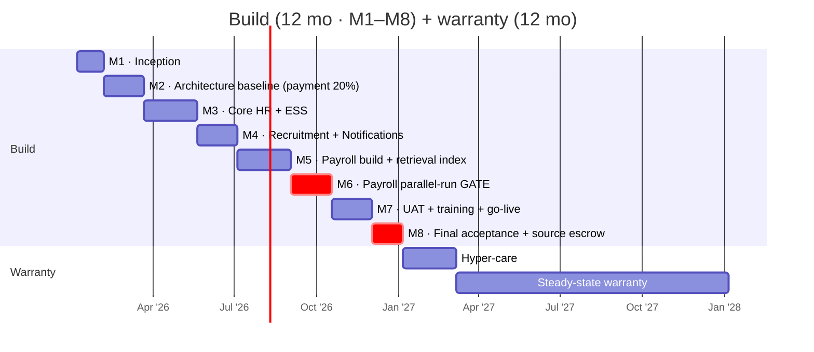

# G · Executive One-Pager

!!! info "How this paper is used"
    Papers **A / B / C / D / E / F** run 15–75 KB each. This paper is deliberately **one page** — for evaluator committee chairs, DepEd senior officials, and anyone who needs the argument in 90 seconds, not 90 minutes. Every number carries a pointer to the detailed paper.

## The bid, in one paragraph

DepEd's Human Resources Information System (project **`2026C-ICTS2-002-B5-CB-034`**) is a **1 M+ employee, 11-module** system to be delivered in **365 days** at an ABC of **PHP 500 M**. This analysis models delivery under **two deployment options** — on-premises at DepEd Central Office (**PHP 421 M**, 15.7 % headroom) or public cloud on GovCloud PH / AWS Manila (**PHP 359 M**, 28.2 % headroom). Both use the same **69-FTE peak team at 2026 PH-market rates** and both ship the same eight **value-added components** at no incremental cost. The choice between them is a decision framework at inception (M1), not a bid-time commitment.

- __The numbers__

    - **ABC** — PHP 500 M
    - **Option A · On-prem** — PHP 421 M · Headroom 15.7 %
    - **Option B · Cloud** — PHP 359 M · Headroom 28.2 %
    - **1 M+ employees** across CO / RO / SDO / District / Schools
    - **365 days** to final acceptance · **8 milestones** · **99 % uptime**
    - **P1** 1 h resp / 24 h res · **P2** 2 h / 48 h · **P3** 4 h / 5 d · **P4** 1 d / next release
    - **11 modules**, of which 3 are detailed in the TOR
    - **28 recruitment reports**, 9 regulator integrations
    - **69 FTE peak** (M3–M6), 17.5 FTE warranty year

- __The approach__

    - **Modular monolith** in PostgreSQL 16, extracted to services only where load demands (Payroll first)
    - **Two deployment options, both PBD-compliant:**
        - **Option A** — on-prem at DepEd Central Office + colo DR (PHP 101 M CAPEX)
        - **Option B** — GovCloud PH or AWS Manila (PHP 3.96 M / mo OPEX)
    - **Keycloak** for OAuth2/OIDC/MFA · **BPMN engine** for workflow · **OpenSearch** for retrieval and audit
    - **Offline-first PWA** with CRDT sync for low-connectivity schools
    - **In-house team** (SCC 7 forbids subcontracting), Filipino market rates, senior-heavy
    - **Cloud wins TCO in years 1–2**; **on-prem wins TCO from year 3+** — decision framework in F.6.4

- __The differentiators (D §1–§8)__

    1. Bilingual UI + SMS/USSD for feature-phone users
    2. Offline-first PWA with CRDT sync (zero-loss under 72-h partition)
    3. Self-hosted HR Copilot (Llama-3.1 / Qwen-2.5 in DepEd DMZ)
    4. Payroll anomaly detector at the M6 parallel-run gate
    5. Hash-chained audit ledger (Estonia X-Road pattern)
    6. Public transparency portal (Georgia PSB pattern)
    7. 10-year source escrow + community edition
    8. Teacher-to-school placement optimiser (Chile SIGE pattern)

- __The top three risks (B §15)__

    1. **Payroll cutover data loss** — mitigated by the M6 parallel-run gate + statistical anomaly detector (D §4)
    2. **Regulator-triggered rework (CSC / DBM / BIR)** — mitigated by 90-day adaptation SLA + versioned rule engine
    3. **Low-connectivity schools locked out** — mitigated by the offline PWA + CRDT sync (D §2)

## The 24-month plan

## Where to go for detail

| Question | Read |
|---|---|
| What does the PBD actually ask for? | [Paper A · Brief](A_technical_specifications_brief.md) |
| How do we answer it clause by clause? | [Paper B · Response](B_tor_response_outline.md) |
| What does the system look like? | [Paper C · Architecture](C_architecture_and_data_model.md) |
| How do we win vs. competitors? | [Paper D · Value-Adds](D_value_added.md) |
| Where's the international precedent? | [Paper E · Benchmarks](E_international_benchmarks.md) |
| Is PHP 500 M realistic? | [Paper F · Delivery & Cost](F_delivery_and_cost.md) |
| How do we move 1 M records from legacy? | [Paper H · Data Migration](H_data_migration.md) |
| How do we satisfy RA 10173 / NPC? | [Paper I · Privacy Impact Assessment](I_privacy_impact_assessment.md) |

---

Prepared as an independent analysis. Not affiliated with DepEd. Every figure is
verifiable in the referenced paper. Full source at
<a href="https://github.com/DennisPitallano/deped-hris-analysis">github.com/DennisPitallano/deped-hris-analysis</a>.

