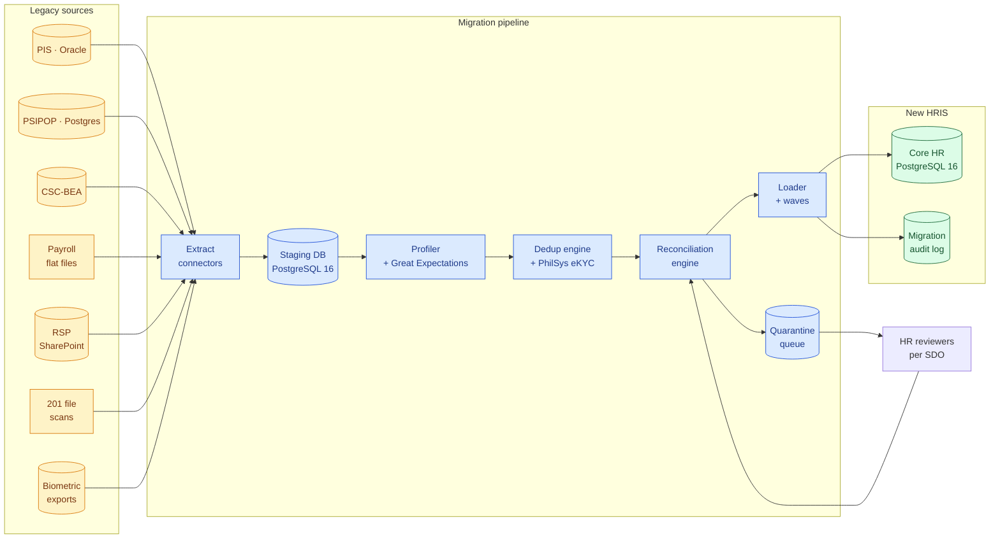

# H · Data Migration Plan

!!! danger "Why this paper exists"
    Every large government HRIS that has failed in the past 15 years — **Novopay (NZ 2012)**, **Queensland Health payroll (AU 2010)**, **UK NHS NPfIT (2011)** — failed on the same axis: **the legacy data was worse than anyone admitted, and the cutover was rushed**. This paper treats data migration as a **first-class workstream** with its own owner, its own budget line (accounted for in Paper F), and its own go / no-go gate before payroll parallel-run at M6.

## H.1 Guiding principles

1. **Migration is not an event. It is a system.** Sources continue to change during the 12-month build. The migration pipeline must run continuously from M3 onwards, not as a one-shot event at M7.
2. **No employee is migrated unless four gates pass.** Identity resolved, employment history reconstructable, mandatory fields non-null, no active disciplinary lock. Records that fail any gate go to a **quarantine queue** for HR review, never silently dropped.
3. **The legacy system stays authoritative until M6.** New HRIS is a read-replica through M5. Only after payroll parallel-run passes at M6 does the new system become authoritative for its bounded contexts.
4. **Every migrated record is traceable to a legacy source row.** A `legacy_source_ref` column exists on every table with a foreign origin. Auditability is not optional.
5. **Waves before big bang.** Migration proceeds region by region — 3 pilot SDOs first, then batched by cluster of similar SDOs. No single all-Philippines cutover.

## H.2 Sources — what we are actually pulling from

The PBD is silent on legacy sources beyond naming the incumbent PIS. Reality across DepEd is that employee data lives in a dozen systems of record, some of which are spreadsheets on personal drives.

| Source | Type | Estimated records | Data quality baseline | Owner |
|---|---|---:|---|---|
| **PIS (legacy Personnel Information System)** | Oracle DB, ~2007 vintage | ~ 900,000 employees | Moderate — canonical for teaching + related-teaching; ghost records common | ICTS-SDD |
| **PSIPOP (Plantilla / positions)** | DBM-owned Postgres | ~ 1,050,000 items | High — authoritative for plantilla items | DBM |
| **CSC-BEA position master** | CSC-owned | ~ 1,050,000 refs | High — but change lag vs PSIPOP | CSC |
| **Payroll runs, past 24 months** | Flat files + Excel | ~ 26 M line items | Variable — used to seed anomaly detector | DepEd Finance |
| **RSP (Recruitment Selection Placement) archives** | SharePoint + shared drives | ~ 180,000 postings | Low — inconsistent formats, PDFs, scans | HR (per RO) |
| **201 file scans (paper)** | Physical + partial PDFs | ~ 850,000 folders | Very low — the manual-entry backstop | HR (per school) |
| **Time & attendance (biometric exports)** | Vendor-specific CSVs | ~ 340 M records/yr | Variable | Per SDO |
| **GSIS / Pag-IBIG / PhilHealth / SSS / BIR** | External regulators | ~ 900,000 refs each | High — regulators are authoritative | External |
| **Leave ledgers** | Excel per RO | ~ 900,000 balances | Low — reconciliation gaps common | HR (per RO) |
| **PDS files (CSC standard form)** | Word / PDF / partial DB | ~ 900,000 | Moderate — self-declared, needs eKYC dedup | Employee-owned |

**Total unique canonical records to reconcile: ~ 1.0 M–1.1 M employees.**

## H.3 Target model — what we are migrating into

Target is the PostgreSQL 16 schema defined in [Paper C](C_architecture_and_data_model.md) — three bounded contexts:

- **Core HR** — `employee`, `employment_history`, `plantilla_item`, `assignment`, `education`, `eligibility`, `training`, `leave_ledger`, `document`
- **Payroll** — populated only during the M6 parallel-run, not before
- **Recruitment** — historical postings and shortlists rebuilt from RSP archives

Every target table has:

- `legacy_source_ref` (jsonb) — pointer(s) to source rows
- `migration_wave` (int) — which cutover batch
- `migration_confidence` (enum: `verified`, `derived`, `stub`) — how much of this row we trust
- `data_quality_flags` (int[]) — bitmask of issues (see H.5)

## H.4 Expected data-quality issues (baseline profile)

Based on public audits of PIS (COA 2019, 2022, 2024) and adjacent public-sector HRIS profiling:

| Issue | Estimated affected records | Handling |
|---|---:|---|
| **Ghost employees** (in PIS, not in PSIPOP or regulator files) | 3,000 – 8,000 | Quarantine → HR verification → written off with audit trail |
| **Duplicate employees** (same person, multiple PIS IDs) | 12,000 – 25,000 | PhilSys eKYC-driven merge (D §13); manual review for non-match |
| **Missing PhilSys number** | ~ 40 % initially | Progressive enrichment via ESS on first login |
| **Missing / stale civil-status** | ~ 15 % | Employee self-service update, deadline enforced |
| **Payroll and PIS employee-ID mismatch** | ~ 8 % | ID reconciliation crosswalk table |
| **Legacy 8-bit encoding on names** | Widespread | UTF-8 normalisation with `ñ` / ligature preservation |
| **Invalid dates** (birth date > hire date, hire before agency existed) | ~ 2 % | Quarantine + HR audit |
| **Position codes not in PSIPOP master** | ~ 3 % | Escalate to DBM; provisional plantilla_item stub |
| **Assignment history discontinuities** | ~ 12 % | Reconstruct from payroll runs; flag if unrecoverable |
| **Multiple concurrent active assignments** | ~ 1.5 % | Business-rule violation; HR must resolve pre-cutover |
| **Leave-balance disputes** | ~ 6 % | Freeze legacy balance at cutover; disputes resolved in new system |
| **Documents in wrong 201 folder** | Unknowable | Reindex during scanning wave; ML-assisted OCR |

Every issue produces a **data-quality report** consumed by the HR governance team weekly during migration.

## H.5 Migration architecture

Components:

- **Extract connectors** — Airbyte or custom Python + `psycopg` for Oracle; `pypdf` + Tesseract OCR for scanned 201 files (with human-in-the-loop review).
- **Staging DB** — a dedicated PostgreSQL 16 instance mirroring the target schema plus source-tracing columns. All transformations happen here; production is never touched by raw source data.
- **Profiler** — Great Expectations + custom dbt tests. Runs daily against staging; publishes a quality dashboard.
- **Dedup engine** — deterministic PhilSys eKYC match first (highest confidence), then fuzzy match on (birthdate, mother's maiden name, first-hire date) with a 0.85 similarity threshold; ambiguous cases go to quarantine.
- **Reconciliation engine** — cross-checks staging against PSIPOP (positions), regulator files (identity), and payroll history (existence-of-life). Emits reconciliation reports per SDO.
- **Loader** — batches records into waves, writes to production, updates `migration_wave` + `migration_confidence` + `data_quality_flags`.

## H.6 Wave plan — regional rollout, not big bang

**M3 · Pilot (3 SDOs, ~20,000 employees)** — one urban (NCR), one rural (Cordillera), one geographically difficult (MIMAROPA). Purpose: validate the pipeline and quality gates on a manageable population.

**M4 · Expansion 1 (5 regions, ~250,000 employees)** — Regions with mature ICT capacity. Purpose: catch edge cases the pilot missed.

**M5 · Expansion 2 (7 regions, ~450,000 employees)** — Includes ARMM/BARMM special considerations (bilingual, multi-currency for hazard pay).

**M6 · Expansion 3 (remaining regions, ~280,000 employees)** — Final wave. All regions live in the new HRIS as a **read-replica** — legacy PIS still authoritative for payroll.

**M6 · Payroll parallel-run gate** — three consecutive payroll cycles matched to legacy within tolerance ([Paper F §F.11.1](F_delivery_and_cost.md#f111-milestone-entry--exit-gates-money-flow-view)). Only after this gate does the new system become **authoritative for payroll**.

**M7 · Cutover** — legacy PIS moves to read-only. New HRIS is single source of truth.

**M8+ · Long tail** — quarantine backlog worked down over 90 days; unrecoverable records written off with COA-visible audit trail.

## H.7 Reconciliation reports (published weekly)

| Report | Consumers | Fail action |
|---|---|---|
| **Employee count delta** (staging vs source vs target) | ICTS-SDD, HR governance | Investigate any variance > 0.1 % |
| **Payroll-total variance** (parallel-run cycles) | Finance, Payroll officers | Fail M6 gate if variance > 0.5 % |
| **Regulator remittance reconciliation** (GSIS / Pag-IBIG / PhilHealth / SSS / BIR) | Finance + regulators | Fail M6 gate if variance > 0.05 % on any regulator |
| **Quarantine queue depth** | HR governance | Escalate to Program Manager if depth grows week-on-week |
| **Data quality flag distribution** | Migration Lead, HR | Trigger remediation sprint if any flag > 10 % |
| **Dedup confidence histogram** | Data Engineer, HR | Manual review batch if fuzzy-match rate > 5 % |
| **SDO adoption metrics** (percentage of records migrated per SDO) | Program Manager | Regional escalation path |

## H.8 Rollback and freeze windows

Two rollback surfaces:

1. **Per-wave rollback (M3–M6)** — waves are transaction-scoped. Any failed wave can be re-run without affecting completed waves. Loader keeps a `pre_load_snapshot` for every wave for 90 days.
2. **Post-cutover rollback (M7 onwards)** — if a P1 defect is detected in the first 72 h post-cutover, the system can revert to **legacy PIS as authoritative for reads**, with all new-HRIS writes replayed against legacy through a dedicated reverse-sync. This is the **"nuclear option"** — never invoked lightly, but pre-designed so it can be invoked at all. Requires a joint Program Manager + DepEd CIO + Finance Head signoff.

**Freeze windows:**

- **72 h before each wave** — legacy source systems freeze writes on the affected records. HR officers pre-notified 14 days in advance.
- **7 d before M6 gate** — all payroll changes freeze; legacy runs one final cycle for parallel-run baseline.
- **48 h at M7 cutover** — full write-freeze across the whole system.

## H.9 Legacy sunset

Legacy PIS is **not** decommissioned at M8. It remains available in **read-only, air-gapped mode for 24 months** post-cutover, then archived to cold storage per RA 9470 (National Archives Act) retention. This gives auditors and COA field officers a fallback for historical queries and preserves any legacy audit trail the new system may not have absorbed.

Sunset schedule:

- **M8** — legacy set to read-only
- **M8 + 12 mo** — legacy moved to isolated network segment; access via ticket only
- **M8 + 24 mo** — legacy backed up to cold storage; database instance decommissioned
- **M8 + 10 yr** — cold storage disposed per COA / National Archives retention rules

## H.10 Ownership, cost, and cross-references

| Aspect | Details |
|---|---|
| **Workstream owner** | Migration Lead + 2 Migration Specialists (see [Paper F §F.3.2](F_delivery_and_cost.md#f32-team-composition--peak-headcount-m4m9)) |
| **Duration** | M3 onwards, 8 months active + 3 months quarantine remediation |
| **Budget** | Included in Paper F personnel (Migration Specialist × 2) + infra (Staging DB in non-prod) + software (Great Expectations OSS, Airbyte OSS, OCR license ~ PHP 400 K) |
| **Risk register anchor** | R1 (Payroll cutover data loss) and R3 (Ghost / duplicate employees) in [Paper B §15](B_tor_response_outline.md#15-risk-register) |
| **Value-add tie-ins** | D §4 (Payroll anomaly detector consumes migration data), D §13 (PhilSys eKYC dedup) |
| **Compliance anchor** | RA 10173 processing must be documented in [Paper I](I_privacy_impact_assessment.md) — migration is a covered processing activity |

## H.11 Success criteria

The migration is declared successful when **all** of the following hold at M8:

1. ≥ 99.5 % of expected employees are in the new HRIS with `migration_confidence` of `verified` or `derived`.
2. Quarantine queue < 5,000 records, all with owner assigned.
3. Three consecutive payroll cycles reconciled to legacy within tolerance.
4. All nine regulator remittances reconciled within 0.05 %.
5. COA has been given walk-through access to the migration audit log.
6. Data Privacy Officer has signed off on the migration under RA 10173 (see [Paper I](I_privacy_impact_assessment.md)).
7. Written sign-off from ICTS-SDD, DepEd CIO, and Finance Head.

Anything less is not a cutover — it is a rollout with known defects, and it must be documented as such before M8 payment is claimed.
