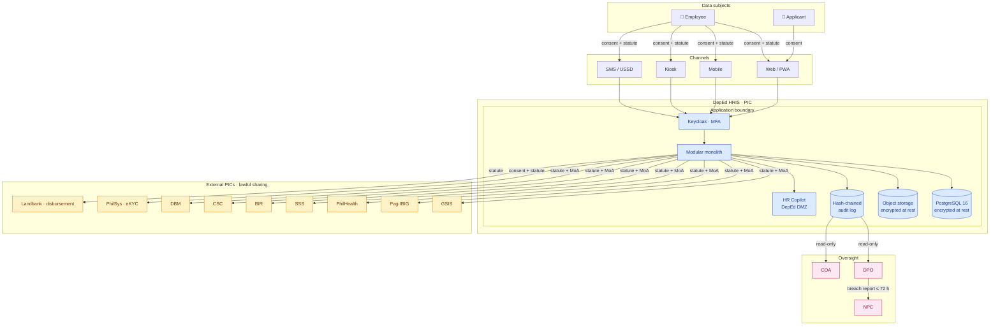
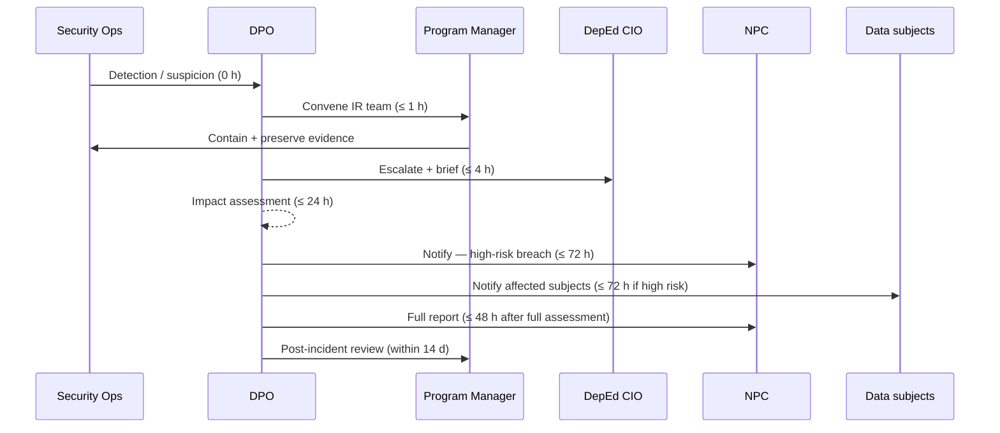

# I · Privacy Impact Assessment (RA 10173)

!!! info "About this paper"
    The National Privacy Commission (NPC) requires a **Privacy Impact Assessment (PIA)** for any personal-data processing system operated by a personal-information controller (PIC). DepEd is a PIC. This paper is a **draft PIA** built from the scope in [Paper A](A_technical_specifications_brief.md), the architecture in [Paper C](C_architecture_and_data_model.md), and the migration in [Paper H](H_data_migration.md). It is designed to be **filed with the NPC** after review by DepEd's Data Protection Officer (DPO) and edited with organisation-specific facts (DPO name, filing date, incident-response contacts).

## I.1 Regulatory anchors

The PIA structure follows:

- **RA 10173** — Data Privacy Act of 2012, especially §11 (general principles), §12 (lawful basis for processing personal information), §13 (lawful basis for sensitive personal information), §16 (rights of data subjects), §19 (data-protection officer), §20 (security measures), §38 (penalties).
- **NPC Circular 16-01** — Security of Personal Data in Government Agencies.
- **NPC Circular 16-03** — Personal Data Breach Management.
- **NPC Circular 2022-04** — Registration of Data Processing Systems.
- **NPC Advisory 2017-01** — Designation of Data Protection Officers.
- **ISO/IEC 27001** and **ISO/IEC 27701** control mappings as adopted in Paper C §7.

## I.2 Scope of the PIA

**In scope.** All processing performed by the DepEd HRIS as scoped in [Paper A](A_technical_specifications_brief.md) — the 11 functional modules, the applicant portal, offline mobile / kiosk access, SMS / USSD channels (D §1), the HR Copilot (D §3), the payroll anomaly detector (D §4), the hash-chained audit ledger (D §5), the transparency portal (D §6), and all nine regulator integrations. **Data migration from legacy PIS** ([Paper H](H_data_migration.md)) is explicitly in scope.

**Out of scope.** DepEd systems outside the HRIS (LIS, EBEIS, DepEd Commons), personal devices of employees not enrolled as endpoints, non-personal statistical outputs.

**Filing intent.** File once with the NPC upon go-live (M7), then re-file **within 30 days** of any material change to processing (per NPC Circular 2022-04).

## I.3 Roles

| Role | Assignment | Responsibility |
|---|---|---|
| **Personal Information Controller (PIC)** | Department of Education | Purposes and means of processing |
| **Data Protection Officer (DPO)** | To be designated by DepEd Secretary | RA 10173 §19 responsibilities; sign-off on this PIA |
| **Compliance Officer for Privacy (COP)** | Per RO / SDO | Local privacy compliance |
| **Personal Information Processor (PIP)** | Prime contractor (bidder) + hosting subcontractors (none per SCC 7) | Processing under DPA |
| **NPC** | National Privacy Commission | Oversight; PIA registration |

Since SCC clause 7 forbids subcontracting, the PIP layer collapses to the prime contractor plus DepEd's own operations team.

## I.4 Data inventory — categories and sensitivity

Personal data processed, classified per RA 10173 §3 (definitions):

| Category | RA 10173 class | Subjects | Volume | Purpose |
|---|---|---:|---:|---|
| **Employee identity** — name, PhilSys number, birthdate, birthplace, gender | Personal (§3.g) | Employees + applicants | ~ 1.1 M | Identity resolution, authentication, appointment |
| **Contact** — address, phone, email, emergency contact | Personal | Employees + applicants | ~ 1.1 M | Notifications, HR contact |
| **Government IDs** — GSIS, Pag-IBIG, PhilHealth, SSS, BIR TIN | Personal + Sensitive (regulatory implication) | Employees | ~ 1.0 M | Regulator remittance |
| **Employment history** — appointments, plantilla items, assignments, promotions | Personal | Employees | ~ 1.0 M | Personnel management |
| **Compensation** — salary, allowances, deductions, deductions history | Personal | Employees | ~ 1.0 M | Payroll |
| **Bank account** — account number, bank code | Personal + Sensitive | Employees | ~ 900 K | Disbursement |
| **Performance evaluations** — SPMS, IPCR, OPCR, disciplinary records | **Sensitive (§3.l.4)** — social security / due-process | Employees | ~ 1.0 M | Performance mgmt |
| **Health profile** — HMO, medical clearance, wellness | **Sensitive (§3.l.1)** — health | Employees | ~ 1.0 M | Wellness module (§5.10) |
| **Educational credentials** — degrees, certifications | Personal | Employees + applicants | ~ 1.5 M | Eligibility |
| **Eligibility & training** — CSC eligibility, training records | Personal | Employees + applicants | ~ 1.5 M | Career progression |
| **Biometric data** — fingerprint / face templates for time & attendance | **Sensitive (§3.l.3)** — biometrics | Employees | ~ 900 K | Attendance |
| **Applicant PDS + attachments** | Personal + potentially Sensitive | Applicants | ~ 200 K/yr | Recruitment (§5.1) |
| **Complaints / disciplinary** — CSC cases, admin cases | **Sensitive (§3.l.2)** — proceedings | Small subset | ~ variable | Personnel management |
| **System usage** — audit log, access log | Personal (§3.g if traceable) | All users | very large | Audit, security |
| **HR Copilot conversations** (D §3) | Personal (varies by query) | Users of Copilot | ~ variable | Assistance |

**Sensitive personal information** (RA 10173 §13) is processed on multiple bases — see §I.6.

## I.5 Data-flow diagram

Key facts encoded in the diagram:

- Employees and applicants are the only data subjects (RA 10173 §3.c).
- All ingress traverses Keycloak with MFA (RA 10173 §20 · organisational).
- Data at rest is encrypted (RA 10173 §20 · technical).
- The HR Copilot runs **inside the DepEd DMZ** — no data leaves the perimeter (D §3).
- Every regulator share has a **defined lawful basis** — either statute or MoA (see §I.6).
- The audit log is **hash-chained** (D §5), giving the DPO and COA tamper-evident visibility.

## I.6 Lawful basis matrix — per processing purpose

Per RA 10173 §12 (personal) and §13 (sensitive), every processing activity is mapped to at least one lawful basis:

| Processing purpose | Data used | Personal · §12 basis | Sensitive · §13 basis |
|---|---|---|---|
| **Personnel management** (§5.1, 5.6) | Identity, employment, compensation | §12(a) consent · §12(e) public function | §13(b) legal obligation (Civil Service laws) |
| **Payroll disbursement** | Identity, compensation, bank | §12(b) contract of employment · §12(e) | §13(b) legal obligation (GAA, DBM) |
| **Regulator remittance** (GSIS / Pag-IBIG / PhilHealth / SSS / BIR) | Government IDs, compensation | §12(c) legal obligation | §13(b) legal obligation |
| **Recruitment** (§5.1–5.3) | PDS, applicant data | §12(a) consent | §13(a) explicit consent |
| **Time & attendance** | Biometric templates | §12(e) public function | §13(b) legal obligation + §13(a) consent |
| **Performance evaluations** | SPMS, IPCR, OPCR | §12(c) legal obligation | §13(b) legal obligation (CSC rules) |
| **Wellness & health** (§5.10) | Health profile | §12(a) consent | §13(a) explicit consent |
| **Disciplinary cases** | Complaint records | §12(c) legal obligation | §13(f) protection of lawful rights |
| **PhilSys eKYC** (D §13) | PhilSys number + demographic verify | §12(a) consent · §12(c) | §13(a) explicit consent |
| **Audit & security** | Access logs, audit trail | §12(f) legitimate interest | n/a |
| **HR Copilot Q&A** (D §3) | Query text + retrieval context | §12(a) consent | §13(a) explicit consent |
| **Transparency portal** (D §6) | Anonymised appointment feed | §12(f) legitimate interest + PIC-controlled anonymisation | n/a — data anonymised before publication |
| **Legacy migration** (Paper H) | Everything in legacy PIS | §12(c) legal obligation (continuity of public function) | §13(b) legal obligation |

Every processing activity in the running system carries a link back to a row in this matrix, exposed to the DPO through the audit ledger.

## I.7 Data-subject rights (RA 10173 §16) — implementation

Each right in §16 must be honoured. Implementation surface:

| Right | Where implemented | How |
|---|---|---|
| §16(a) **To be informed** | ESS onboarding + privacy notice on every collection form | Explicit "you are giving us X for purpose Y under basis Z" text |
| §16(b) **To object** | ESS settings page | Employee can flag processing they object to; escalates to DPO |
| §16(c) **Access** | ESS "My 201 File" page | Complete personal-data export in machine-readable form |
| §16(d) **Correct** | ESS "Update my info" form | Change request routes to HR officer for verification |
| §16(e) **Erase / block** | Contact DPO channel | Handled by DPO under §16(e) exceptions (e.g. legal-obligation retention) |
| §16(f) **Damages** | DPO channel + NPC complaint | Documented process, escalation SLA |
| §16(g) **Data portability** | ESS "Export my data" (JSON + PDF) | Structured export under NPC Circular 2016-02 |
| §16(h) **Right to complain to NPC** | Prominently displayed on every screen footer | Direct link to NPC complaint form |

## I.8 Risk assessment — likelihood × impact

Per NPC guidance, risks are scored on 1–5 scales (5 = highest). Only risks ≥ 12 receive dedicated mitigation.

| # | Risk | Likelihood | Impact | Score | Primary control |
|---:|---|---:|---:|---:|---|
| 1 | Payroll disbursement to wrong account | 3 | 5 | **15** | M6 parallel-run + anomaly detector (D §4) |
| 2 | Unauthorised regulator remittance | 2 | 5 | **10** | Signed API calls, per-regulator audit log |
| 3 | Insider access abuse | 3 | 4 | **12** | RBAC + ABAC + RLS + audit ledger + quarterly access review |
| 4 | External breach via app vulnerability | 2 | 5 | **10** | Pen-test at M5 + quarterly, WAF, CSP, dependency scanning |
| 5 | Sensitive-data leak via HR Copilot | 2 | 4 | **8** | Self-hosted model, per-role RAG scoping, red-team eval (D §3) |
| 6 | Migration-time data loss / corruption | 3 | 5 | **15** | Paper H waves + reconciliation gates + rollback |
| 7 | Lost or stolen mobile / kiosk device | 4 | 3 | **12** | Device attestation + short session TTL + remote wipe |
| 8 | Session hijack | 2 | 4 | **8** | MFA + short-lived tokens + IP anomaly detection |
| 9 | Backup exposed on wrong tier | 2 | 5 | **10** | Encryption-at-rest, access reviews, offline copies |
| 10 | Print / screenshot exfiltration | 4 | 3 | **12** | Watermarking, download audit, disciplinary policy |
| 11 | Regulator forced disclosure | 2 | 3 | **6** | Legal review before disclosure; DPO in the loop |
| 12 | Third-party dependency compromise | 2 | 4 | **8** | SBOM, dependency signing, minimal supply-chain surface |
| 13 | Employee-signed PhilSys eKYC replay | 2 | 4 | **8** | Nonce-bound requests, PhilSys audit logs |
| 14 | Transparency-portal re-identification | 3 | 4 | **12** | k-anonymity + differential privacy for public feeds (D §6) |
| 15 | Retention exceeded on separated employees | 3 | 3 | **9** | Automated retention policy (§I.11) |

## I.9 Technical and organisational measures (RA 10173 §20)

Consolidated from the design in [Paper C §7](C_architecture_and_data_model.md), the deployment view in Paper C §8, the migration plan in Paper H, and the runbooks in the operations manual (planned).

### Technical (§20.c)

- **Encryption in transit** — TLS 1.3 minimum; internal traffic mTLS through service mesh.
- **Encryption at rest** — PostgreSQL TDE (or LUKS + column-level for sensitive), object storage server-side encryption, backups encrypted with a rotated KMS key.
- **Authentication** — Keycloak OAuth2 / OIDC, MFA mandatory for HR / Payroll / Admin roles, single sign-out.
- **Authorisation** — RBAC × ABAC, row-level security per organisational scope, per-request policy check.
- **Audit** — every mutation captured to hash-chained ledger (D §5) with a per-year Merkle-root anchor.
- **Segmentation** — application, database, and admin planes on separate VLANs; production isolated from non-prod.
- **Deployment residency** — [Paper F](F_delivery_and_cost.md) prices **two deployment options** (on-premises in DepEd facilities, or public cloud on GovCloud PH / AWS Manila). **Both satisfy RA 10173 residency** when configured per §I.5. Option B (cloud) requires explicit region pinning to a PH-based region and an annual review of the provider's SOC 2 / ISO 27001 attestation. Option A (on-prem) satisfies residency by construction — data never leaves DepEd-owned premises.
- **Backup & recovery** — 3-2-1 rule, tested restore quarterly, RTO 4 h / RPO 15 min.
- **Endpoint hardening** — CIS benchmarks on all servers, EDR on admin workstations.
- **Vulnerability management** — SCA and SAST in CI, DAST pre-release, third-party pen-test twice per year.
- **Anomaly detection** — payroll (D §4), authentication (rate + IP), data exfiltration.
- **Data minimisation** — API responses trimmed per role; download watermarking; report-side redaction.

### Organisational (§20.a, §20.b)

- **Designated DPO** with direct line to DepEd Secretary; contact published on every user-facing screen.
- **Per-RO / SDO Compliance Officers for Privacy** (COPs), trained on RA 10173 and NPC circulars.
- **Data-processing register** maintained per NPC Circular 2022-04.
- **Vendor management** — no subcontracting (SCC 7); prime contractor's team subject to background checks.
- **Training** — mandatory RA 10173 module for every employee with system access, annual refresher.
- **Access reviews** — quarterly HR + IT joint review of privileged accounts.
- **Incident-response plan** — see §I.10.
- **PIA refresh cadence** — annually, and on any material change to processing.

### Physical (§20.a)

- **Data-centre access** — biometric + card + escort for non-staff.
- **CCTV** at all racks and access doors.
- **Environmental** — fire suppression, redundant power, cooling.
- **Media disposal** — degaussing + certified destruction with COA-visible chain of custody.

## I.10 Breach management — RA 10173 §38 + NPC Circular 16-03

Trigger: any suspected unauthorised access to, disclosure of, or loss of personal data.

Templates for the breach notification (both NPC and subject-facing) are held in the DPO's runbook and drilled twice per year.

## I.11 Retention & disposal schedule

Per COA and CSC retention rules, with NPC-guided minimisation. Retention starts on the trigger event.

| Data category | Trigger | Retention |
|---|---|---|
| Employee 201 file | Separation | **10 years** then archived |
| Payroll records | Fiscal year close | **10 years** then archived |
| Applicant PDS (not hired) | Application closed | **2 years** then delete |
| Applicant PDS (hired) | Hire date | Merged into 201 file (retention as above) |
| Biometric templates | Separation | **1 year** then delete (template only; audit log retained) |
| Audit log | Log creation | **7 years** hot; longer archived per DepEd + COA |
| Session logs | Session end | **90 days** then delete |
| HR Copilot conversations | Conversation end | **30 days** then delete unless flagged for review |
| Backup snapshots | Snapshot creation | **90 days** rolling + monthly for 12 months + yearly for 7 years |
| Migration audit log | Cutover completion | **10 years** cold storage |

## I.12 DPO sign-off sequence

This PIA is not final until:

1. **DPO review** — DPO reviews §§I.1–I.11, edits any organisation-specific facts.
2. **DepEd CIO review** — architecture and controls check against the operating context.
3. **Legal review** — DepEd Legal Service reviews lawful bases and retention schedule.
4. **Program Manager sign-off** — confirms deliverability inside the 365-day contract.
5. **NPC filing** — per NPC Circular 2022-04, filed within 30 days of go-live.
6. **Annual re-affirmation** — DPO reviews and re-affirms every year, and on any material change.

## I.13 What is deliberately not covered here

- **PIAs for other DepEd systems** (LIS, EBEIS, DepEd Commons) — separate PIAs, out of scope.
- **Employee-personal-device policies** — separate HR issuance, references RA 10173 but is not this PIA.
- **Third-party analytics** — none used; explicitly excluded from architecture.
- **International data transfer** — none by design (HR Copilot, cloud DR, all remain in-country); if this ever changes, this PIA must be re-filed with §§I.4–I.6 updated for the transfer.

## I.14 Cross-references

- Scope of processing → [Paper A · Brief](A_technical_specifications_brief.md)
- Technical controls → [Paper C · Architecture §7 Security & Privacy](C_architecture_and_data_model.md)
- Migration processing → [Paper H · Data Migration](H_data_migration.md)
- Team accountable for security & DPO liaison → [Paper F §F.3](F_delivery_and_cost.md#f3-team-composition-and-monthly-cost)
- Risk register anchor → [Paper B §15](B_tor_response_outline.md#15-risk-register) (R6, R10)

---

This is a draft PIA prepared as an independent analysis. Before filing with the NPC, the designated DPO must complete §§I.3 (their name and contact), I.9 (organisation-specific procedures), I.10 (contact details for the IR team), and I.12 (sign-off dates).

