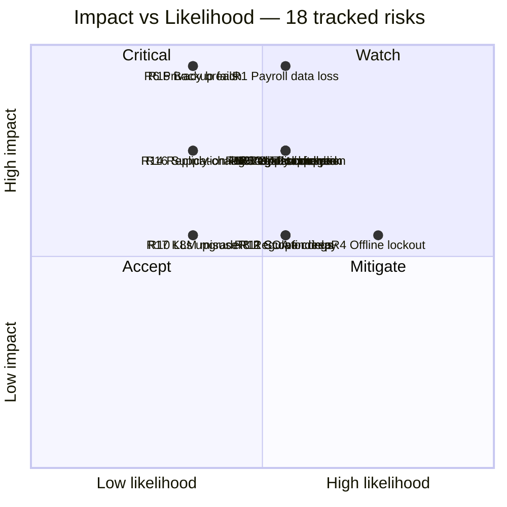

# J · Risk Register

!!! info "How this paper is used"
    Paper **B §15** carries a 12-item inline risk table for the compliance response. This paper is the **standalone register** an evaluator committee, a Program Steering Committee, or an internal QA gate expects — with 18 risks scored, owned, and cross-referenced.

    A live copy of this register (Excel or ADO board) is created at M1 and updated weekly through M8; the copy that lives in this paper is the **frozen version filed with the bid**.

## J.1 Method

**Scoring.** Likelihood × Impact on a 1–5 scale each. Scores multiplied, banded per §J.2.
**Owner.** Named role from [Paper F §F.3](F_delivery_and_cost.md#f3-team-composition-and-monthly-cost). Every risk has one accountable owner, not a shared responsibility.
**Trigger.** The observable event that would cause the risk to fire. If you cannot state a trigger you cannot monitor the risk.
**Control.** The specific paper section that describes the mitigation. Every control is traceable to a design decision, not to a vague "we will manage it."
**Residual score.** Score after the control is in place. Residual ≥ 12 requires escalation to the Program Steering Committee.

## J.2 Risk-appetite bands

| Score | Band | Action |
|:---:|---|---|
| **1–5** | Low | Accept; review quarterly |
| **6–11** | Medium | Mitigate under normal governance |
| **12–19** | High | Mitigate + weekly monitoring + PSC visibility |
| **20–25** | Critical | Board-level attention, contingency plan pre-approved |

## J.3 The register

### J.3.1 Delivery risks

| # | Risk | L | I | Score | Trigger | Control | Owner | Residual |
|---:|---|---:|---:|---:|---|---|---|---:|
| **R1** | Payroll cutover data loss | 3 | 5 | **15** | Payroll parallel-run variance > 0.5% for ≥ 1 cycle | M6 parallel-run gate + statistical anomaly detector ([D §4](D_value_added.md#4--payroll-anomaly-detector--m6-parallel-run-gate)) · [Paper H §H.7](H_data_migration.md#h7-reconciliation-reports-published-weekly) | Payroll Tech Lead | **4** |
| **R2** | Regulator-triggered rework (CSC / DBM / BIR issuance) | 3 | 4 | **12** | New DepEd Order or CSC memo published in build window | 90-day adaptation SLA + versioned rule engine · [Paper A §A.3.5](A_technical_specifications_brief.md#a3-general-cross-cutting-specifications) | Solutions Architect | **6** |
| **R3** | Ghost / duplicate employees carried into new system | 3 | 4 | **12** | Dedup engine emits > 15 K ambiguous matches | PhilSys eKYC dedup + reconciliation engine ([Paper H §H.5](H_data_migration.md#h5-migration-architecture)) + HR quarantine review | Migration Lead | **4** |
| **R4** | Low-connectivity schools locked out at go-live | 4 | 3 | **12** | Field survey shows > 15% of pilot SDOs unable to sync within 24 h | Offline PWA + CRDT sync ([D §2](D_value_added.md#2--offline-first-pwa-with-crdt-sync)) + SMS/USSD fallback ([D §1](D_value_added.md#1--bilingual-ui---sms--ussd-channels)) | Delivery Manager | **4** |
| **R5** | Vendor lock-in post-turnover | 3 | 4 | **12** | Prime contractor exits, DepEd cannot self-operate | 10-yr source escrow + community edition ([D §7](D_value_added.md#7--10-year-source-escrow--community-edition)) + full source turnover at M8 | Program Manager | **3** |
| **R6** | Data privacy breach or unauthorised disclosure | 2 | 5 | **10** | SOC detects unauthorised query pattern, or NPC complaint filed | ISO 27001 / 27701 controls + hash-chain audit ledger ([D §5](D_value_added.md#5--hash-chained-audit-ledger)) + [Paper I](I_privacy_impact_assessment.md) breach protocol | Security Engineer + DPO | **4** |
| **R7** | UAT slippage compressing M7 into unusable window | 3 | 4 | **12** | UAT script pass-rate < 80% at M6 exit | Continuous UAT from M3 + env-parity discipline + M6 exit criteria enforced | QA Lead | **6** |
| **R8** | Integration partner delay (GSIS / Pag-IBIG / etc.) | 3 | 3 | **9** | Any regulator misses a sandbox milestone by > 30 d | Contract-first mocks + fallback batch mode + escalation to DICT | Solutions Architect | **4** |
| **R9** | Adoption failure at school level | 3 | 4 | **12** | ESS login rate < 40% at pilot SDOs after 30 d | Bilingual UI + SMS/USSD + trainer network + change-mgmt campaign ([Paper F §F.8](F_delivery_and_cost.md#f8-training-change-management-documentation)) | Change Management Lead | **6** |
| **R10** | LLM misuse or hallucination in HR Copilot | 2 | 3 | **6** | User reports incorrect citation or unsafe output | Self-hosted retrieval-only model + guardrails + red-team eval ([D §3](D_value_added.md#3--hr-copilot--self-hosted-llm)) | Data Engineer | **3** |
| **R11** | Scope creep from module 4–11 discovery | 3 | 3 | **9** | > 3 new requirements accepted post-inception | Fixed inception window + change-control board + reference to §A.2 | Delivery Manager | **4** |
| **R12** | Post-audit COA findings on disbursement | 3 | 3 | **9** | COA field audit within 90 d of go-live | Anomaly detector + transparency portal + hash-chain ledger + procurement-clean process | Program Manager | **3** |

### J.3.2 Technical risks

| # | Risk | L | I | Score | Trigger | Control | Owner | Residual |
|---:|---|---:|---:|---:|---|---|---|---:|
| **R13** | Peak-load payroll cycle triggers OLTP contention | 3 | 4 | **12** | Load test at M5 shows P95 > 3 s under 80 K concurrent | Sizing per [Paper F §F.5.1](F_delivery_and_cost.md#f51-sizing-model--the-numbers-this-is-built-on) + read replica for reports + connection pooling + k6 load runs pre-M6 | Solutions Architect | **4** |
| **R14** | PostgreSQL replication lag under sustained write load | 2 | 4 | **8** | Sync replica lag > 250 ms sustained | Streaming replication + monitored lag alerts + fallback to async replica for reports | Database Engineer | **3** |
| **R15** | Backup restoration fails at scale | 2 | 5 | **10** | Quarterly restore drill fails or exceeds RTO | Tested restore quarterly + immutable snapshots + off-site replicas | DevOps Lead | **3** |
| **R16** | Third-party dependency supply-chain compromise | 2 | 4 | **8** | Advisory or notarised CVE on a bundled dependency | SBOM per release + dependency signing + private registry + rapid-patch procedure | Security Engineer | **4** |
| **R17** | Kubernetes cluster upgrade breaks workload | 2 | 3 | **6** | Post-upgrade regression on non-prod | Progressive rollout policy + canary + version-N-1 support policy | DevOps Lead | **3** |
| **R18** | Legacy PIS data corruption discovered mid-migration | 3 | 4 | **12** | Reconciliation report flags > 1% variance in identity fields | Multi-source cross-check + HR quarantine review + wave-scoped rollback ([Paper H §H.8](H_data_migration.md#h8-rollback-and-freeze-windows)) | Migration Lead | **4** |

## J.4 Heat-map view

## J.5 Residual-score movement

Every risk in J.3 shows a **residual score** — the score *after* the control lands and is proven. The residual column is what a Steering Committee reads first.

Only **two risks retain a medium residual** (score ≥ 6) after mitigation:

- **R2 · Regulator rework** — driven by external issuances (CSC, DBM, BIR); we can compress but not eliminate.
- **R7 · UAT slippage** — driven by DepEd availability of UAT participants; we can mitigate through continuous UAT but the calendar constraint remains.
- **R9 · Adoption failure** — driven by school-level connectivity and staff readiness; mitigated by fallback channels but true residual is behavioural.

All others drop to Low. **No risk has a critical residual.**

## J.6 Trigger monitoring — what gets watched, and where

| Trigger | Data source | Cadence | Escalation |
|---|---|---|---|
| Payroll variance > 0.5% | Parallel-run reconciliation report | Every payroll cycle | Payroll TL → Delivery Mgr → PSC |
| Reconciliation variance on any regulator > 0.05% | Regulator remittance report | Weekly through M8, monthly post | Finance + DBA → Program Mgr |
| Dedup ambiguous matches > 15 K | Migration dashboard | Weekly | Migration Lead → HR Governance |
| Field survey offline-sync failure | Pilot SDO report | Post-pilot | Delivery Mgr → PSC |
| SOC anomaly on data-access pattern | SIEM + audit ledger | Real-time | SecEng → DPO |
| ESS login rate < 40% at SDO | Adoption dashboard | Weekly for 90 d post-go-live | Change Mgmt → Program Mgr |
| Load-test P95 > 3 s | k6 CI runs | Pre-M5, pre-M6, pre-M7 | Solutions Arch → Delivery Mgr |
| Replication lag > 250 ms sustained | Prometheus alert | 1-min | DBA on-call |
| Quarterly restore drill fail | Backup runbook | Quarterly | DevOps Lead → Program Mgr |

## J.7 Contingency budget draw-down

The 7% contingency line in [Paper F §F.9.1](F_delivery_and_cost.md#f91-build-phase-m1m8-12-months) is **PHP 17.5 M** for the build phase. Draw-down policy:

| Trigger | Draw | Governance |
|---|---:|---|
| R2 fires (regulator issuance mid-build) | Up to 3.0 M | Delivery Mgr sign-off |
| R7 fires (UAT slippage of ≤ 2 weeks) | Up to 4.0 M | Delivery Mgr + Program Mgr |
| R13 fires (perf regression requiring re-architecture) | Up to 5.0 M | Program Mgr + PSC |
| Any two Medium residual risks fire concurrently | Full 7% | PSC + client sign-off |
| Any risk moves from residual Low to Medium | Up to 2.0 M | Delivery Mgr sign-off |
| Reserved for unforeseeable | 3.5 M | Held to end of build |

## J.8 Review cadence

- **Weekly (Delivery Mgr + Tech Leads)** — Trigger dashboard, any new risks, residual movements.
- **Monthly (Program Steering Committee)** — Full register, heat map, contingency ledger.
- **Milestone gates (M1, M2, M3, M4, M5, M6, M7, M8)** — Formal review; risks with residual ≥ 6 require written sign-off before payment claim.
- **On any breach or trigger fire** — Ad-hoc PSC meeting within 48 h.

## J.9 Cross-references

- Delivery plan and cost model that funds mitigations → [Paper F](F_delivery_and_cost.md)
- Migration-specific controls → [Paper H](H_data_migration.md)
- Privacy-risk detail (R6) → [Paper I §I.8](I_privacy_impact_assessment.md#i8-risk-assessment--likelihood--impact)
- Value-adds acting as controls → [Paper D](D_value_added.md) §§ 2 · 3 · 4 · 5 · 7
- Inline procurement-facing 12-risk table → [Paper B §15](B_tor_response_outline.md#15-risk-register)
