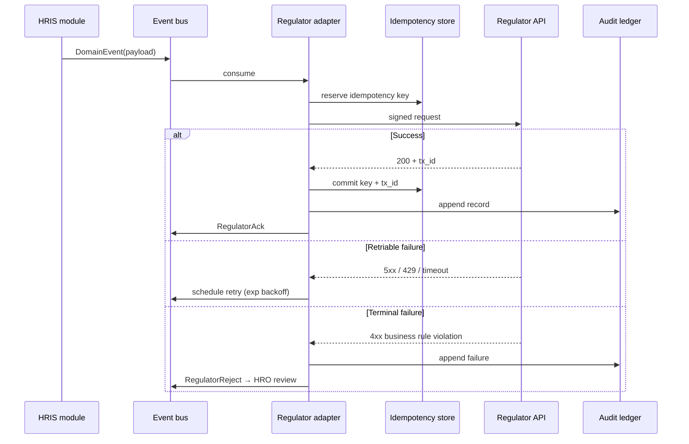

# K · Integration Specifications

!!! info "How this paper is used"
    [Paper C](C_architecture_and_data_model.md) lists the nine external integrations at the container level; [Paper A](A_technical_specifications_brief.md) names them by regulator. This paper is what an engineer opens on day one of M2 to write the first line of integration code — a contract, an auth model, a rate limit, a retry policy, and a testability plan, per regulator.

    Contracts and rate limits below reflect **publicly documented behaviour** and community-reported patterns as of Q1 2026. Sandbox credentials, IP allow-lists, and any signed MoA details are placeholders to be filled during inception (M1).

## K.1 Contract discipline — what every integration must have

Every regulator integration in this deck ships with **six artefacts** before any production traffic:

1. **OpenAPI 3.1 contract** (or documented protocol equivalent for non-REST).
2. **Auth handshake diagram** — issuer, key rotation cadence, replay protection.
3. **Rate-limit and backoff policy** — request/second ceiling, burst budget, retry ladder.
4. **Idempotency plan** — how a retry does not double-process.
5. **Test fixtures + mock server** — reproducible responses for CI without depending on the sandbox.
6. **Runbook** — what to do when the regulator is down, delayed, or returns malformed data.

If any of the six is missing, the integration is **not** promoted past SIT. This is a design gate, not a wish.

## K.2 Regulator inventory — one-line each

| # | Regulator | Protocol | Purpose | Est. calls / month | Criticality |
|---:|---|---|---|---:|:---:|
| 1 | **GSIS** | REST + JWS | Loan / retirement remittance | ~ 2 M | 🔴 Payroll-critical |
| 2 | **Pag-IBIG** | REST | HDMF contribution + loan | ~ 2 M | 🔴 Payroll-critical |
| 3 | **PhilHealth** | SOAP + REST | Health premium remittance | ~ 2 M | 🔴 Payroll-critical |
| 4 | **SSS** | REST | SSS premium (COS / JO staff) | ~ 200 K | 🟡 Payroll-material |
| 5 | **BIR** | REST + eBIRForms | Withholding tax + reporting | ~ 2 M + 12 K forms | 🔴 Payroll-critical |
| 6 | **CSC** | REST | Position + eligibility + Form 9 | ~ 400 K | 🟠 Recruitment-critical |
| 7 | **DBM** | REST + file drop | PSIPOP position master + WFP | ~ 1.1 M ref / mo | 🟠 Plantilla-critical |
| 8 | **DICT** | REST + policy | eGov interop + PhilGov cert | Ad-hoc | 🟢 Compliance |
| 9 | **PhilSys** | REST + mTLS | eKYC verify + demographic | ~ 3 M (peak migration) | 🔴 Identity-critical |

Non-regulator but architecturally similar: **Landbank** disbursement API (already listed in [Paper C](C_architecture_and_data_model.md)). Not a "regulator" in the RA 10173 sense but shares the integration pattern.

## K.3 Common design — everything anchors to this

Before per-regulator detail, every integration inherits the same skeleton:

Non-negotiable properties:

- **Every request is signed** — JWS or mTLS, per regulator; no unsigned production traffic ever.
- **Every request has an idempotency key** — reused across retries; regulators that do not accept an idempotency header have one synthesised in the request payload.
- **Every response is written to the audit ledger** — including hash of request body, response status, and regulator's transaction ID.
- **No adapter has direct access to source-of-truth tables** — it reads from the outbox and writes to inbox tables owned by its bounded context (transactional outbox pattern).
- **Circuit-breaker + bulkhead** — an unhealthy regulator cannot exhaust the thread pool for the healthy ones.

## K.4 Per-regulator specifications

### K.4.1 GSIS

| Aspect | Detail |
|---|---|
| **Auth** | JWS signature with rotating RSA keypair; keys re-registered every 12 months |
| **Protocol** | REST / JSON |
| **Endpoints used** | `/members/{gsis_no}`, `/remittance/monthly`, `/loan-status/{gsis_no}` |
| **Rate limit** | ~ 60 req/s per client; monthly bulk endpoint accepts 100 K rows/batch |
| **Peak call pattern** | Concentrated on payroll cutoff (day 10 and day 25 of month) |
| **Timeout** | 30 s per call; batch endpoint 5 min |
| **Retry policy** | Exponential backoff 2, 4, 8, 16, 32 s; give up after 5; move to next-cycle retry |
| **Idempotency** | Header `X-GSIS-Idempotency-Key`; regulator dedups for 24 h |
| **Historical outage pattern** | Scheduled maintenance nightly 00:00–02:00 PHT; occasional unannounced outages during month-end |
| **Fallback** | Queue for next window; anomaly detector flags stalled remittances at 24 h |
| **Data pushed** | Employee GSIS number, salary base, contribution, cycle period |
| **Data pulled** | Loan balances, retirement eligibility, membership status |
| **Audit anchor** | Every push includes GSIS transaction ID stored in `payroll.gsis_remit.regulator_tx_id` |

### K.4.2 Pag-IBIG (HDMF)

| Aspect | Detail |
|---|---|
| **Auth** | API key + IP allow-list + HMAC signature |
| **Protocol** | REST / JSON |
| **Endpoints used** | `/employer/remittance`, `/member/{mid}/loans`, `/member/{mid}/contributions` |
| **Rate limit** | ~ 40 req/s; bulk remittance 50 K rows/batch |
| **Peak call pattern** | Payroll cutoff + 25 of month |
| **Timeout** | 30 s |
| **Retry policy** | Same 5-step exponential ladder |
| **Idempotency** | Payload includes `client_ref`; regulator dedups for 48 h |
| **Historical outage pattern** | Occasional partial outages when member portal is under load |
| **Fallback** | Batch-file drop (SFTP) is a documented alternative; adapter can switch |
| **Special note** | HDMF has a separate loan-remittance workflow; do not mix with monthly contribution |

### K.4.3 PhilHealth

| Aspect | Detail |
|---|---|
| **Auth** | Digital certificate (PKI) + SOAP-WS-Security header |
| **Protocol** | **SOAP** (legacy) with a REST wrapper for newer endpoints |
| **Endpoints used** | `SubmitRF1`, `RegisterMember`, `RetrieveContributions` |
| **Rate limit** | ~ 20 req/s per client; RF1 batch accepts up to 10 K rows |
| **Peak call pattern** | Month-end RF1 submission |
| **Timeout** | 45 s (SOAP is slow) |
| **Retry policy** | 3 retries only; PhilHealth idempotency is fragile — over-retrying causes duplicate contribution records |
| **Idempotency** | Not natively supported; adapter enforces via local dedup table + reconciliation report |
| **Historical outage pattern** | Weekend maintenance windows; occasional SSL cert rotation issues |
| **Fallback** | Manual RF1 upload via portal remains a documented last-resort |
| **Special note** | **This is the highest-risk regulator integration** — plan the retry ceiling and reconciliation report as first-class controls |

### K.4.4 SSS

| Aspect | Detail |
|---|---|
| **Auth** | JWT bearer + IP allow-list |
| **Protocol** | REST / JSON |
| **Endpoints used** | `/employer/contribution`, `/employer/loan-remittance`, `/member/status` |
| **Rate limit** | ~ 30 req/s |
| **Peak call pattern** | Cutoff + 15 for COS / JO staff |
| **Timeout** | 30 s |
| **Retry policy** | Standard 5-step exponential |
| **Idempotency** | `X-SSS-Ref` header |
| **Historical outage pattern** | Nightly maintenance; occasional slow response during peak |
| **Data volume** | Lower than GSIS (COS / JO only; plantilla staff are on GSIS not SSS) |

### K.4.5 BIR

| Aspect | Detail |
|---|---|
| **Auth** | Client certificate + shared secret per SDO branch |
| **Protocol** | REST for real-time; eBIRForms XML upload for filings |
| **Endpoints used** | Withholding-tax computation validators; eBIRForms Form 1601-C / 1604-CF |
| **Rate limit** | ~ 25 req/s real-time; eBIRForms limits by portal quota |
| **Peak call pattern** | Payroll cutoff + monthly / quarterly / annual filing windows |
| **Timeout** | 45 s |
| **Retry policy** | 3 retries + human escalation |
| **Idempotency** | Filing IDs; overwrites are audit-visible |
| **Historical outage pattern** | Filing-deadline day slowdowns (April 15 and quarterly) |
| **Special note** | Form generation is deterministic from payroll ledger; if BIR is down, forms are held in outbox and released when connectivity restores |

### K.4.6 CSC

| Aspect | Detail |
|---|---|
| **Auth** | OAuth2 client credentials + JWT |
| **Protocol** | REST / JSON |
| **Endpoints used** | `/positions/{code}`, `/eligibility/{philsys}`, `/form9/submit`, `/personnel-actions` |
| **Rate limit** | ~ 15 req/s |
| **Peak call pattern** | Recruitment posting windows + appointment issuance |
| **Timeout** | 30 s |
| **Retry policy** | Standard 5-step |
| **Idempotency** | Native — `X-CSC-Client-Ref` |
| **Historical outage pattern** | Predictable maintenance Sundays |
| **Data pushed** | CSC Form 9 (job posting), personnel action reports |
| **Data pulled** | Eligibility records, position-classification master, active issuances |

### K.4.7 DBM (PSIPOP)

| Aspect | Detail |
|---|---|
| **Auth** | mTLS + IP allow-list |
| **Protocol** | REST + monthly file drop (CSV over SFTP) |
| **Endpoints used** | `/psipop/positions`, `/psipop/vacancies`, `/wfp/employees` |
| **Rate limit** | ~ 10 req/s live; nightly full-master ~ 1.1 M rows |
| **Peak call pattern** | Monthly plantilla reconciliation |
| **Timeout** | 60 s |
| **Retry policy** | For live: 5-step; for file drop: retry with new file next window |
| **Idempotency** | Position codes are the natural key; PATCH is idempotent by design |
| **Historical outage pattern** | Batch endpoint occasionally slow at end of fiscal year |
| **Special note** | DBM PSIPOP is authoritative for plantilla items; conflicts resolve in DBM's favour |

### K.4.8 DICT

| Aspect | Detail |
|---|---|
| **Auth** | Per-service — GovCloud PH uses IAM; eGovPH uses OIDC |
| **Protocol** | Varies per service |
| **Usage** | Certificate authority for code signing + eGovPH SSO handshake (future) + DICT security-advisory feed |
| **Rate limit** | Very low; primarily advisory / compliance |
| **Peak call pattern** | On advisory publication (aperiodic) |
| **Special note** | DICT is more a compliance regulator than a live integration — the HRIS ingests advisories rather than transacting |

### K.4.9 PhilSys

| Aspect | Detail |
|---|---|
| **Auth** | mTLS + client certificate (per PSA-issued) |
| **Protocol** | REST / JSON |
| **Endpoints used** | `/verify/{philsys_no}` (eKYC), `/authenticate` (biometric-optional) |
| **Rate limit** | ~ 50 req/s per client; higher during onboarding waves |
| **Peak call pattern** | Migration wave M3 (initial enrolment); ESS first-login |
| **Timeout** | 20 s |
| **Retry policy** | 3 retries then move to manual verification queue |
| **Idempotency** | `X-PhilSys-Ref` header |
| **Historical outage pattern** | Rare; PSA-run infrastructure |
| **Special note** | Used for the [D §13 PhilSys eKYC dedup](D_value_added.md) value-add; the migration pipeline in [Paper H §H.5](H_data_migration.md#h5-migration-architecture) is the biggest single consumer |

## K.5 Cross-cutting concerns

### K.5.1 Rate-limit budgeting

Each adapter carries a rate budget. If two integrations peak concurrently — the payroll cutoff hits GSIS + Pag-IBIG + PhilHealth + SSS + BIR together — the aggregate outbound rate must stay under DepEd's own egress limits and the regulators' ceilings.

| Time window | Concurrent integrations | Aggregate ceiling | Design headroom |
|---|---|---:|---|
| Payroll cutoff (day 10, 25) | GSIS + Pag-IBIG + PhilHealth + SSS + BIR | 175 req/s total | 40% headroom → 105 req/s target |
| Month-end filing | BIR + PhilHealth RF1 | 45 req/s | 40% headroom |
| Recruitment posting | CSC + PhilSys | 65 req/s | 50% headroom |
| Migration wave | PhilSys + DBM PSIPOP | 60 req/s | 50% headroom |

Adapter queues use **priority + fair-share** — payroll-critical requests preempt discretionary ones (e.g. eligibility lookups) during contention.

### K.5.2 Testability — mock everything, always

Every adapter ships with a **stateful mock server** that speaks the same contract as the regulator sandbox. CI runs full end-to-end tests against the mock. The sandbox is used only for **contract-drift detection** (weekly) and for the pre-M5 dress rehearsal.

Mock servers live in `platform/mocks/{gsis,pagibig,philhealth,sss,bir,csc,dbm,dict,philsys}` and are versioned alongside the adapters.

### K.5.3 Runbook essentials

Every adapter has a runbook that answers:

1. **How do I know the regulator is down?** Prometheus alert + status endpoint + last-successful-call metric.
2. **What breaks if it stays down for 1 h? 24 h? 1 week?** Written impact matrix per adapter.
3. **What is the manual fallback?** Documented (portal upload, batch drop, phone call).
4. **How do I replay the queue when it comes back?** Documented replay command with idempotency guarantee.
5. **Who do I call?** Regulator-side contact, escalation chain.

## K.6 Observability

Every adapter emits the same telemetry:

| Metric | Type | Alert threshold |
|---|---|---|
| `regulator_calls_total{regulator, status}` | counter | Error rate > 5% for 5 min |
| `regulator_latency_seconds{regulator}` | histogram | P95 > 10 s for 5 min |
| `regulator_queue_depth{regulator}` | gauge | Depth > 10 K for 15 min |
| `regulator_retry_total{regulator}` | counter | Retry rate > 10% |
| `regulator_last_success_seconds{regulator}` | gauge | > 3600 for payroll-critical |
| `regulator_idempotency_hits_total{regulator}` | counter | Investigate spike |

Grafana dashboard `regulator-integrations.json` is the single view an on-call engineer opens first when payroll or recruitment misbehaves.

## K.7 Deliverable checklist — per integration, before go-live

Every adapter is signed off by **all four** of these people before it enters production:

- [ ] **Solutions Architect** — contract accepted, error taxonomy mapped
- [ ] **Tech Lead** — code review, mock parity verified
- [ ] **Security Engineer** — key rotation drilled, mTLS certificates in production KMS
- [ ] **Operations Lead** — runbook + alert routing + on-call ownership in place

The checklist is what a Steering Committee sees at M6 gate; missing any signature is a blocker.

## K.8 Cross-references

- Container-level integration list → [Paper C](C_architecture_and_data_model.md) §Container view
- Regulators named in the PBD → [Paper A §A.3](A_technical_specifications_brief.md#a3-general-cross-cutting-specifications)
- PhilSys eKYC as a value-add → [Paper D §13](D_value_added.md)
- Regulator-integration risk items → [Paper J §R8, §R13, §R14](J_risk_register.md)
- Migration reliance on PhilSys / DBM PSIPOP → [Paper H §H.2](H_data_migration.md#h2-sources--what-we-are-actually-pulling-from)
- Data flowing to regulators, under RA 10173 → [Paper I §I.5](I_privacy_impact_assessment.md#i5-data-flow-diagram) and [§I.6](I_privacy_impact_assessment.md#i6-lawful-basis-matrix--per-processing-purpose)
