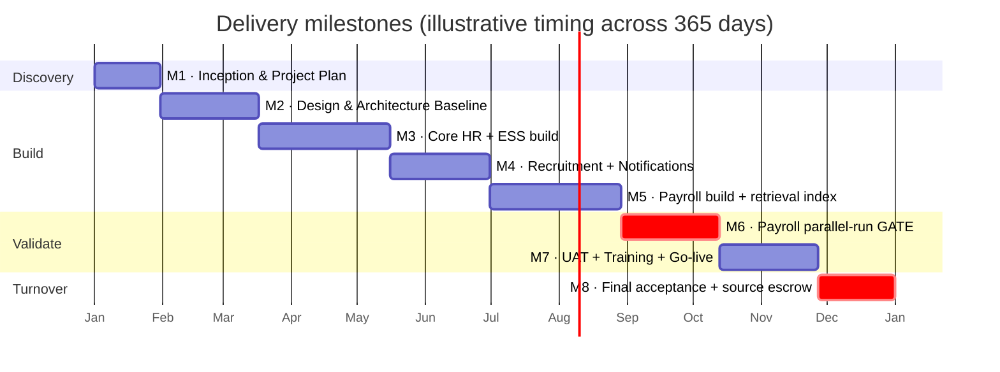
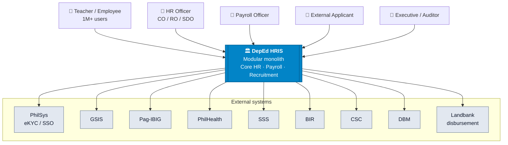
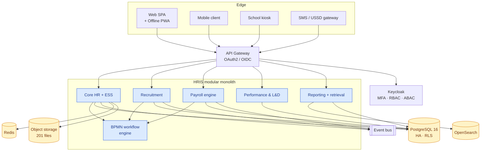

# DepEd HRIS

## Analysis, Response & Architecture

Independent technical read of the Philippine Bidding Document 
Project <code>2026C-ICTS2-002-B5-CB-034</code> · ABC PHP 500 M · 365 days

---
layout: default
---

# The bid at a glance

  
1 M+

  
Employees in scope

  
PHP 500 M

  
Approved Budget (ABC)

  
365 d

  
Contract duration from NTP

  
11

  
Functional modules

  
8

  
Milestone payments

  
99%

  
Uptime target · P1–P4 SLA

Procuring entity: <strong>DepEd ICTS-SDD</strong> · Funding: GAA FY 2025 (DCP – SAGIP continuing) ·
Subcontracting <strong>not allowed</strong> · No advance payment · Liability capped at Contract Price.

---
layout: two-cols
routeAlias: toc
---

# Five papers, one thesis

Click any card to jump straight to that section.

  <Link to="paper-a" class="nav-card"><b>A · Brief</b> — what the RFP actually says</Link>
  <Link to="paper-b" class="nav-card"><b>B · Response</b> — how to answer it, clause-by-clause</Link>
  <Link to="paper-c" class="nav-card"><b>C · Architecture</b> — C4 model + PostgreSQL DDL</Link>
  <Link to="paper-d" class="nav-card"><b>D · Value-Added</b> — 8 differentiators, zero incremental cost</Link>
  <Link to="paper-e" class="nav-card"><b>E · Benchmarks</b> — international precedent</Link>
  <Link to="paper-f" class="nav-card"><b>F · Delivery & Cost</b> — bottom-up model, PHP 421 M vs 500 M ABC</Link>

::right::

| Paper | For… | Format |
|---|---|---|
| **A** | Orientation | Structured analysis |
| **B** | Bid preparation | Compliance matrix |
| **C** | System design | Diagrams + DDL |
| **D** | Winning the bid | Component pitch |
| **E** | Evaluators | Country tables |
| **F** | Cost & delivery plan | Bottom-up model |

Tip: press <kbd>O</kbd> for overview · <kbd>F</kbd> for fullscreen · <kbd>?</kbd> for all shortcuts.

---
layout: section
routeAlias: paper-a
---

# Paper A
## Technical Specifications Brief

What the Philippine Bidding Document actually requires

<SectionNav current="A" />

---

# Scope of coverage

### Organisational levels
- Central Office
- Regional Offices
- Schools Division Offices
- District Offices
- Schools (Elementary / JHS / SHS)

### Population
- **> 1,000,000 employees**
- Plantilla · COS · Job Order
- Teaching · Related-teaching · Non-teaching

### 11 functional modules

1. Personnel Information Management ★
2. Applicant Portal ★
3. Recruitment, Selection, Placement ★
4. Employee Self-Service Portal
5. Leave & Attendance Management
6. Payroll (General, Special, Voucher)
7. Performance Management (SPMS/IPCR/OPCR)
8. Learning & Development
9. Rewards & Recognition
10. Employee Wellness & Welfare
11. Succession Planning

★ = detailed in TOR · Modules 4–11 finalised at inception

---

# 8 milestones · 365 days · payment weights

  
M1 <b>10%</b>

  
M2 <b>20%</b>

  
M3 <b>15%</b>

  
M4 <b>10%</b>

  
M5 <b>15%</b>

  
M6 <b>10%</b>

  
M7 <b>10%</b>

  
M8 <b>10%</b>

Liquidated damages after <strong>15 days</strong> of unjustified delay ·
Full source-code turnover a condition of final acceptance at M8.

---

# SLA · Availability · Support

### Service levels

- **99% uptime** excluding scheduled maintenance
- **≤ 3 s** response for core transactions under normal load
- **Regulator adaptation** within **90 days** of new issuance

### Support matrix

| Sev | Response | Resolution |
|---|---|---|
| **P1** Critical | 1 h | 24 h |
| **P2** High | 2 h | 48 h |
| **P3** Medium | 4 h | 5 working days |
| **P4** Low | 1 working day | Next release |

### Security & compliance

- **RA 10173** — Data Privacy Act
- **ISO/IEC 27001**, **27701** control mapping
- **NIST CSF** alignment
- **MFA** for HR, Payroll, Admin roles
- **RBAC + ABAC** with row-level security (RLS)
- Immutable, **hash-chained audit log**

### Breach response

- **Contain** immediately
- **Notify** within **24 h**
- **Full report** within **48 h**
- Data return **15 d** post-termination
- Notarised destruction cert **30 d** later

---
layout: section
routeAlias: paper-b
---

# Paper B
## Bid Response Outline

A placeholder-populated compliance matrix — every Section VII clause answered

<SectionNav current="B" />

---

# How the response is structured

### Per-clause format

Every Section VII requirement gets three fixed rows:

- **Comply** — Yes/Partial/No
- **Implementation approach** — 2–4 sentences
- **Evidence** — Annex reference (e.g. `V-04`)

### Bidder-specific fields

- Marked as `[[PLACEHOLDER]]`
- One `grep` reveals every value to fill in
- Nothing to invent, nothing to forget

### What's included

- All 11 module clauses answered
- All 28 required recruitment reports mapped
- 8 milestone **entry/exit criteria**
- **12-risk register** with impact × likelihood
- §16.5 formal wording for **Paper D value-adds**
- Integration matrix (GSIS, Pag-IBIG, PhilHealth, SSS, BIR, CSC, DBM, DICT, NPC)

### Length

- ~56 KB · 45-minute read
- 8 rendered PDF sections
- Cross-linked to Papers A & C

---

# Risk register — the twelve tracked risks

| # | Risk | Impact | Likelihood | Mitigation anchor |
|---|---|---|---|---|
| R1 | Payroll cutover data loss | Critical | Medium | **M6 parallel-run gate** + anomaly detector (D §4) |
| R2 | Regulator-triggered rework (CSC/DBM/BIR) | High | High | 90-day adaptation SLA · versioned rule engine |
| R3 | Ghost / duplicate employees | High | Medium | PhilSys eKYC · payroll anomaly detector |
| R4 | Low-connectivity schools locked out | High | High | **Offline PWA + CRDT sync** (D §2) |
| R5 | Vendor lock-in on completion | High | Medium | Source escrow · community edition (D §7) |
| R6 | Data breach / privacy incident | Critical | Low | ISO 27001/27701 · hash-chain ledger (D §5) |
| R7 | UAT slippage compressing M7 | Medium | High | Continuous UAT from M3 · env parity |
| R8 | Integration partner delay (GSIS et al.) | Medium | Medium | Contract-first mocks · fallback batch mode |
| R9 | Adoption failure at school level | High | Medium | Bilingual UI + SMS/USSD (D §1) |
| R10 | LLM misuse or hallucination | Medium | Low | Self-hosted, retrieval-only Copilot (D §3) |
| R11 | Scope creep from module 4–11 discovery | Medium | High | Fixed inception window · change-control |
| R12 | Post-audit COA findings on disbursement | High | Medium | Anomaly detector + transparency portal (D §6) |

---
layout: section
routeAlias: paper-c
---

# Paper C
## Architecture & Data Model

C4 diagrams, PostgreSQL DDL, and event flows

<SectionNav current="C" />

---

# C4 · System context

---

# C4 · Container view

---

# Data model · three bounded contexts

### 🧑 Core HR

- `employee`
- `employment_history`
- `plantilla_item`
- `assignment`
- `education`, `eligibility`, `training`
- `leave_credit`, `leave_ledger`
- `document` (201 file)

Owns identity, employment, ESS

### 💰 Payroll

- `payroll_cycle`
- `earning`, `deduction`
- `payslip`
- `gsis_remit`, `philhealth_remit`
- `sss_remit`, `bir_remit`
- `disbursement_batch`
- `anomaly_flag` *(D §4)*

Owns money movement + regulator remittance

### 📋 Recruitment

- `posting`, `csc_form_9`
- `application`, `applicant`
- `screening`, `interview`
- `selection_board`
- `appointment`, `oath`
- 28 report views

Owns hiring · issues appointment events

~1,000 lines of PostgreSQL 16 DDL · <strong>row-level security</strong> per organisational scope ·
<strong>cross-schema event handoffs</strong> (appointment → employee, employee → payroll) ·
report-coverage traceability included.

---
layout: section
routeAlias: paper-d
---

# Paper D
## Value-Added Components

Eight differentiators offered at <strong>zero incremental cost</strong> to the ABC

<SectionNav current="D" />

---

# The three gates every VAC had to pass

  
🎯

  
1 · Documented pain

  

    PBD or operating context proves the need — but leaves the solution unpriced.
  

  
📅

  
2 · Fits 365 days

  

    Slots into an existing milestone. Zero displacement of base scope.
  

  
⚖️

  
3 · Survives audit

  

    Passes CSC, COA, NPC, DICT review with no extra legal or procurement action.
  

Ideas that failed any gate are recorded but <strong>not offered</strong> —
a VAC that becomes a scope conversation is a liability, not a differentiator.

---

# The eight value-adds

<b>1 · Bilingual UI + SMS/USSD</b> Filipino, Cebuano, Ilocano · payslip via feature-phone

<b>2 · Offline-first PWA + CRDT sync</b> Zero data loss under 72-h partition · schools + kiosks

<b>3 · HR Copilot (self-hosted LLM)</b> Llama-3.1 / Qwen-2.5 · retrieval-grounded · in DMZ

<b>4 · Payroll anomaly detector</b> M6 parallel-run gate · ghost/dupe/drift detection

<b>5 · Hash-chained audit ledger</b> Estonia X-Road pattern · tamper-evident every write

<b>6 · Public transparency portal</b> Georgia PSB pattern · anonymised appointment feed

<b>7 · 10-year source escrow + community edition</b> Kills vendor lock-in · discharges COA finding class

<b>8 · Teacher-to-school placement optimiser</b> Chile SIGE pattern · CP-SAT solver · advisory

Formally worded in <b>Paper B §16.5</b> · every VAC ties to an Annex <code>V-##</code> with evidence.

---
layout: two-cols
---

# Deep-dive · HR Copilot

**What.** Conversational assistant grounded in the 201 file store,
plantilla, DepEd Orders, and CSC memoranda.

**Example.** *"How many secondary teachers in Region VIII are eligible
for reclassification this fiscal year?"* — answer with cited passages,
never free-text.

**Deployment.** Self-hosted **Llama-3.1-8B-Instruct** or
**Qwen-2.5-7B-Instruct** class model inside the **DepEd DMZ** — no data
leaves the perimeter, RA 10173 satisfied by construction.

**Milestones.** Retrieval index at M5, assistant UI + guardrails at M7.

::right::

# Deep-dive · Anomaly detector

**What.** Statistical + rules-based detector runs against every
payroll cycle **before** disbursement is authorised.

**Flags.** Ghost employees · duplicate bank accounts · out-of-band
net-pay deltas · deduction imbalances · GSIS/BIR/PhilHealth
remittance drift · time-clock anomalies.

**Why it wins.** Turns the mandatory M6 parallel-run from a compliance
chore into a **fraud-prevention asset** — directly reduces the
disbursing officer's personal exposure.

**Milestones.** Trained at M4 on legacy data · gated at M6 ·
production at M8.

---
layout: section
routeAlias: paper-e
---

# Paper E
## International Benchmarks

Government HRIS ≥ 100,000 employees · deployed in production · English-accessible sources

<SectionNav current="E" />

---

# Education-department analogues

| System | Country | Scale | Signature idea | Applies to |
|---|---|---|---|:-:|
| **Shala Darpan + UDISE+** | India | ~9 M teachers | Aadhaar eKYC dedupe · SMS-first self-service | D §1 |
| **DIKSHA** | India | 4 M+ teachers | Training completion → appraisal directly | D §14 |
| **TSC + TPAD** | Kenya | ~340 K teachers | Mobile-first appraisal for field connectivity | D §2 |
| **PERSAL / PILIR** | South Africa | 1.2 M civil servants | Longest-running large public payroll on continent | A · C |
| **SNED + SIGE** | Chile | ~240 K teachers | **CP-SAT solver** for teacher placement | **new VAC #8** |
| **Novopay (rebuild)** | New Zealand | ~110 K teachers | Reference for payroll parallel-run at scale | A M6 · B §9 |

### Adjacent inspiration

**NHS ESR** (UK, 1.5 M) · **HRMIS** (Malaysia, 1.6 M) · **HRP@Gov / OneCV** (Singapore) ·
**X-Road / eesti.ee** (Estonia) · **e-People** (Korea) · **NFC** (US federal) ·
**SAPK / SIASN** (Indonesia, 4.2 M) · **PSB HR portal** (Georgia).

---

# Six patterns to borrow · three disasters to avoid

### ✅ Borrow

1. **India** — Aadhaar-linked eKYC → PhilSys dedupe *(D §13)*
2. **Kenya** — Mobile-first TPAD → offline PWA *(D §2)*
3. **Chile** — CP-SAT teacher placement → **new VAC #8**
4. **NHS ESR** — SSO + LMS at 1.5 M scale *(D §14)*
5. **Malaysia** — BPMN workflow engine at 1.6 M scale *(Paper C)*
6. **Estonia** — Per-query audit log → **hash-chain ledger** *(D §5)*

### ❌ Avoid — and cite by name

- **Novopay** (NZ, 2012) — no parallel run
  → **Anchor the M6 gate.**
- **UK NHS "National Programme for IT"** (2011)
  → Avoid mega-monolith · anchor bounded contexts.
- **Queensland Health payroll** (2010) — untested go-live
  → Anchor UAT continuity from M3.

Naming disasters in <b>Paper B §15 Risk Management</b> signals maturity —
evaluators recognise them.

---
layout: section
routeAlias: paper-f
---

# Paper F
## Delivery Plan, Infrastructure & Cost Model

Is PHP 500 M realistic for what the PBD asks? Bottom-up model at 2026 PH rates.

<SectionNav current="F" />

---

# The team · 69 FTE at peak · fully-loaded 2026 PH rates

| Function | Count | PHP/mo |
|---|---:|---:|
| Program leadership | 3 | 756,000 |
| Architecture | 2 | 621,000 |
| Engineering leadership (Tech Leads) | 3 | 729,000 |
| Senior engineering | 10 | 1,890,000 |
| Mid engineering | 14 | 1,701,000 |
| Junior engineering | 6 | 445,500 |
| Platform / SRE | 4 | 837,000 |
| Data + DB | 4 | 769,500 |
| Security | 2 | 513,000 |
| QA (leads + engineers) | 10 | 1,161,000 |
| Product / BA | 4 | 567,000 |
| Design | 3 | 384,750 |
| Documentation | 2 | 175,500 |
| Adoption / trainers | 4 | 432,000 |
| Migration | 2 | 310,500 |
| **Peak** | **69** | **PHP 11.3 M / mo** |

### Rate assumptions

- **Loaded rates** (base × 1.35) — 13th month, HMO, SSS/PhilHealth/Pag-IBIG,
  retirement, equipment.
- **Median 2026 PH-market values** from WTW, JobStreet PH, Kalibrr.
- **In-house team**, no subcontracting (SCC clause 7).
- Consulting-firm rates (T&M) would be **1.8–2.5×** these numbers —
  outside the ABC.

### Curve, not level-loaded

- **M1:** 12 FTE (inception, hiring)
- **M2:** 42 FTE (architecture)
- **M3–M5 peak:** 69 FTE
- **M7:** 40 FTE (UAT + training)
- **Build total: PHP 102 M** over 12 months
- **Warranty year: 17.5 FTE, PHP 40 M** over 12 months

Full role-by-role table and monthly curve: <b>Paper F §F.3 · §F.4</b>.

---

# Two deployment options · same team, same scope

### 🏢 Option A · On-premises

**Sizing at 80,000 concurrent users**
- K8s 3 master + 12 worker (32 vCPU / 128 GB each)
- **PostgreSQL 16** HA: primary + sync + async replica
- Redis · OpenSearch · Ceph 80 TB · WAF · NGFW
- Primary DC (DepEd Central Office) + DR site + 4 non-prod envs

**Cost profile**
- **CAPEX: PHP 101 M** (year 1)
- OPEX: PHP 1.35 M/mo (power, colo DR, warranties)
- 24-mo TCO: PHP 88.5 M net of residual

**Best when**
- DepEd DC readiness confirmed by M1
- Capital available upfront
- 5-year horizon matters
- Physical control required

### ☁️ Option B · Public cloud

**Sizing at 80,000 concurrent users**
- EKS + c6i.8xlarge workers × 12 (RI, 3-yr)
- **RDS PostgreSQL** Multi-AZ (managed HA)
- ElastiCache · OpenSearch Service · S3
- Primary ap-southeast-1 · warm DR ap-southeast-3

**Cost profile**
- **CAPEX: 0** — zero upfront
- OPEX: PHP 3.96 M/mo (RI-heavy)
- 24-mo TCO: PHP 95 M

**Best when**
- Speed of provisioning matters
- Managed services reduce ops burden
- Elastic scaling for payroll cutoff bursts
- DC readiness uncertain

Both options fully comply with RA 10173 residency. Decision made at inception (M1), not bid-time. Full comparison: <b>Paper F §F.6.4</b>.

---

# Pros and cons · at a glance

### 🏢 Option A · On-premises

**Pros**
- Data residency by construction
- No FX exposure — all PHP
- Cheaper from year 3+ (hardware amortises)
- Predictable cost line — CAPEX one-time
- Full physical control for COA audit
- No cloud egress or bandwidth charges

**Cons**
- High upfront CAPEX (PHP 101 M)
- 90–120 day hardware procurement
- Requires DepEd DC readiness
- Slower scale-up (need to buy hardware)
- Requires 4-FTE in-house SRE team
- Hardware refresh every 5 years

### ☁️ Option B · Public cloud

**Pros**
- Zero CAPEX — pure OPEX
- Elastic scaling for payroll peaks
- Rapid provisioning (hours, not months)
- Managed services reduce ops burden
- Built-in multi-AZ DR
- Smaller ops team (3 FTE)
- No hardware refresh cycle

**Cons**
- Higher OPEX (PHP 95 M vs 32.5 M / 24 mo)
- FX exposure (unless GovCloud PH)
- Cross-over at month 30 — on-prem cheaper long-term
- Cloud egress + transfer charges
- Vendor API lock-in (KMS, IAM)
- Requires FinOps discipline

Six-question decision framework: <b>Paper F §F.6.4</b>. Neither wins outright — the answer depends on DepEd's own conditions at inception.

---

# The cost breakdown · both options inside the PHP 500 M ABC

### 🏢 Option A · On-premises

| Phase | PHP |
|---|---:|
| Build (M1–M8) — personnel 102 + CAPEX 101 + rest | 340.3 M |
| Warranty year — personnel 40 + infra 16 + rest | 81.1 M |
| **24-month contract price** | **PHP 421.4 M** |
| % of ABC (500 M) | **84.3%** |
| Bid headroom | **PHP 78.6 M** (15.7%) |
| Year 3+ run-rate (informational) | ~ PHP 65 M/yr |

### ☁️ Option B · Public cloud

| Phase | PHP |
|---|---:|
| Build (M1–M8) — personnel 102 + cloud OPEX 48 + rest | 242.1 M |
| Warranty year — personnel 40 + cloud OPEX 48 + rest | 117.0 M |
| **24-month contract price** | **PHP 359.1 M** |
| % of ABC (500 M) | **71.8%** |
| Bid headroom | **PHP 140.9 M** (28.2%) |
| Year 3+ run-rate (informational) | ~ PHP 105 M/yr |

<b>Cloud is cheaper over the contract window · on-prem is cheaper from year 3+.</b> 
Both leave meaningful bid headroom for competitive positioning or additional value-adds.

Full sensitivity analysis + comparables (Novopay, HRMIS, SIASN): <b>Paper F §F.10 · §F.13</b>.

---

# Also in the analysis · G · H · I

### G · Executive One-Pager

The whole argument on **one page** — ABC math, 24-month Gantt, 8 differentiators, top-3 risks.

For evaluator committee chairs and senior officials who need it in 90 seconds.

<b>~ 4 KB · 3 min read</b> 
Print-friendly · exec briefing

### H · Data Migration Plan

Legacy PIS + PSIPOP + CSC-BEA + 850 K paper 201 files → new HRIS.

Wave rollout (pilot → regional), reconciliation gates, freeze windows, per-wave rollback + nuclear-option post-cutover revert.

The workstream **Novopay, Queensland Health, and NHS NPfIT all got wrong**.

<b>~ 18 KB · 20 min read</b> 
1 M+ records · 5 waves · 7 reconciliation reports

### I · Privacy Impact Assessment

Draft PIA per **RA 10173** and **NPC Circular 16-01**.

15 data categories · lawful-basis matrix (§12, §13) · data-flow diagram · 15-risk matrix · technical + organisational measures · breach protocol · retention.

**NPC-fileable** after DPO edits.

<b>~ 28 KB · 30 min read</b> 
RA 10173 · NPC Circulars · DPO sign-off

All three are on the same site: <b>dennispitallano.github.io/deped-hris-analysis</b>

---
layout: section
routeAlias: summary
---

# Bringing it together

<SectionNav current="·" />

---

# What this analysis gives a bidder

### Before submission

- **Paper A** — verify no PBD clause is misunderstood
- **Paper B** — fill `[[PLACEHOLDER]]` fields · sign
- **Paper C** — hand to engineering as the reference
- **Paper D** — the differentiator narrative
- **Paper E** — the evaluator's language

### On day 1 of NTP

- PostgreSQL DDL ready to migrate
- C4 model ready to hand to teams
- Risk register ready to track
- Milestone entry/exit criteria pre-agreed

### What it does **not** replace

- Legal review of SCC clauses
- Bidder-specific pricing model
- Formal ISO 27001 certification evidence
- Client-specific integration credentials
- Signed subcontractor / partner MoUs

Every deliverable is Markdown-first, PDF-rendered, and
version-controlled at <b>github.com/DennisPitallano/deped-hris-analysis</b>.

---
layout: center
class: text-center
---

# Thank you

📄 Live site · [dennispitallano.github.io/deped-hris-analysis](https://dennispitallano.github.io/deped-hris-analysis)

💻 Source · [github.com/DennisPitallano/deped-hris-analysis](https://github.com/DennisPitallano/deped-hris-analysis)

🔗 Sibling analysis · [DTI REI (105 M · Managed Services)](https://dennispitallano.github.io/deped-dti-analysis)

Prepared by <b>deped-hris</b> · Solutions architect — HRIS & data platforms 
Independent public analysis · no official association with DepEd is implied

